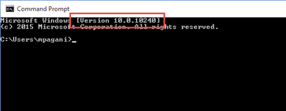
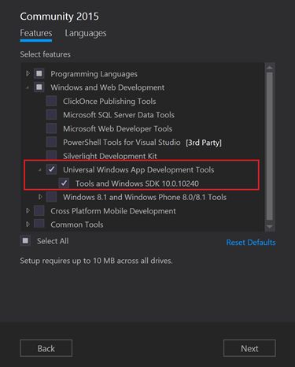
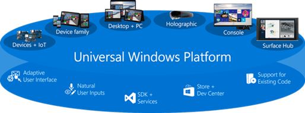
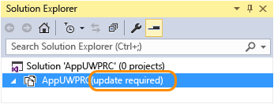
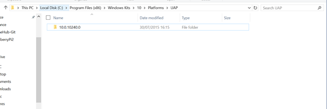
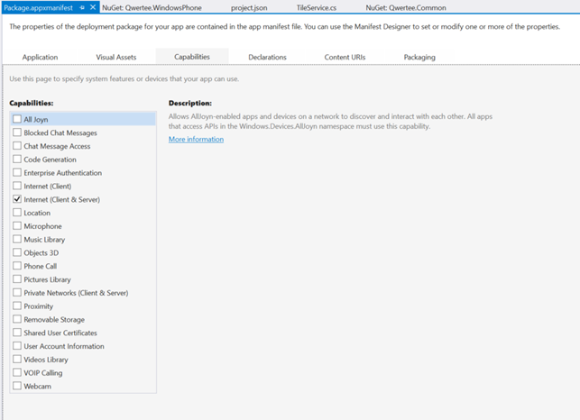
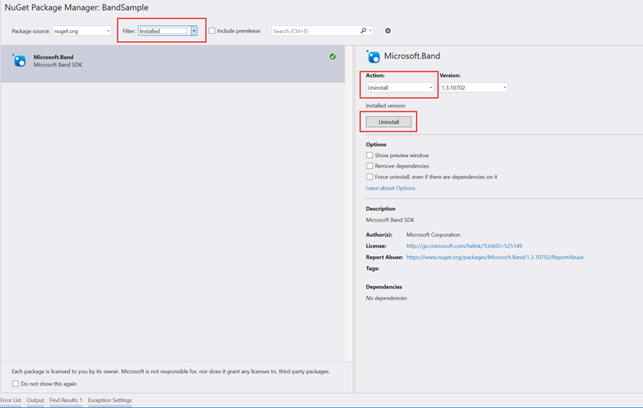
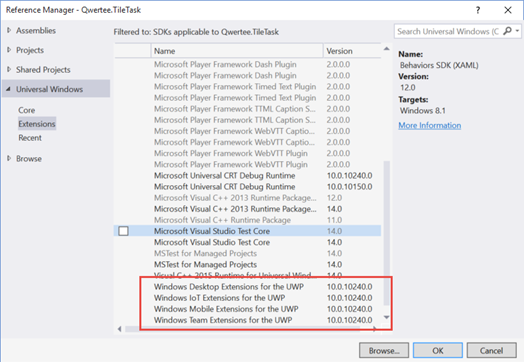

# Pubblicare e migrare la vostra prima Universal Windows app per Windows 10

*Questo post è stato scritto da [Matteo
Pagani](https://twitter.com/qmatteoq), Support Engineer in
Microsoft per il programma AppConsult.*

Le ultime due settimane sono state molto importanti per gli sviluppatori
Microsoft e non: il 20 Luglio è stata rilasciata la RTM di Visual Studio
2015, mentre il 29 Luglio, oltre al rilascio ufficiale di Windows 10, è
stata distribuita la versione finale dell’SDK che consente lo sviluppo e
la pubblicazione di Universal Windows app per Windows 10.

A partire da tale data, infatti, il Dev Center ha aperto le porte alla
pubblicazione di applicazioni Windows 10 sullo Store. Se negli ultimi
mesi avete sfruttato le preview per iniziare a sviluppare (o a migrare)
la vostra prima Universal Windows app per Windows 10, ora finalmente
avete la possibilità di pubblicarla e farla scaricare alle tantissime
persone che in questi giorni stanno aggiornando, in maniera
completamente gratuita, il loro PC dotato di Windows 7 o Windows 8.1 (è
di ieri [la
notizia](http://blogs.windows.com/bloggingwindows/2015/07/30/windows-10-the-first-24-hours/)
che, a 24 ore dal lancio, Windows 10 è già stato installato su oltre 14
milioni di computer).

Se provate, però, ad aprire il vostro progetto dopo aver installato la
versione finale di Visual Studio 2015 e dei tool di Windows 10, vi
accorgerete di una serie di problemi che vi impediranno di preparare il
pacchetto da caricare sullo Store, da quelli più semplici da risolvere
(come il fatto che il progetto non si apra perché cerca una versione
dell’SDK che non esiste più) a quelli invece all’apparenza più
misteriosi (come la mancanza di classi fondamentali del framework .NET).

Il motivo è che la struttura del progetto Universal Windows app ha
subito delle sostanziali modifiche, collegate in particolar modo alle
novità introdotte dalla nuova versione di NuGet. La soluzione più
semplice per risolvere il problema è creare un nuovo progetto di tipo
Universal Windows app e copiare tutti i file che fanno parte della
vostra soluzione attuale (classi, asset, ecc.). Questa soluzione è
documentata direttamente su MSDN, all’indirizzo
<https://msdn.microsoft.com/en-us/library/windows/apps/xaml/mt188198.aspx>

In alcuni casi, però, si tratta di una strada non percorribile.
Pensiamo, ad esempio, ad un progetto sotto source control: il fatto di
dover eliminare il vecchio progetto e sostituirlo con uno nuovo potrebbe
essere difficile da gestire. Vediamo perciò i passaggi da seguire per
modificare un progetto già esistente e renderlo compatibile con il nuovo
formato introdotto con la versione finale dei tool di sviluppo.

I prerequisiti: i tool di sviluppo
==================================

Le informazioni riportate in questo paragrafo, in realtà, sono utili a
chiunque voglia sviluppare un’applicazione per Windows 10 e non solo a
chi è già pronto per pubblicare la sua prima applicazione.

Il primo requisito **è quello di avere Windows 10**: non è
indispensabile, dato che i tool di sviluppo possono essere utilizzati
anche su un PC con Windows 8.1, ma è sicuramente la strada più semplice,
dato che potrete gestire la fase di sviluppo e di testing sulla stessa
macchina. In caso contrario, potete continuare ad utilizzare Windows 8.1
per lo sviluppo, ma avrete bisogno di un altro device con Windows 10 (un
altro computer, un tablet, ecc.) per testare e fare debug della vostra
app.

La distribuzione di Windows 10 è iniziata il 29 Luglio come
aggiornamento gratuito per chiunque abbia una copia valida di Windows 7
o Windows 8.1. Trovate tutte le informazioni necessarie all’indirizzo
<http://www.microsoft.com/en-us/windows/windows-10-upgrade> Se, invece,
siete iscritti al programma Insider, assicuratevi che il vostro PC sia
aggiornato e che siate sulla build 10240 (potete verificarlo aprendo un
prompt dei comandi, in cima viene sempre riportata l’indicazione sul
numero di versione).



Il secondo requisito è **installare Visual Studio 2015**: ne esistono
diverse versioni, a seconda delle vostre esigenze, che trovate sul sito
ufficiale <http://www.visualstudio.com>. È importante sottolineare,
però, la presenza di una versione, definita
[Community](https://www.visualstudio.com/en-us/products/visual-studio-community-vs.aspx),
che è completamente gratuita per gli sviluppatori indipendenti e per i
progetti open source, che offre le stesse funzionalità della versione
Professional.

Nel momento in cui lanciate il setup di Visual Studio 2015, è importante
non procedere con l’installazione standard ma utilizzare questa
personalizzata: questo perché, come impostazione predefinita, l’SDK di
Windows 10 non viene installata. Assicuratevi, perciò, che l’opzione
rappresentata nella schermata seguente sia abilitata prima di procedere:



Una volta terminata l’installazione, siete pronti per creare un nuovo
progetto per Windows 10 (grazie ai template presenti nella categoria
Windows Universal) o a migrarne uno già esistente.

Il primo passo: modificare i progetti
=====================================

Una delle novità più importanti di Windows 10 è la Universal Windows
Platform (abbreviata, UWP): una piattaforma per gli sviluppatori che è
disponibile, in maniera trasversale, su tutti i device Windows 10, siano
essi computer, tablet, telefoni o Raspberry PI 2. La Universal Windows
Platform ha la peculiarità di potersi evolvere in maniera indipendente
dal sistema operativo: ciò significa che, in futuro, come Microsoft
potremo rilasciare delle nuove versioni della UWP, senza per questo
rilasciare però una nuova versione di Windows. Di conseguenza, le
Universal Windows app per Windows 10 non hanno più come target di
riferimento una versione specifica del sistema operativo, ma una
versione della UWP.



 

Ecco il motivo per cui, una volta aperta la soluzione che avete creato
con Visual Studio 2015 RC, vi comparirà un messaggio di errore e il
Solution Explorer vi mostrerà il vostro progetto (o progetti) con, di
fianco, la dicitura **Update Required**.



L’installazione di Visual Studio 2015 e dell’SDK finale di Windows 10,
infatti, si fa carico di eliminare tutte le versioni precedenti della
UWP, le quali erano in Preview. Di conseguenza, la versione corrente del
vostro progetto sarà configurata per utilizzare una versione della UWP
(come la 10069 o la 10166) che sul vostro computer non esiste più.

Potete verificare tutte le versioni della Universal Windows Platform
installate sul vostro computer aprendo il percorso *C:\\Program Files
(x86)\\Windows Kits\\10\\Platforms\\UAP*. Se avete installato
correttamente i tool in versione finale, dovreste trovare solamente una
cartella relativa alla versione 10240.



 

Il primo passaggio, perciò, è quello di modificare il progetto per
utilizzare la versione 10240 della UWP: dovete intervenire manualmente,
modificando il file .csproj che contiene la configurazione del progetto.
Dato che, al momento, il progetto non è attivo, potete farlo
direttamente da Visual Studio: fatevi click con il tasto destro e
scegliete la voce **Edit**, che sarà seguite dal nome del file di
progetto. In questo modo, direttamente in Visual Studio si aprirà il
file .csproj in versione testuale, che non è altro che un file XML che
contiene tutte le informazioni sulla struttura del progetto (nome, file
e reference, configurazioni, ecc.)

All’interno, troverete le due seguenti proprietà:

```json
<TargetPlatformVersion>10.0.10069.0</TargetPlatformVersion>
<TargetPlatformMinVersion>10.0.10069.0</TargetPlatformMinVersion> 
```

All’interno, troverete la versione della UWP su cui è basata la vostra
applicazione, che dovrete modificare indicando la più recente, ovvero la
versione 10240. La proprietà più importante è **TargetPlatformVersion**,
che dovrete impostare su **10.0.10240.0**: grazie a questa modifica,
avrete la possibilità di aprire il progetto in Visual Studio,
semplicemente facendoci clic sopra con il tasto destro e scegliendo la
voce **Reload project.** La proprietà **TargetPlatformMinVersion**
specifica, invece, la versione minima della Universal Windows Platforms
su cui l’applicazione è in grado di funzionare. Nella maggior parte dei
casi, in questo momento, le due proprietà avranno lo stesso valore, in
quanto la versione 10240 coincide con la prima release ufficiale di
Windows 10 (le versioni precedenti erano accessibili in forma di preview
solamente agli iscritti al programma Insider). In futuro, invece, con
l’evoluzione di Windows 10 e il rilascio di nuove versioni della UWP,
invece, sarà plausibile che queste due proprietà possano differire.

Il secondo passo: modificare il file di manifest
================================================

Una delle novità che sicuramente noterete con maggiore piacere della
versione finale dei tool di sviluppo è il ritorno dell’editor visuale
del file di manifest. Facendo doppio clic sul file
**Package.appxmanifest**, infatti, si aprirà una comoda interfaccia
visuale, che vi permetterà con semplicità di configurare le capability,
gli asset predefiniti, ecc.



Dietro le quinte, però, il file di manifest non è altro che un file XML
che, a sua volta, contiene anche lui l’informazione su quale sia la UWP
di riferimento. Tale informazione, però, non è accessibile
dall’interfaccia grafica; dovrete, perciò, fare click con il tasto
destro sul file **Package.appxmanifest** e scegliere la voce **View**
**code**. All’interno del file XML troverete le seguenti righe:

```json
<Dependencies>
<TargetDeviceFamily Name=“Windows.Universal“ MinVersion=“10.0.10069.0“ MaxVersionTested=“10.0.10240.0“ />
</Dependencies> 
```

Anche in questo caso, dovrete specificare:

1.  La versione della UWP utilizzata, tramite la proprietà
    **MinVersion**. Un dispositivo con una versione della UWP inferiore
    non sarà in grado di utilizzare l’applicazione.
2.  La versione massima della UWP con cui abbiamo testato la nostra
    applicazione e per la quale siamo sicuri non ci siano problemi di
    compatibilità, tramite la proprietà **MaxVersionTested**.

Anche in questo caso vale il ragionamento fatto in precedenza: essendo
la 10240 la prima versione ufficiale di Windows 10, in questo momento le
due proprietà probabilmente coincideranno nella maggior parte dei casi.

Goodbye packages.config, welcome project.json
=============================================

La novità forse più importante della versione finale dei tool di
sviluppo è l’utilizzo di un nuovo formato per la gestione delle
dipendenze di un progetto, legato all’introduzione della versione 3.0 di
NuGet, il celebre package manager di Visual Studio.

Le versioni precedenti erano basate su un file, incluso nella root del
progetto, chiamato **packages.config**: si tratta di un XML che contiene
la descrizione di tutti i pacchetti che sono stati installati tramite
NuGet. Le nuove applicazioni Windows 10, invece, fanno uso di un nuovo
file di nome **project.json** che, usando il formato JSON, descrive
tutte le dipendenze che sono necessarie all’applicazione per essere
compilata correttamente.

Ecco un esempio di file **project.json**:
```json
{ 
    "dependencies": { 
        "Microsoft.ApplicationInsights": "1.1.0", 
        "Microsoft.ApplicationInsights.PersistenceChannel": "1.1.0", 
        "Microsoft.ApplicationInsights.WindowsApps": "1.1.0", 
        "Microsoft.NETCore.UniversalWindowsPlatform": "5.0.0", 
        "Newtonsoft.Json": "7.0.1", 
    }, 
    "frameworks": { 
        "uap10.0": {} 
    }, 
    "runtimes": { 
        "win10-arm": {}, 
        "win10-arm-aot": {}, 
        "win10-x86": {}, 
        "win10-x86-aot": {}, 
        "win10-x64": {}, 
        "win10-x64-aot": {} 
    } 
}
```
Come vedete, contiene la definizione dei pacchetti NuGet
(**dependencies**), dei framework utilizzati **(frameworks)** e dei
runtime per cui viene compilata l’app (**runtimes**). Se osservate le
dipendenze, ne noterete una particolare: .NET Core, ovvero la libreria
che vi permette di sfruttare il bridge specifico di .NET per la
Universal Windows Platform.

Questo è il motivo per cui, se cercherete di compilare il vostro
progetto otterrete una serie di errori, all’apparenza misteriosi,
relativi alla mancanza di classi base del framework .NET, come Object o
string. Di conseguenza, anche se avete un progetto che non contiene
alcuna riferimento a librerie esterne (e, di conseguenza, non ha un file
packages.config) avrete comunque bisogno di un file project.json: senza
di esso, mancherà il fondamentale riferimento a .NET Core.

Il modo più semplice per migrare il vostro progetto è seguire questi
passaggi:

1.  Annotatevi da qualche parte il contenuto del file packages.config,
    così da avere un riferimento di tutte le librerie che
    avete installato.
2.  Dall’interfaccia di NuGet, disinstallate tutte le
    librerie installate. Per visualizzarle, scegliete la voce
    **Installed** dal menu a tendina **Filter:** ora, una per una,
    selezionatala e, dal menu a tendina **Action**, scegliete l’opzione
    **Uninstall**.


3.  Eliminate dal vostro progetto il file packages.config.
4.  Ora create un file di nome **project.json** e aggiungetelo al
    progetto, con la seguente definizione base:

```json
{
    "dependencies": {
    "Microsoft.NETCore.UniversalWindowsPlatform": "5.0.0",
        },
    "frameworks": {
        "uap10.0": {}
        },
    "runtimes": {
        "win10-arm": {},
        "win10-arm-aot": {},
        "win10-x86": {},
        "win10-x86-aot": {},
        "win10-x64": {},
        "win10-x64-aot": {}
        }
}
```
5.  Chiudete Visual Studio e riaprite la soluzione.
6.  Ora riaprite l’interfaccia di NuGet e, aiutandovi con il contenuto
    del vecchio file packages.config che avete annotato in precedenza,
    reinstallate tutte le librerie utilizzate dal vostro progetto. In
    questo modo, andrete in automatico ad utilizzare la nuova versione
    di NuGet e noterete che i riferimenti alle librerie non saranno più
    aggiunti nel file packages.config, ma all’interno del nodo
    dependencies del file project.json.

Gestire le Extension SDK
========================

Se avete già iniziato a sviluppare Universal Windows app per Windows 10,
dovreste conoscere il concetto di Extension SDK. La UWP, come già detto,
è una piattaforma di sviluppo in comune tra tutti i device con Windows
10. A volte, però, si ha la necessità di sfruttare delle funzionalità
che sono disponibili solamente su una tipologia di device: ad esempio,
non avrebbe senso utilizzare le API per interagire con i GPIO di un
micro computer come Raspberry PI 2 su un pc o un tablet. Di conseguenza,
all’interno del menu **Add reference** di Visual Studio, alla voce
**Extensions**, troverete una serie di librerie in grado di aggiungere
alla UWP una serie di funzionalità specifiche in base alla famiglia di
device (mobile, desktop, IoT, ecc.).

Nel passaggio alla versione 10240 della UWP anche queste extension sono
state aggiornate: di conseguenza, se ne facevate uso, dovrete rimuovere
nella sezione **References** del progetto il riferimento a quelle
vecchie e aggiungere, invece, quella nuova.



 

È giunta l’ora di pubblicare!
=============================

Se avete seguito correttamente i passaggi fin qui riportati, ora il
vostro progetto dovrebbe compilare senza errori e sarete in grado di
lanciare la vostra applicazione sia sul vostro PC che sull’emulatore
della versione mobile di Windows 10. A questo punto, potete procedere
con la pubblicazione con le stesse modalità utilizzate per le
applicazioni 8.1: fate clic con il tasto destro sul vostro progetto e,
alla voce **Store**, scegliete l’opzione **Create app packages**.
Seguendo il wizard (che vi guiderà passo per passo chiedendovi una serie
di informazioni, come il numero di versione dell’applicazione) otterrete
alla fine un pacchetto di tipo .appxupload, che dovrete caricare sul
[Dev Center](http://dev.windows.com) quando vi sarà richiesto durante la
procedura di invio.

Non vediamo l’ora di vedere e provare le vostre Universal Windows app!
Happy coding!


