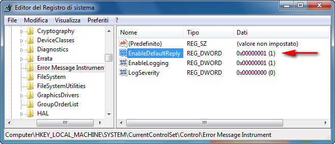
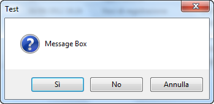
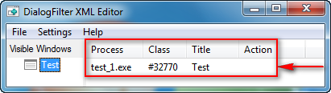
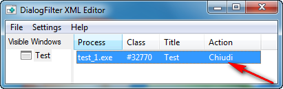

#### di [Beppe Platania](https://mvp.support.microsoft.com/profile/Beppe)

1.  {width="0.5938331146106737in"
    height="0.9376312335958005in"}

Riveduto e corretto da: Gianni Rosa Gallina e Marina Sabetta

*Agosto 2012*

Una delle funzionalità più richieste nei sistemi Embedded è quella di
evitare, in qualche modo, che l’utente sia “invitato”, dal sistema
operativo o da un applicativo non progettato per l’Embedded, ad
interagire tramite tastiera, mouse o touch.

Questa situazione, ben evidenziata dalle immagini che seguono, mette in
imbarazzo l’utente, che non soltanto non ha la possibilità di
intervenire ma, anche se fosse in grado di farlo, spesso non saprebbe
cosa rispondere.

1.  {width="4.131944444444445in"
    height="3.782503280839895in"}

    {width="4.583333333333333in"
    height="3.437014435695538in"}

    {width="3.5in"
    height="4.665165135608049in"}

    {width="2.8333333333333335in"
    height="3.7796281714785653in"}

Si torna, di fatto, alla differenza tra un sistema desktop, dove
l’utente è tenuto ad avere consapevolezza di essere davanti ad un
computer con un sistema operativo e delle applicazioni, ed un sistema
Embedded inteso come una “soluzione dedicata”, in cui l’utente sa di
essere di fronte ad un prodotto pensato e realizzato per rispondere ad
una sua esigenza specifica (es: il registratore di cassa per una
cassiera, un chiosco informativo per ricevere informazioni, ecc...).

Per evitare (o almeno ridurre) l’interazione del sistema operativo e
delle altre applicazioni con l’utente e per evitare di trovarsi nelle
situazioni esposte in precedenza, Windows Embedded Standard 7 offre
molte soluzioni che, combinate fra loro, permettono di limitare, se non
escludere completamente, la richiesta di intervento da parte dell’utente
su finestre non di sua competenza.

Alcune di queste, come la possibilità di rispondere in maniera
“standard” ad una Message box prima che questa venga visualizzata o
quella di NON far comparire i Balloon Pop-Up di notifica, erano
possibili già nelle precedenti versioni (Windows Embedded Standard
2009). Altre, come la possibilità di mettere un filtro su una qualsiasi
finestra che sta per comparire in modo da poterne pilotare il
comportamento, sono state aggiunte in questa versione.

La funzione MessageBox delle API di Windows offre al programmatore la
possibilità di far comparire una finestra di dialogo che può contenere
del testo, dei pulsanti e dei simboli. Questa funzione viene tipicamente
utilizzata per visualizzare degli avvertimenti o degli errori ed offrire
all’utente delle scelte su come operare rispetto alla situazione
visualizzata.

Con Balloons (che nella versione italiana vengono tradotti come
“fumetti”) ci riferiamo a quei messaggi che compaiono quando un
applicativo (o il sistema stesso) vuole comunicare qualcosa che riguarda
lo stato di una funzione: ad esempio, quando si inserisce una chiavetta
USB ed il sistema ne fa comparire uno per notificare che è stato
rilevato un dispositivo e se ne sta caricando il driver opportuno.

#### Risposta standard ai messaggi (Message Box Default Reply)

Sia il sistema operativo Windows che le applicazioni che girano in
questo ambiente spesso richiedono un’interazione da parte
dell’utilizzatore. Questo può accadere in una situazione di errore: si
vuole attirare l’attenzione dell’utente, anche se non c’è effettivamente
nessuna scelta da compiere; semplicemente, si conferma di avere letto il
messaggio. Può presentarsi invece la situazione in cui la finestra con
la Message box richieda una scelta e, in questo caso, chi ha preparato
il messaggio ha anche scelto la risposta “standard” (quella cioè dove è
posizionato il “focus” - pulsante attivo) e che viene presa come
default: basta premere Invio per confermarla.

Nel caso dei dispositivi Embedded, come abbiamo evidenziato all’inizio
di questo capitolo, spesso l’utente è ignaro di essere davanti ad un
computer e ad un sistema operativo, quindi NON si aspetta di dover
intervenire su richieste che non sono strettamente quelle
dell’applicativo che sta utilizzando (es: se una cassiera vedesse una
finestra di messaggio che le chiede qualcosa legato al sistema
operativo, chiamerebbe l’assistenza senza continuare il proprio lavoro).

Il poter intercettare i messaggi di sistema (System Message
Interception) può essere una base per evitare questa situazione. Per far
questo si può sfruttare una proprietà già presente nella NTUSER.Dll e
pilotata da alcune chiavi del registro, ma l’ambiente di sviluppo ci
viene incontro con il configuratore (ICE) che ci permette in un modo
molto semplice di gestire le nostre scelte senza scrivere una riga di
codice.

I messaggi che arrivano a schermo potrebbero essere importanti sia per
l’applicazione che per il sistema; quindi, poterli ridirigere sul file
di LOG del sistema è di fondamentale importanza. Il file di LOG, che
normalmente può essere analizzato da applicativi di sistema, nel caso di
dispositivi Embedded può essere controllato da un applicativo remoto,
automatizzato quanto basta perché, in caso di segnalazioni che
necessitano di un intervento di un tecnico (es: un disco sta per
riempirsi), quest’ultimo possa intervenire senza interruzioni di
servizio.

Prima di tutto, vediamo cosa si può fare: l’obiettivo principale è non
far arrivare a schermo il messaggio, ma gestirlo correttamente.

#### Risposta standard ai messaggi (configurazione mediante ICE)

Dopo aver inserito nella build il package “Message Box Default Reply”
(=MBDR) che si trova tra le “Embedded Enabling Features”, abbiamo a
disposizione queste scelte:

1.  {width="6.142961504811899in"
    height="1.3540605861767279in"}

EnableDefaultReply Serve ad abilitare o meno questa funzionalità:\
0= disabilitata, la funzione non intercetta nessun messaggio;\
1= abilitata (valore di default), la funzione intercetta tutte le
****Message box**** e seleziona automaticamente la risposta di default.

EnableLogging Serve a scegliere se far generare al sistema un evento per
tener traccia della finestra di messaggio nel log degli eventi:\
0= disabilitata, nessun evento viene generato;\
1= abilitata (valore di default), viene generato un evento di sistema in
accordo con il valore che viene selezionato nel parametro LogSeverity.

> LogSeverity Serve a scegliere quali tipi di messaggi generare nel log
> degli eventi di sistema;\
> 0= memorizza tutti i tipi di messaggi (valore di default);\
> 1= memorizza tutti i messaggi che definiscono i parametri di stile
> (dwStyle): MB\_USERICON, MB\_ICONASTERISK, MB\_ICONQUESTION,
> MB\_ICONEXCLAMATION e MB\_ICONHAND;\
> 2= memorizza tutti i messaggi di errore, avvertimento, domanda e di
> informazione, mentre i messaggi senza parametri di stile (dwStyle) o
> dove lo stile è MB\_ICONUSER NON vengono memorizzati;\
> 3= memorizza tutti i messaggi di errore, di avvertimento e di domanda.
> I messaggi di informazione senza parametri di stile (dwStyle) e quelli
> che hanno un livello (severity) definito dall’utente NON vengono
> memorizzati;\
> 4= memorizza soltanto i messaggi di errore e di avvertimento;\
> 5= memorizza soltanto i messaggi di errore;

#### Risposta standard ai messaggi (configurazione mediante IBW)

Mentre le configurazioni che abbiamo visto possono essere facilmente
effettuate all’interno del Configuratore (ICE), utilizzando il Wizard
(IBW) non è possibile scendere nello stesso dettaglio. Ci si limiterà ad
inserire il package nella build e, a Run-Time, si interverrà, con le
dovute cautele, sulle chiavi di registro che pilotano questo filtro. Con
riferimento alle variabili di cui sopra, risulta che per abilitare la
funzionalità in toto, bisogna agire sulle variabili della chiave:

> HKLM\\System\\CurrentControlSet\\Control\\**Error Message Instrument**

Riportiamo le chiavi che ci potrebbero interessare con i loro valori di
default risultanti dalla build:

*…*\\Error Message Instrument\\EnableDefaultReply=1

*…*\\Error Message Instrument\\EnableLogging=1

*…*\\Error Message Instrument\\LogSeverity=0

Allo stesso tempo è necesseario configurare le chiavi:

HKLM\\System\\CurrentControlSet\\Services\\EventLog\\Application\\Error
Instrument\\ TypesSupported=0x00000007 (REG\_DWORD)

e

HKLM\\System\\CurrentControlSet\\Services\\EventLog\\Application\\Error
Instrument\\ EventMessageFile=%SystemRoot%\\System32\\User32.dll
(REG\_EXPAND\_SIZE)

1.  **Note:**

-   La modifica di queste chiavi, di solito, necessita di un riavvio
    della macchina.

-   Alcune applicazioni, siano queste di sistema o di terze parti, NON
    utilizzano le finestre di messaggio in maniera canonica e quindi
    questi POP-UP NON vengono intercettati! In questo caso bisognerà
    ricorrere ad altri metodi per evitare che il messaggio “non voluto”
    arrivi all’utente.

-   Se si sceglie di abilitare questa funzione, lo si fa per TUTTE le
    Message box senza poter distinguere ulteriormente.

-   Attenzione alle situazioni di “stallo”: un applicativo, alla
    pressione della X in alto a destra della finestra, mostra una
    Message box con una scritta del tipo “Chiudere l’applicazione?” ed
    il default sul tasto “SI”; a questo punto, visualizza una seconda
    Message box con la scritta “Sei proprio sicuro di voler chiudere?”
    ed il default su “NO”. In questa situazione, se la funzionalità di
    MBDR è abilitata, premendo la X non si riuscirà a chiudere
    l’applicazione, poiché entrerà in un ciclo infinito tra le due
    Message box!

-   Attenzione all’utilizzo di questi filtri con quelli che proteggono
    la scrittura su disco. Il consiglio è di disabilitare tutti i filtri
    di scrittura su disco, effettuare tutte le prove del caso fino ad
    arrivare ad una situazione soddisfacente e solo in quel momento
    riabilitare i filtri sui dischi e creare la copia MASTER
    del sistema.

    1.  

#### Risposta standard ai messaggi (installazione mediante DISM)

Una delle nuove funzionalità introdotte da questa versione di Windows
Embedded rispetto alle precedenti è la capacità di aggiungere dei
package ad un’immagine di sistema già operativa. Utilizzando il tool
DISM (Deployment Image Servicing and Management), infatti, si possono
eseguire molte operazioni sui package contenuti nel sistema e, tra
queste, l’aggiunta “OnLine” (cioè su un sistema che sta girando) di
singoli package o di intere “configuration set” (gruppi di package
legati tra loro da dipendenze interne).

Per compiere l’operazione di aggiunta bisogna seguire dei semplici
passi:

1.  Controllare che il package che si vuole aggiungere NON abbia altre
    dipendenze da package NON inseriti nel sistema;

2.  Individuare il nome del package che si vuole inserire e la sua
    posizione;

3.  Rendere disponibile il package al sistema che si vuole aggiornare;

4.  Eseguire il comando di aggiunta del package “OnLine”.

5.  

Vediamo come:

1\. Supponiamo che l’Answer File di partenza del nostro sistema sia
“Validato”, ma che non contenga il Package “Message Box Default Reply”;

a - Si apre il file di costruzione (l’Answer File di build) del nostro
sistema con il configuratore (ICE);

b - Si aggiunge il package
“\\FeaturePack\\EmbeddedEnablingFeatures\\Message Box Default Reply”;

c - Si esegue la validazione della build;

d - Si salva questa nuova versione dell’Answer File con un nome diverso
dall’originale;

e - Si controlla che le differenze tra i due Answer File siano soltanto
legate all’aggiunta del package “Message Box Default Reply”; dovrebbero
esserci soltanto queste “cinque” righe:

&lt;package action="install"&gt;

&lt;assemblyIdentity name="WinEmb-MessageBoxDefaultReply"
version="6.1.7600.16385" processorArchitecture="x86"
publicKeyToken="31bf3856ad364e35" language="neutral"
versionScope="nonSxS" /&gt;

&lt;source
location="%distributionshareroot%\\Packages\\FeaturePack\\x86\~winemb-messageboxdefaultreply\~\~\~\~6.1.7600.16385\~1.0\\WinEmb-MessageBoxDefaultReply.cab"
/&gt;

&lt;ew:packageInfo releaseType="Feature Pack" customInfoVersion="1.0"
/&gt;

&lt;/package&gt;

2\. Il nome del package e il percorso dove si trova il suo file
d’installazione si possono desumere direttamente dall’***Answer File***
nella riga “source location”:

"%distributionshareroot%\\Packages\\FeaturePack\\x86\~winemb-messageboxdefaultreply\~\~\~\~6.1.7600.16385\~1.0\\WinEmb-MessageBoxDefaultReply.cab"

Oppure, nell’ambiente del configuratore (ICE), ci si posiziona nella
colonna centrale dell’***Answer File*** e si effettua un doppio click
sul package **Message Box Default Reply**: sulla destra, l’elemento Path
del folder **properties** ci darà il nome della cartella dove si trova
il package ed il suo nome corretto.

3\. Copiamo il file d’installazione (.CAB) in un posto dove potremo
raggiungerlo dal sistema che vogliamo aggiornare (ad esempio sulla
cartella principale di una chiavetta USB).

4\. Supponiamo che la chiavetta di cui sopra per il sistema che vogliamo
aggiornare si chiami “E:”. Per eseguire il comando:

a - Aprire un prompt di comandi con i diritti di amministratore;

b - Dare il comando:

dism /online /add-package
/PackagePath:E:\\WinEmb-MessageBoxDefaultReply.cab

Il sistema risponderà con una serie di messaggi:

Deployment Image Servicing and Management tool

Version: 6.1.7600.16385

Image Version: 6.1.7601.17514

Processing 1 of 1 - Adding package
WinEmb-MessageBoxDefaultReply\~31bf3856ad364e3

5\~x86\~\~6.1.7600.16385

poi farà comparire una barra di progressione fatta a caratteri, che,
raggiunto il 100%, si presenterà così:

\[==========================100.0%==========================\]

The operation completed successfully.

Restart Windows to complete this operation.

Do you want to restart the computer now (Y/N)?

Al riavvio il sistema completerà l’installazione.

**Nota:** Il package così installato è subito abilitato
all’intercettazione delle **Message Box**.

#### Risposta standard ai messaggi (esempio pratico)

Per meglio comprendere il funzionamento di questo servizio, abbiamo
creato una semplice applicazione .NET, chiamata ***Test\_1*,** che
visualizza una ****Message box**** di nome ***Test*** con tre pulsanti:
***Annulla***, ***No*** e ***Sì*** (***Sì*** è la selezione di
*default*) e, a prescindere dal pulsante premuto, visualizza una
finestra, chiamata ***Form1***, che presenta soltanto un pulsante con la
“stringa” della funzione del pulsante premuto in precedenza; la prima
finestra che compare può essere gestita con la risposta standard ai
messaggi (MBDR) che, se abilitata, avrà l’effetto di non far apparire la
prima finestra: verrà visualizzata direttamente la seconda con il nome
del pulsante a “***Yes***”, come se avessimo premuto il tasto Invio
sulla prima finestra.

Scendendo nella pratica del nostro esempio, per prima cosa controlliamo
che la chiave di registro per l’abilitazione dell’intercettazione dei
messaggi NON sia abilitata, in modo da capire come evolve l’applicazione
senza filtri. Utilizzando l’editor del registro di Windows (con diritti
di amministratore) ***Regedit*** navighiamo fino alla chiave:

HKLM\\System\\CurrentControlSet\\Control\\Error Message Instrument

E controlliamo che la variabile di abilitazione sia a zero:
****EnableDefaultReply=0****

**Nota:** Per poter utilizzare gli applicativi di amministrazione sul
PC-Target, bisogna includere nella build i pacchetti che li contengono;
ad esempio, per **Regedit** il pacchetto è:

1.  **FeaturePack\\Management\\System Management\\System
    Management Utilities.**

    Per trovare il pacchetto corretto nell’ambiente del configuratore
    (**ICE**), si consiglia di:

    - utilizzare la funzione “**Find**” (Ctrl-F);

    - selezionare l’opzione “Search file names in packages”;

    - cercare “Regedit.exe”.

    Con un doppio click sulla riga corrispondente ci si ritroverà già
    nella colonna della Distribution Share con il package
    corretto selezionato.

Lanciamo ora l’applicativo ***Test\_1*** ed otteniamo**:**

1.  {width="2.7244094488188977in"
    height="1.3346456692913387in"}

Clicchiamo, ad esempio, il pulsante **No** nella ****Message box****
ottenendo;

1.  {width="2.1850393700787403in"
    height="2.1850393700787403in"}

se clicchiamo su quest’altro pulsante **No**, l’applicativo ci ripropone
la ****Message box**** iniziale. Si possono provare gli altri pulsanti
della prima maschera oppure chiudere l’applicativo cliccando sulla X in
alto a destra della maschera ***Form1***.

A questo punto, abilitiamo il servizio in modo che intercetti le
****Message box****. Utilizzando l’editor del registro di Windows (con
diritti di amministratore) ***Regedit*** navighiamo fino alla chiave:

HKLM\\System\\CurrentControlSet\\Control\\Error Message Instrument

e modifichiamo la variabile di abilitazione mettendola a uno:
****EnableDefaultReply=1****

1.  {width="5.803149606299213in"
    height="2.4960629921259843in"}

    **Nota:** Questa variazione è recepita quasi immediatamente dal
    sistema senza necessitare di altre azioni per renderla efficace.

Rilanciamo l’applicativo ***Test\_1*** ed otteniamo direttamente**:**

1.  {width="2.188976377952756in"
    height="2.188976377952756in"}

Proprio come se avessimo premuto il pulsante **Yes**, che è la scelta di
default.

Se in condizioni normali cliccassimo sul pulsante **Yes**, l’applicativo
ci riproporrebbe la ****Message box**** iniziale, ***ma ora il servizio
la intercetta e non la visualizza, quindi si ritorna alla stessa
maschera***; per chiudere l’applicativo clicchiamo sulla X in alto a
destra.

Per controllo, si potrà analizzare il registro degli eventi di Windows
alla voce “Applicazioni”: si verificherà che, se si è abilitata la
chiave di registro ***EnableLogging,*** tutte le volte che
un’applicazione visualizza una ****Message box**** viene riportato un
evento nei log di sistema anche se il filtro MBDR ne ha impedito la
visualizzazione. Utilizzando il visualizzatore degli eventi di Windows
(con diritti di amministratore) ***Eventvwr,*** riconosceremo l’evento
che ci interessa dall’Origine (= **Error Instrument**) e da **Data e
ora**. Nella cartella “Generale” si possono controllare le altre
informazioni: ProcessName (=***Test\_1***), MsgCaption (=Test), ecc..

1.  {width="6.354330708661418in"
    height="4.350393700787402in"}

#### Eliminazione della visualizzazione dei “fumetti” (Balloons)

Mentre nelle versioni precedenti di Windows la visualizzazione di questi
Pop-Up veniva pilotata da alcune chiavi di registro, in Windows 7 (e
quindi in Windows Embedded Standard 7) i “fumetti” sono aumentati e le
modalità per NON farli comparire si sono differenziate, arrivando a
dipendere dall’applicativo che le visualizza.

Per quelli legati all’installazione di nuovo hardware (es: quando si
inserisce una chiavetta o più generalmente un dispositivo), si può
intervenire, con i diritti di amministratore, sulla chiave di registro:

\[HKEY\_LOCAL\_MACHINE\\SOFTWARE\\Policies\\Microsoft\\Windows\\DispositivoInstall\\Settings\]

"DisableBalloonTips"=0x00000001 (REG\_DWORD)

1.  Se uguale ad 1 la chiave è abilitata e NON compariranno i “fumetti”;

    Se uguale ad 0 la chiave è disabilitata e compariranno i “fumetti”.

    1.  

Nella situazione di default la chiave NON esiste, quindi la funzione
risulta disabilitata.

Questa chiave può essere controllata tramite il programma di sistema per
la “Modifica Criteri di gruppo” (Group Policy Editor). Per attivare la
funzione per NON visualizzare i “fumetti”:

1.  fare clic sul pulsante Start e nella casella di ricerca programmi e
    file; digitare “Modifica Cr..”: il sistema presenterà una lista di
    applicazioni tra cui potrete scegliere “Modifica Criteri di gruppo”.

    Navigare tra i pannelli: **Configurazione computer – Modelli
    amministrativi – Sistema – Installazione dispositivi ;**

    1.  {width="6.169291338582677in"
        height="2.9173228346456694in"}

    Fare click sull’impostazione: Disattiva fumetti “Trovato nuovo
    Hardware” durante l’installazione” ;

    Fare click sul pulsante: Attivata ed eventualmente digitare un
    Commento come pro-memoria;

    1.  {width="5.822834645669292in"
        height="5.322834645669292in"}

    Fare click sul pulsante: **Ok**;

    Chiudere l’applicativo “Gestione criteri di gruppo”.

<!-- -->

1.  

Altri tipi di “fumetti”, ad esempio quelli legati alla disponibilità di
nuovi aggiornamenti di sistema, possono essere disabilitati intervenendo
sulle funzioni configurabili nel pannello di “Modifica impostazioni
Centro operativo” (Change Action Center Settings):

1.  fare clic sul pulsante Start e nella casella di ricerca programmi e
    file, digitare “Centro Operativo” e attivarlo;

    Sulla colonna di sinistra selezionare “Modifica impostazioni
    Centro operativo”.

<!-- -->

1.  1.  {width="6.271653543307087in"
        height="4.7047244094488185in"}

    <!-- -->

    1.  **Note:**

-   Questo pannello si riferisce ai “Messaggi” delle varie funzioni e
    non alle funzioni stesse, che vanno gestite ognuna secondo le
    proprie impostazioni.

-   Se ci riferiamo al nostro dispositivo target come ad un oggetto
    identificabile con l’applicazione per cui è stato ideato, il
    consiglio è che, se la barra di comando (o tutta la shell
    “esplora risorse”) non è utile all’applicazione, quest’ultima sia
    eletta a **shell di sistema**, evitando tante interferenze
    dell’utente e del sistema con l’applicazione stessa.

#### Filtro dei messaggi (Dialog box filter)

Poiché, come abbiamo visto, la ****Message box**** non è l’unica
funzione che permette di interagire con l’utente, Microsoft ha messo a
disposizione un nuovo filtro che agisce a livello di finestra.

Questo filtro permette di definire una serie di parametri che
caratterizzano la finestra (Es: il nome del processo, il nome della
classe ed il titolo della finestra) e l’azione da compiere prima della
sua visualizzazione (es: chiudi, iconizza, massimizza o una lista di
pulsanti). Queste definizioni vengono prese in carico da un servizio
che, poco prima che la finestra venga visualizzata, attua su di essa
l’azione che è stata scelta. E’ importante evidenziare che per
utilizzare questo filtro bisogna “conoscere” la finestra su cui si vuole
agire.

Il filtro è ottenuto tramite un servizio Windows basato su un file di
configurazione che, quando è attivo, cattura tutte le finestre nel
momento in cui vengono create. Quando l’applicativo chiede una
visualizzazione, il servizio confronta i dati della finestra con quelli
del filtro e, se i dati di individuazione della finestra coincidono con
una delle righe del file di configurazione, esegue l’azione prevista.

Il file di configurazione, chiamato ***ConfigurationList.XML** , è*
posizionato (di default) nel disco di sistema, nella cartella

ProgramData\\Microsoft\\DialogFilter.

Per identificare la finestra su cui si vuole agire, è possibile
utilizzare il “visualizzatore eventi” di Windows, dopo averne abilitato
la funzione di LOG, oppure utilizzare un applicativo che fa parte del
pacchetto Windows Embedded Studio 7 di nome “Dialog Filter Editor”
(***DialogFilterEditor.exe***) e si che trova (di default) nella
cartella:

“C:\\Program Files\\Windows Embedded Standard 7\\EmbeddedSDK\\bin”

1.  **Note:**

    - Nella cartella ***en-us,*** posizionata nello stesso percorso,
    troviamo il file ***DialogFilterEditor.exe.mui*** che contiene le
    risorse ***indispensabili*** per il corretto funzionamento
    dell’applicativo!

    - Si sconsiglia di modificare (e/o di creare) il file .XML
    manualmente; esso deve infatti seguire uno schema di base fornito
    da “ConfigurationListSchema.xsd”. Nella pratica, per la creazione
    del file si consiglia di utilizzare l’applicativo
    DialogFilterEditor.exe e soltanto in casi in cui sia veramente
    necessario modificare a mano il file con un XML-editor (UTF-8).

    - I messaggi di sicurezza (come ad esempio quelli UAC=User
    Account Control) non vengono filtrati: si consiglia di configurare
    la sicurezza in modo che venga controllata in automatico senza
    chiedere conferma all’utente. In questo modo:

    - gli utenti addetti alla manutenzione del dispositivo Embedded
    (tipicamente con i diritti di amministratore locale) saranno
    abilitati in automatico senza ulteriori conferme (attenzione a
    questa situazione, perché porta in sé una diminuzione della
    sicurezza);

    - gli utenti che devono utilizzare il dispositivo (tipicamente senza
    i diritti di amministratore locale) saranno incapaci di effettuare
    azioni che avrebbero bisogno di conferme; questa situazione va nella
    giusta direzione, in quanto limita l’utente a rimanere entro le
    scelte messe a disposizione dall’applicazione.

#### Filtro dei messaggi (configurazione mediante ICE)

Dopo aver inserito nella build il package “Dialog Box Filter” (DBF) che
si trova tra le “Embedded Enabling Features”.

1.  {width="3.9606299212598426in"
    height="1.8425196850393701in"}

Abbiamo a disposizione queste scelte:

1.  Il Path, se impostato, istruisce il servizio su dove andare a
    caricare il file ***ConfigurationList.XML*** per poter intercettare
    correttamente le finestre. Il path di default è:
    ***ProgramData\\Microsoft\\DialogFilter\\*** , che è una cartella
    con attributi “System+Hidden” del disco di sistema*;*

    La tripletta: Dominio, Username e Password serve ad impostare le
    credenziali di dove si trova il file, che può essere posizionato sia
    internamente al dispositivo sia in un percorso di rete.

<!-- -->

1.  

Abbiamo la possibilità di inserire direttamente il file
***ConfigurationList.XML*** nell’immagine che si sta preparando con il
configuratore (ICE) posizionando il file nella *Distribution Share* (nel
nostro esempio: DSSP1), ricreandone il percorso che dovrà avere nel
dispositivo target. Nel nostro caso, supponendo che la cartella sul
dispositivo sarà quella di default

%SystemDrive%\\ProgramData\\Microsoft\\DialogFilter

dovremo posizionare il file nella Distribution Share nel ramo “**\$OEM\$
Folders**”:

%distributionshareroot%\\\$OEM\$
Folders\\DialogFilter\\\$OEM\$\\\$1\\ProgramData\\Microsoft\\DialogFilter\\

Per identificare la nostra **Distribution Share** all’interno del
Configuratore (ICE):

1.  Posizioniamoci sulla Colonna di sinistra della **Distribution
    Share** e clicchiamo con il tasto destro del mouse sulla prima riga
    della colonna: “la radice”;

    Sulla lista che si presenta selezioniamo “Explore Distribution
    Share”;

    Il configuratore (ICE) aprirà direttamente una finestra di “Esplora
    risorse” sulla cartella della **Distribution Share**.

<!-- -->

1.  1.  {width="4.622047244094488in"
        height="2.5984251968503935in"}

Per creare il file ***ConfigurationList.XML*** che contiene la lista
delle finestre su cui vogliamo intervenire, utilizziamo l’applicativo
**DialogFilterEditor** mentre le finestre sono attive sullo schermo e
scegliamo, per ognuna di loro, l’azione che deve compiere il Servizio
DialogFilter prima che la finestra sia visualizzata (riferirsi al
paragrafo degli esempi pratici più avanti).

Quando avrete terminato la compilazione della lista, chiedete
all’applicativo di salvare i dati nel file ***ConfigurationList.XML*** e
quindi copiatelo nella cartella del ramo **\$OEM\$ Folders** creata in
precedenza.

All’interno di ICE bisognerà configurare OEMFolderPaths del package\
Foundation Core\\Windows Embedded Edition\\Setup-x86.

Il modo più veloce e sicuro per farlo è:

1.  Posizionarsi sulla colonna della *Distribution Share* ed aprire, con
    un click, la cartella ***\$OEM\$ Folders***;

    doppio click sulla cartella ***DialogFilter***;

    L’ambiente di configurazione (ICE):

    creerà automaticamente gli elementi di una nuova sezione di
    **Path&Credentials** con i dati corretti del path;

    selezionerà il filtro per i passi di configurazione (Filter view by)
    a “1WindowsPE”;

    si posizionerà sulla sezione creata per permettere l’eventuale
    inserimento delle credenziali.

<!-- -->

1.  

Si otterrà una situazione come in figura:

1.  {width="5.920354330708661in"
    height="1.8839720034995626in"}

Completate tutte le altre configurazioni e validata la build, si
procederà come al solito facendo creare all’ambiente l’immagine ISO (o
direttamente il supporto di installazione: chiavetta o disco USB, CF,
ecc...) passando da ***Tools/Create Media/Create IBW Image From Answer
file***. Alla fine della generazione si potrà notare come il percorso
creato nella cartella:

…\\AutoUnattend\_Files\\windowsPE\\\$OEM\$
Folders\\DialogFilter\\\$OEM\$\\\$1

della Distribution Share ha creato il percorso voluto nel sistema
target:

\\ProgramData\\Microsoft\\DialogFilter

con dentro il nostro file di configurazione: ***ConfigurationList.XML***

1.  **Note:**

    - Il dispositivo così creato partirà direttamente con
    l’installazione della build e, se abbiamo già preparato tutte le
    risposte alle domande d’installazione, non si fermerà fino ad
    installazione completata.

    - L’installazione di default parte già con il filtro dei messaggi
    (Dialog Box Filter) attivo.

    - L’eventuale correzione del file di configurazione avrà effetto
    soltanto dopo un riavvio del servizio.

<!-- -->

1.  

#### Filtro dei messaggi (configurazione mediante IBW)

Utilizzando il Wizard (IBW) ci si limiterà ad inserire il package
“Dialog Box Filter” nella build e, a Run-Time, si interverrà, con le
dovute cautele, sulle chiavi di registro che pilotano questo filtro. Con
riferimento alle variabili di cui sopra risulta che, per abilitare la
funzionalità in toto, bisogna agire sulle variabili della chiave:

> *HKLM\\System\\CurrentControlSet\\services*\\DialogFilter**\\parameters**

Riportiamo le chiavi che ci potrebbero interessare con i loro valori di
default:

> …**\\parameters\\**ConfigList=%SystemDrive%\\ProgramData\\Microsoft\\DialogFilter\\ConfigurationList.XML
>
> …**\\parameters**\\ConfigSchema=%SystemDrive%\\ProgramData\\Microsoft\\DialogFilter\\ConfigurationListSchema.xsd
>
> …**\\parameters**
> \\ServiceDll=%systemRoot%\\System32\\DialogFilterSvc.dll

Una volta che IBW ha inserito il servizio nel sistema sarà cura del
sistemista, dopo le opportune prove, preparare il disco MASTER per la
clonazione.

#### Filtro dei messaggi (configurazione mediante DISM)

Utilizziamo il tool DISM (Deployment Image Servicing and Management) per
aggiungere “OnLine” (cioè sul sistema che sta girando) il singolo
package “Dialog Box Filter” ad un sistema costruito in precedenza senza
questo package.

Per compiere l’operazione di aggiunta bisogna seguire dei semplici
passi:

1.  Controllare che il package che si vuole aggiungere NON abbia altre
    dipendenze da package NON inseriti nel sistema;

2.  Individuare il nome del package che si vuole inserire e la sua
    posizione;

3.  Rendere disponibile il package al sistema che si vuole aggiornare;

4.  Eseguire il comando di aggiunta del package “OnLine”.

<!-- -->

1.  

Vediamo come:

1.  Supponiamo che l’***Answer File*** di partenza del nostro sistema
    sia “Validato”, ma che non contenga il Package “Dialog Box Filter”:

    a.  Si apre il file di costruzione del nostro sistema con il
        > configuratore (ICE);

2.  Si aggiunge il package “\\FeaturePack\\EmbeddedEnablingFeatures\\
    Dialog Box Filter”;

3.  Si esegue la validazione della build;

4.  Si salva questa nuova versione dell’***Answer File*** con un nome
    diverso dall’originale;

5.  Si controlla che le differenze tra i due ***Answer File*** siano
    soltanto legate all’aggiunta del package “Dialog Box Filter”,
    dovrebbero esserci soltanto queste “cinque” righe:

<!-- -->

1.  

> &lt;package action="install"&gt;
>
> &lt;assemblyIdentity name="WinEmb-Dialog-Filter"
> version="6.1.7601.17514" processorArchitecture="x86"
> publicKeyToken="31bf3856ad364e35" language="neutral"
> versionScope="nonSxS" /&gt;
>
> &lt;source
> location="%distributionshareroot%\\Packages\\FeaturePack\\x86\~winemb-dialog-filter\~\~\~\~6.1.7601.17514\~1.0\\winemb-dialog-filter.cab"
> /&gt;
>
> &lt;ew:packageInfo releaseType="Feature Pack" customInfoVersion="1.0"
> /&gt;
>
> &lt;/package&gt;

1.  Il nome del package e il percorso dove si trova il suo file di
    installazione si possono desumere direttamente dall’***Answer
    File*** nella riga “source location”:

> "%distributionshareroot%\\Packages\\FeaturePack\\x86\~winemb-dialog-filter\~\~\~\~6.1.7601.17514\~1.0\\winemb-dialog-filter.cab"
>
> Oppure, nell’ambiente del configuratore (ICE), ci si posiziona nella
> colonna centrale dell’***Answer File*** e si effettua un doppio click
> sul package **Dialog Box Filter**:
>
> sulla destra, l’elemento Path del folder **properties** ci darà il
> nome della cartella dove si trova il package ed il suo nome corretto.

1.  Copiamo il file d’installazione (.CAB) in un posto dove potremo
    raggiungerlo dal sistema che vogliamo aggiornare (ad esempio, sulla
    cartella principale una chiavetta USB).

2.  Supponiamo che la chiavetta di cui sopra per il sistema che vogliamo
    aggiornare si chiami “E:”. Per eseguire il comando:

    a.  Aprire un prompt di comandi con i diritti di amministratore;

    b.  Dare il comando:

<!-- -->

1.  

> dism /online /add-package /PackagePath:E:\\ winemb-dialog-filter.cab
>
> Il sistema risponderà con una serie di messaggi:
>
> Deployment Image Servicing and Management tool
>
> Version: 6.1.7600.16385
>
> Image Version: 6.1.7601.17514
>
> Processing 1 of 1 - Adding package
> WinEmb-Dialog-Filter\~31bf3856ad364e35\~x86\~\~6.1.7601.17514
>
> poi farà comparire una barra di progressione fatta a caratteri, che,
> raggiunto il 100%, si presenterà così:
>
> \[==========================100.0%==========================\]
>
> The operation completed successfully.
>
> Restart Windows to complete this operation.
>
> Do you want to restart the computer now (Y/N)?
>
> Al riavvio Il sistema completerà l’installazione.

**Nota:** Il servizio installato con questo package è subito abilitato
anche se mancherà il file di configurazione (***ConfigurationList.XML***
) che lo pilota.

#### Filtro dei messaggi (Esempio pratico)

Per meglio comprendere il funzionamento di questo servizio, abbiamo
creato una semplice applicazione .NET, chiamata ***Test\_1*** che
visualizza una ****Message box**** di nome ***Test*** con tre pulsanti:
**Annulla*,*** ***No*** e ***Sì*** (***Sì*** è la selezione di
*default*) e, a prescindere dal pulsante premuto, visualizza una
finestra, chiamata ***Form1***, che presenta soltanto un pulsante con la
“stringa” della funzione del pulsante premuto in precedenza: anche se la
prima finestra che compare può essere gestita con la risposta standard
ai messaggi (MBDR), la si può intercettare anche con il filtro dei
messaggi (DBF). Questa scelta può essere dovuta al fatto che usare la
risposta standard ai messaggi è una configurazione globale del sistema,
mentre il filtro dei messaggi è un intervento mirato al messaggio
specifico.

Scendendo nella pratica del nostro esempio, per prima cosa controlliamo
che il servizio ****DialogFilter**** NON sia attivo e che la chiave di
registro per il filtro di risposta standard dei messaggi (MBDR) NON sia
abilitato, in modo da capire come evolve l’applicazione **completamente
senza filtri**:

Utilizzando l’applicazione per la gestione dei servizi di Windows (con
diritti di amministratore) ***Servizi di Windows***, fermiamo il
servizio ****DialogFilter****; oppure, da un prompt di comandi avendo i
diritti di amministratore:

sc stop dialogfilter

Il servizio si presenterà così:

1.  {width="5.889763779527559in"
    height="1.4251968503937007in"}

Se dovesse presentarsi l’errore 15100 è perché il servizio non ha
trovato il suo file di configurazione;

Lo stato lasciato in bianco significa “NON Avviato”;

Utilizzando l’editor del registro di Windows (con diritti di
amministratore) ***Regedit***, navighiamo fino alla chiave:

> ****HKLM\\System\\CurrentControlSet\\Control\\Error Message
> Instrument****

e controlliamo che la variabile di abilitazione sia a zero:
****EnableDefaultReply=0****

1.  **Nota:** Per poter utilizzare gli applicativi di amministrazione
    sul PC-Target bisogna includere nella build i pacchetti che li
    contengono; ad esempio, per **Regedit** il pacchetto è:

    **FeaturePack\\Management\\System Management\\System
    Management Utilities.**

    Per trovare il pacchetto corretto si consiglia di:

    - utilizzare la funzione “**Find**” (Ctrl-F) dell’ambiente del
    configuratore (**ICE**);

    - di selezionare l’opzione “Search file names in packages”;

    - e di cercare “Regedit.exe”.

    Con un doppio clidk sulla riga corrispondente ci si ritroverà già
    nella colonna della Distribution Share con il package
    corretto selezionato.

Lanciamo ora l’applicativo ***Test\_1*** ed otteniamo**:**

1.  {width="2.7244094488188977in"
    height="1.3346456692913387in"}

Clicchiamo, ad esempio, il pulsante **No** nella ****Message box****
ottenendo:

1.  {width="2.1850393700787403in"
    height="2.1850393700787403in"}

se clicchiamo su quest’altro pulsante **No** l’applicativo ci ripropone
la ****Message box**** iniziale. Si possono provare gli altri pulsanti
della prima maschera oppure chiudere l’applicativo cliccando sulla X in
alto a destra della maschera ***Form1***.

Rilanciamo ora l’applicativo ***Test\_1*** e rimaniamo sulla prima
finestra.

1.  {width="2.7244094488188977in"
    height="1.3346456692913387in"}

A questo punto lanciamo l’applicativo ***DialogFilterEditor*** (**con i
diritti di amministratore**), in modo che la finestra che vogliamo
intercettare sia già visualizzata. Se si chiudono tutte le altre
finestre e si aggiorna la schermata (**F5** oppure
***Settings/Refresh***), rimarranno soltanto queste due finestre:

1.  {width="3.425196850393701in"
    height="2.484251968503937in"}

Cliccando due volte sulla riga della finestra di ***Test*** nella lista
delle “Visible Windows” l’applicativo enumera le informazioni della
finestra: Process, Class e Title.

1.  {width="3.4173228346456694in"
    height="0.9645669291338582in"}

Cliccando due volte sul nome del processo ***test\_1.exe***
l’applicativo visualizza una nuova finestra che riporta le informazioni
precedenti e richiede di selezionare l’opzione da utilizzare su questa
finestra: **Annulla**, **Chiudi**, **No**, e **Sì.**

1.  {width="3.1692913385826773in"
    height="3.4763779527559056in"}

    **Nota:** Nella lista delle azioni selezionabili vengono riportati,
    oltre ai pulsanti della finestra **Chiudi,** anche quelli
    dell’applicazione **Annulla, No** e **Sì**; questo ci da la
    possibilità di gestire la finestra proprio come ci serve, scendendo
    in un dettaglio che fino ad ora non ci era concesso, utilizzando i
    filtri a nostra disposizione. L’alternativa possibile era quella di
    “scriversi” un filtro personalizzato che rimaneva in attesa della
    preparazione della finestra e la “gestiva” prima della sua
    effettiva visualizzazione.

Scegliamo “***Chiudi***” e premiamo **OK**:

1.  {width="3.1692913385826773in"
    height="3.4763779527559056in"}

Nella colonna **Action** comparirà: **Chiudi**

1.  {width="3.425196850393701in"
    height="1.0826771653543308in"}

A questo punto si può chiedere all’applicativo ***DialogFilterEditor***
di salvare il file di configurazione (XML) per poterlo poi far elaborare
al servizio: sulla riga comando scegliere “**file**” e poi “**save as**”
ed un nome che dovrà essere ***ConfigurationList.XML*** nella cartella
**%SystemDrive%\\*ProgramData\\Microsoft\\DialogFilter***.

Ecco il contenuto del file:

&lt;?xml version="1.0" encoding="utf-8"?&gt;

&lt;CL:dialogs xmlns:CL="urn:Dialogs"&gt;

&lt;dialog&gt;

&lt;ProcessImageName&gt;test\_1.exe&lt;/ProcessImageName&gt;

&lt;Title&gt;Test&lt;/Title&gt;

&lt;Class&gt;\#32770&lt;/Class&gt;

&lt;Buttons&gt;

&lt;Button&gt;Sì&lt;/Button&gt;

&lt;Button&gt;No&lt;/Button&gt;

&lt;Button&gt;Annulla&lt;/Button&gt;

&lt;Button&gt;Chiudi&lt;/Button&gt;

&lt;/Buttons&gt;

&lt;Actions&gt;

&lt;Action&gt;Chiudi&lt;/Action&gt;

&lt;/Actions&gt;

&lt;/dialog&gt;

&lt;/CL:dialogs&gt;

A questo punto facciamo partire il servizio ****DialogFilter**** e
lanciamo l’applicativo Test.

Utilizzando l’applicazione per la gestione dei servizi di windows (con
diritti di amministratore) ***Servizi di Windows*** attiviamo il
servizio ****DialogFilter****, oppure da un prompt di comandi avendo i
diritti di amministratore:

sc start dialogfilter

Lanciamo ora l’applicativo ***Test\_1*** ed otteniamo direttamente**:**

1.  {width="2.5in" height="2.5in"}

Otterremo direttamente la seconda finestra perchè la prima è stata
filtrata dal servizio simulando la pressione del pulsante X.

Andiamo avanti supponendo di voler intercettare e neutralizzare anche
questa seconda finestra quindi chiudiamo l’applicazione ***Test\_1***,
fermiamo di nuovo il servizio:

sc stop dialogfilter (da un prompt di comandi con diritti di
amministratore)

1.  {width="5.889763779527559in"
    height="1.4251968503937007in"}

Rilanciamo l’applicativo ***DialogFilterEditor*** (**con i diritti di
amministratore**), chiudiamo tutte le altre finestre e dalla riga
comando scegliamo ”**file**” e “**Open...**” carichiamo il file
***ConfigurationList.XML*** della cartella
**%SystemDrive%\\*ProgramData\\Microsoft\\DialogFilter*** ed otteniamo:

1.  {width="3.1535433070866143in"
    height="1.1929133858267718in"}

Rilanciamo l’applicazione ***Test\_1*** e clicchiamo sul pulsante
***X*** per chiudere la prima finestra:

1.  {width="2.909448818897638in"
    height="1.4251968503937007in"}

Comparirà la seconda finestra (**Form1**) con il pulsante **Cancel:**

1.  {width="2.5in" height="2.5in"}

Torniamo sull’applicativo ***DialogFilterEditor*** e dalla riga comando
scegliamo ”**Settings**” e ”**Refresh**”, comparirà un elemento
**Form1**. Se clicchiamo due volte su ***Form1*** nella lista delle
“Visible Windows”, l’applicativo enumera le informazioni della finestra:
Process, Class e Title. ed otteniamo:

1.  {width="4.633858267716535in"
    height="1.2165354330708662in"}

Cliccando due volte sul nome del processo ***test\_1.exe*** della riga
con il “Title” ***Form1*** l’applicativo visualizza una nuova finestra
che riporta le informazioni precedenti e richiede di selezionare
l’opzione da utilizzare su questa finestra: **Cancel**, **Chiudi,
Ingrandisci, Riduci a icona:**

1.  {width="2.968503937007874in"
    height="3.2559055118110236in"}{width="2.97244094488189in"
    height="3.2598425196850394in"}

Scegliamo “***Chiudi***” e premiamo **OK**: nella colonna **Action**
comparirà: **Chiudi **

1.  {width="4.633858267716535in"
    height="1.2165354330708662in"}

A questo punto si chiede all’applicativo ***DialogFilterEditor*** di
salvare il file di configurazione (XML) per poterlo poi dare in pasto al
servizio: sulla riga comando scegliere “**file**”, poi “**save**” (il
nome e il percorso sono già corretti) e possiamo chiudere il
***DialogFilterEditor.*** Ecco il contenuto aggiornato del file
***ConfigurationList.XML*** :

&lt;?xml version="1.0" encoding="utf-8"?&gt;

&lt;CL:dialogs xmlns:CL="urn:Dialogs"&gt;

&lt;dialog&gt;

&lt;ProcessImageName&gt;test\_1.exe&lt;/ProcessImageName&gt;

&lt;Title&gt;Test&lt;/Title&gt;

&lt;Class&gt;\#32770&lt;/Class&gt;

&lt;Buttons&gt;

&lt;Button&gt;Sì&lt;/Button&gt;

&lt;Button&gt;No&lt;/Button&gt;

&lt;Button&gt;Annulla&lt;/Button&gt;

&lt;Button&gt;Chiudi&lt;/Button&gt;

&lt;/Buttons&gt;

&lt;Actions&gt;

&lt;Action&gt;Chiudi&lt;/Action&gt;

&lt;/Actions&gt;

&lt;/dialog&gt;

&lt;dialog&gt;

&lt;ProcessImageName&gt;test\_1.exe&lt;/ProcessImageName&gt;

&lt;Title&gt;Form1&lt;/Title&gt;

&lt;Class&gt;WindowsForms10.Window.8.app.0.378734a&lt;/Class&gt;

&lt;Buttons&gt;

&lt;Button&gt;Cancel&lt;/Button&gt;

&lt;Button&gt;Riduci a icona&lt;/Button&gt;

&lt;Button&gt;Ingrandisci&lt;/Button&gt;

&lt;Button&gt;Chiudi&lt;/Button&gt;

&lt;/Buttons&gt;

&lt;Actions&gt;

&lt;Action&gt;Chiudi&lt;/Action&gt;

&lt;/Actions&gt;

&lt;/dialog&gt;

&lt;/CL:dialogs&gt;

A questo punto facciamo partire il servizio “***DialogFilter***”:

sc start dialogfilter (da un prompt di comandi con diritti di
amministratore)

lanciamo l’applicativo **Test\_1**: a schermo non compariranno né la
prima e né la seconda finestra.

#### I filtri verso l'interfaccia - conclusioni 

Per proteggere la nostra applicazione dai messaggi che arrivano dal
sistema o dalle altre applicazioni, possiamo usare la risposta standard
ai messaggi (**Message Box Default Reply**), disabilitare i “fumetti”
(**Balloons**) o configurare opportunamente i filtri dei messaggi
(**Dialog Box Filter**). Con le prime due soluzioni otteniamo una
modifica globale al sistema; con l’ultima possiamo migliorare la
granularità della configurazione. Questo è molto efficace se dobbiamo
neutralizzare “chirurgicamente” alcune finestre che compaiono quando non
vorremmo, ma diventa un lavoro oneroso all’aumentare del numero delle
finestre da gestire: basti pensare alla localizzazione dei pulsanti che
ci costringe ad una diversificazione dei file di configurazione in base
alla lingua utilizzata.

\_\_\_\_\_\_\_\_\_\_\_\_\_\_\_\_\_\_\_\_\_\_\_\_\_\_\_\_\_\_\_\_\_\_\_\_

Questo articolo è stato scritto, curato nei particolari oltre che da me
anche da due miei colleghi: Gianni Rosa Gallina
([blog](http://giannishub.cloudapp.net/) e
[MVP](https://mvp.support.microsoft.com/profile/Gianni.Rosa%20Gallina))
e Marina Sabetta.

Per ulteriori informazioni potete riferirVi a questi collegamenti (in
inglese):

<http://msdn.microsoft.com/en-us/library/ff793549(v=winembedded.60)>

<http://msdn.microsoft.com/en-us/library/ff794009(v=winembedded.60).aspx>

http://msdn.microsoft.com/en-us/library/ee832759.aspx

#### di Beppe Platania ([blog](http://beppeplatania.cloudapp.net/)) – Microsoft MVP
