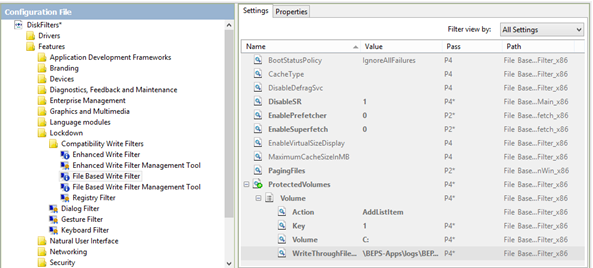

# Windows Embedded Standard I filtri sui dischi e sul registro: FBWF – File Based Write Filter

#### di [Beppe Platania](http://mvp.microsoft.com/it-it/mvp/Beppe%20Platania-4029281) - Microsoft eMVP

#### Blog: <http://beppeplatania.com/it>

#### Riveduto e corretto da: [Gianni Rosa Gallina](http://mvp.microsoft.com/it-it/mvp/Gianni%20Rosa%20Gallina-4034912) - Microsoft eMVP

#### Blog: <http://gianni.rosagallina.com/it>

*Giugno 2014*

Negli articoli precedenti
([Introduzione](embedded-filtri-su-dischi-registro-intro.md)
ed [EWF](embedded-filtri-su-dischi-registro-EWF.md)) ci
siamo interessati ai filtri di scrittura in generale, e all’Enhanced
Write Filter (EWF) più in particolare; in questo ci occuperemo di quello
che va sotto il nome di filtro di scrittura basato su file:
***filtro-FBWF*** (File Based Write Filter).

Il filtro di scrittura di cui ci occupiamo ***filtro-FBWF*** interviene
a livello di file system e può essere applicato su una o su più
partizioni/volumi. Questo ***filtro-FBWF***, a differenza del
***filtro-EWF*** che rende in sola lettura l’intero volume su cui si
applica, prevede di proteggere da scrittura tutto un volume ad eccezione
di una serie di file e/o cartelle configurabili. Inoltre, lavorando a
livello di file system, ci permette di aggiornare selettivamente dei
file protetti nel momento in cui decidiamo che è giusto rendere
definitiva la loro modifica.

Il ***filtro-FBWF*** memorizza tutte le sua configurazioni nel registro
e quindi non ha bisogno d’altro che dell’overlay dove lavorare.
L’overlay è sempre in memoria e la sua dimensione è configurabile, ma
predefinita e, quindi, sia con degli strumenti specifici che
programmaticamente, è possibile sapere quanto di questo overlay viene
davvero utilizzato.

Da un punto di vista pratico si decide quale volume proteggere e quali
cartelle e/o file mantenere fuori da questa protezione in modo che, se
una lettura/scrittura riguarda la parte protetta, il comportamento sarà
uguale a quello che abbiamo riscontrato nel ***filtro-EWF***: la prima
lettura viene effettuata dal volume fisico e da lì in poi, se l’elemento
viene modificato, le altre azioni di scrittura/lettura vengono
effettuate da e sull’overlay, in modo che il dato evolva correttamente,
ma alla fine della sessione di lavoro (al riavvio) tutto ritornerà come
prima. Se invece la lettura/scrittura riguarda la parte esclusa dalla
protezione, il comportamento sarà uguale a quello di un normale accesso
al volume senza protezioni e tutte le modifiche effettuate sull’elemento
coinvolto saranno permanenti.

Vista la modalità di funzionamento, vediamo ora quali sono i punti da
tenere sotto osservazione del ***filtro-FBWF***:
- Può gestire diversi file system: NTFS, FAT32, exFAT;
- Per quanto riguarda NTFS non gestisce la funzionalità di “quota”
(l’assegnazione ad un utente di una porzione definita del disco)
- Non può essere applicato a volumi non formattati in quanto agendo a
livello di file system ha bisogno di questi per essere operativo;
- I file nell’overlay non sono criptati;
- Non è possibile “muovere” file da una parte protetta ad una non protetta
e viceversa;
- Anche se è possibile chiedere l’aggiornamento immediato sul volume
fisico di un file che risiede in una zona protetta (commit), non è
possibile eseguire questa operazione per file cancellati o per nuove
cartelle;
- Quando il filtro è attivo, anche il registro di sistema è protetto da
scrittura (per non proteggere alcuni rami si può utilizzare il ***filtro
sul registro***);
- In ogni momento è possibile conoscere il livello di occupazione della
parte di memoria dedicata all’overlay per poterne gestire le criticità;
- Il ***filtro-FBWF*** è incompatibile ***sullo stesso volume*** con il
***filtro-EWF*** mentre i due tipi di filtro si possono applicare allo
stesso tempo soltanto su volumi diversi.

Tutte le altre opzioni di questa funzionalità, che vedremo più avanti,
servono a “modellare” il funzionamento del ***filtro-FBWF***.

***Prerequisiti di sistema***

Al contrario del ***filtro-EWF***, il ***filtro-FBWF*** non ha
prerequisiti specifici a parte i punti elencati sopra. L’overlay è
sempre in RAM e la lista degli elementi esclusi dalla gestione del
filtro (file e cartelle) è memorizzata nel registry.

***Gli elementi del *filtro-FBWF****

La tecnologia del ***filtro-FBWF*** utilizza un certo numero di elementi
che si occupano, ognuno per il proprio compito, di eseguire tutte le
funzionalità che il filtro prevede: dalla gestione dell’abilitazione e
disabilitazione all’avvio fino alla possibilità di memorizzare i
cambiamenti avvenuti fino ad un certo momento con una chiamata a
sistema.

Il package che contiene tutti questi elementi si chiama: “***File Based
Write Filter***”, nel catalogo è posizionato nel ramo:
Features\\Lockdown\\Compatibility Write Filters\\ e contiene gli
elementi descritti nella seguente tabella:

|  Elemento |     Descrizione|
|---------|-------|
|Fbwf.sys|E’ il driver di sistema del ***filtro-FBWF***. Colui che si occupa di intercettare le richieste di scrittura e lettura dal disco che si sta proteggendo indirizzando la funzione al disco fisico o all’overlay a seconda dei casi dettati dalla lista di esclusione.|
|Fbwfcfg.exe|E’ l’eseguibile che viene lanciato al momento dell’installazione degli elementi del ***filtro-FBWF*** o durante il loro aggiornamento. L’eseguibile si limita a lanciare la corrispondente DLL (fbwfcfg.dll) che gestisce tutte le funzionalità necessarie.|
|Fbwfcfg.dll|I parametri del ***filtro-FBWF***, configurati tramite ICE (= Image Configuration Editor), vengono gestiti da questa DLL in vari momenti della vita del sistema: all’installazione, all’aggiornamento o quando si usa Sysprep per preparare il sistema alla duplicazione.|
|FBwfmgr.exe|Fbwfmgr.exe (FBWF Manager Console Application) è l’applicazione a riga commando che permette di conoscere lo stato del ***filtro-FBWF*** e la sua configurazione attuale. Inoltre, offre una serie di comandi per modificare lo stato del ***filtro-FBWF*** e la sua configurazione (più avanti vedremo la lista dei comandi in dettaglio).|
|Fbwfapi.dll|Fbwfapi.dll (File Based Write Filter API) è la libreria di interfaccia per poter gestire il ***filtro-FBWF*** dall’interno di un applicativo. Tutte le richieste di stato ed i comandi che si possono gestire mediante l’applicativo Fbwfmgr.exe, si possono gestire con delle chiamate (API) verso questa libreria.|

In aggiunta a questi elementi, già dal SP1 di Standard 7 è stato
aggiunto un package (File Based Write Filter Management Tool) per la
gestione a run-time, con un’interfaccia grafica, del ***filtro-FBWF***.
Ne parleremo approfonditamente più avanti.

Nei parametri di configurazione presentati dal configuratore ***ICE***
per questa funzionalità, alcuni sono generici di tutti i filtri sui
dischi:

|Nome|Descrizione|
|-----|---------|
|BootStatusPolicy|Determina, in caso di errori che si dovessero presentare all’avvio o al riavvio del sistema, quali debbano essere visualizzati. Poiché stiamo operando proprio per poter spegnere il dispositivo direttamente interrompendo l’alimentazione, è meglio evitare che, alla ripartenza del sistema, venga visualizzato un qualsiasi messaggio d’errore. I possibili valori sono:  DisplayAllFailures – Visualizza tutti gli errori; IgnoreAllFailures – Non visualizzare errori (***default***); IgnoreBootFailures – Non visualizzare gli errori di avvio del sistema; IgnoreShutdownFailures – Non visualizzare gli errori di chiusura del sistema.|
|DisableDefragSvc|Determina se disabilitare o meno il servizio di deframmentazione disco.  Questo servizio, utile se si sta lavorando con un disco rigido, diventa inutile e dannoso se si sta lavorando con una flash che ha già internamente un sistema di organizzazione delle scritture ottimizzato per la propria natura. I valori possibili sono soltanto: **True**; Disabilita il Servizio (**default**);  **False**; Abilita il Servizio.|
|DisableSR|Determina se disabilitare o meno la memorizzazione dei dati “di ripristino” del sistema.  Nel nostro caso specifico, spesso conviene evitare che il sistema scriva dei dati “di ripristino” sul disco che, protetto dal ***filtro-FBWF***, li scriverebbe di fatto in memoria e al riavvio, se non salvati con un comando specifico, li perderebbe.  0; Abilita la memorizzazione dei dati “di ripristino”; 1; Disabilita la memorizzazione dei dati “di ripristino” (**default**).|
|EnablePrefetcher|La funzionalità di “Prefetch” fa in modo che il sistema cominci a caricare dei dati degli applicativi più utilizzati dall’utente nella sessione prima ancora che questi ne chieda nuovamente il caricamento. Tutto questo velocizza i tempi di risposta percepiti dall’utente nel momento in cui richiede i successivi caricamenti. 0; Disabilita la funzionalità (**default**);  1; Abilita la funzionalità.|
|EnableSuperfetch|La funzionalità di “Superfetch” è una miglioria alla funzionalità di “Prefetch” estendendola oltre la sessione: il sistema memorizza gli applicativi più utilizzati dall’utente e comincia a precaricarli nella prossima sessione prima ancora che l’utente ne chieda il caricamento. Tutto questo velocizza i tempi di risposta percepiti dall’utente nel momento in cui richiede applicativi che aveva utilizzato nelle sessioni precedenti. In caso specifico di utilizzo del ***filtro-FBWF***, questa memorizzazione verrebbe persa al riavvio e quindi in generale la funzionalità è meglio lasciarla disabilitata in modo da non affaticare il sistema con azioni inutili.  0; Disabilita la funzionalità (**default**); 1; Abilita la funzionalità.|
|PagingFiles|Determina il nome ed il posizionamento del file di ***paging*** del sistema. Il file di ***paging*** è il luogo dove il sistema si appoggia quando è in carenza di RAM. Nel nostro caso, dove stiamo utilizzando il ***filtro-FBWF***, utilizzare un ***paging*** potrebbe portare ad un controsenso: il sistema è in carenza di RAM e tenta di scrivere su un ***paging*** file che è su un volume protetto e che quindi scriverebbe su un overlay che è esso stesso in RAM!! Come **default** la funzionalità è disabilitata ed il valore di questo parametro è una stringa vuota.|
  

Altri parametri di configurazione sono specifici del ***filtro-FBWF***:
| Nome                                 | Descrizione                          |
|-----|----|  
|  CacheType|Seleziona come configurare il tipo di allocazione per l’overlay cache del ***filtro-FBWF***. Ecco i valori previsti: Pre-allocated – il ***filtro-FBWF*** alloca subito il valore specificato nella variabile EnableVirtualSizeDisplay; Dynamic – il ***filtro-FBWF*** alloca la memoria dell’overlay dinamicamente; Dynamic Compressed – il ***filtro-FBWF*** alloca la memoria dell’overlay dinamicamente comprimendo i dati. In questo modo si risparmia RAM, ma ci si impiega più tempo.|
|EnableVirtualSizeDisplay|Seleziona la visualizzazione standard delle dimensioni dei dischi protetti da scrittura. Se questo valore è **True** verrà visualizzata la dimensione virtuale del volume, cioè lo spazio di memoria disponibile sull’overlay. Se il valore è **False** verrà visualizzata la dimensione attuale del volume fisico.|
|MaximumCacheSizeInMB|Seleziona la dimensione massima dell’overlay espressa in MB. Ecco i valori dei limiti e del default per le due architetture: **Valore** -  **32-bit** -  **64-bit** Default - 128 -  256  Minimo   - 16 -  16 Massimo -  1024  - 131072|             
|ProtectedVolumes|Elenca la lista dei volumi (partizioni) che devono essere protette dal ***filtro-FBWF***. Se il volume non è presente in questa lista, non potrà essere protetto a “run-time”. Questo è un parametro “complesso” che prevede, per ogni volume inserito, un’ulteriore lista di parametri elencati nella tabella che segue.|
                             
Lista dei parametri per ogni volume configurato nel ***filtro-FBWF***.

| Nome                                 | Descrizione                          |
|------|------|
| Action | Determina come deve essere inizializzato il volume. I possibili valori sono:  **AddListItem** – La configurazione del volume viene aggiunta all’immagine (**default**);  **Modify** – La configurazione del  volume viene aggiornata;   **RemoteListItem** – La  configurazione del volume viene   rimossa.|
| Key | E’ un numero positivo, che parte da 1, per identificare il volume che si vuole proteggere. Ogni Volume deve avere una ***Key*** univoca.  |
| Volume | E’ la lettera del volume su cui applicare il ***filtro-FBWF***.\    I valori possibili sono da C: a Z: |  
| WriteThroughFilesAndFolders | E’ un parametro per configurare la lista dei file e/o delle cartelle che devono essere escluse dalla protezione del volume. Questi file e cartelle vengono direttamente memorizzate sul volume protetto dal ***filtro-FBWF***. Nel compilare questo elenco separate ogni elemento con uno spazio, senza inserire la  lettera del volume. |

Nella figura seguente vediamo come si presenta la configurazione dei
parametri del ***filtro-FBWF*** nel configuratore ICE.

La configurazione del filtro-FBWF a riga comando 
-------------------------------------------------

Fbwfmgr.exe è l’applicativo console che permette di interagire con i
servizi e le configurazioni del ***filtro-FBWF.*** L’applicazione, per
funzionare correttamente, ha bisogno dei privilegi di amministrazione e
si trova nelle cartelle di sistema (%windowsdir%\\system32), quindi è
accessibile da qualsiasi posizione.

Quasi tutti i comandi del ***filtro-FBWF*** hanno bisogno di un riavvio
per diventare operativi.

La sintassi:

> fbwfmgr \[ /? | /help /\[switch\] | /displayconfig |  
/overlaydetail | /enable | /disable | /addvolume \[volumename\] |  
/removevolume \[volumename\] \[1|0\] |  
/addexclusion \[volumename\] \[file or directory path\] |  
/removeexclusion \[volumename\] \[file or directory path\] |  
/setthreshold \[threshold\] | /setcompression \[1|0\] |  
/setpreallocation \[1|0\] | /commit \[volumename\] \[file path\] |  
/restore \[volumename\] \[file path\] | /setsizedisplay \[1|0\] |  
/getvirtualsize \[volumename\] | /getactualsize \[volumename\]  

Vediamo prima i vari parametri in dettaglio:

| Nome parametro                       | Descrizione                          |
|----|----|
| Volumename                           | E’ il nome del volume su cui si opera nel comando e può essere indicato sia come lettera del volume (es: C) sia come nome di un device\  (es: \\Device\\Harddiskvolume) sia con il suo percorso GUID nella forma "\\\\?\\Volume{&lt;GUID&gt;}\\" dove &lt;GUID&gt; identifica il volume\  (es: \\\\?\\Volume{26a21bda-a627-11d7-9931-806e6f6e6963}\\).   Riferirsi al volume utilizzando il GUID è più affidabile perché si  evita di sbagliarsi con  l’abbinamento alle lettere eseguito dal sistema. Per recuperare il GUID del volume (che NON è il nome dell’etichetta del volume) fate  riferimento alla funzione  GetVolumeNameForVolumeMountPoint.    |
| Threshold                            | E’ il valore di soglia dell’overlay e va espresso in megabytes. (es: 192)  
| file or directory path               | E’ il nome del file o della cartella su cui opera il comando (es: \\BEPS-Apps\\logs).             |
| file path                            | E’ il nome del file su cui opera il comando (es: \\BEPS-Apps\\Config.xml).       |
| /? /help                             | Visualizza l’help                    |
| help / \[switch\]                    | Visualizza l’help del comando specificato |

Ora analizziamo i comandi previsti:

| Nome comando                         | Descrizione                          |
|----|----|
| /addexclusion \[volumename\]\  \[file or directory path\]      | Aggiunge un percorso alla lista di  esclusione dei percorsi e dei file per il volume indicato. Questa aggiunta sarà operativa al prossimo riavvio. |
| /addvolume    \[volumename\] | Aggiunge un volume alla lista dei volumi da proteggere.  Questa aggiunta sarà operativa al prossimo riavvio.|
| /commit\   \[volumename\]\  \[file path\] | Aggiorna le modifiche effettuate sul file direttamente sul volume fisico (es: /commit C: \\BEPS-App\\Config.xml) NOTA: Il volume su cui si agisce deve essere uno di quelli protettialtrimenti si otterrà un errore (The system cannot find the drive specified).|
| /disable | Disabilita il filtro di scrittura su tutti i volumi. Questa operazione sarà operativa al prossimo riavvio. |
| /displayconfig | Visualizza tutta la configurazione e lo stato del ***filtro-FBWF***. Ecco cosa viene visualizzato:   Lo stato del filtro – Indica se il  ***filtro-FBWF*** è attualmente abilitato o disabilitato e quale sarà il suo stato al prossimo riavvio;  I volume protetti – Presenta la lista dei volume attualmente protetti e quella attiva al prossimo riavvio;  Compressione – Indica lo stato attuale della compressione della cache e lo stato che avrà al prossimo riavvio.   La soglia – Indica il valore della soglia di attenzione per l'occupazione dell’overlay;   Lista di esclusione – Presenta la lista delle cartelle e dei file attualmente esclusi dalla protezione e quella attiva al prossimo riavvio;  Preallocazione – Indica lo stato attuale della preallocazione della cache e lo stato che avrà al prossimo riavvio. |
| /enable                              | Abilita il filtro di scrittura su tutti i volumi.Questa operazione sarà operativa al prossimo riavvio.                    |
| /getactualsize \[volumename\]        | Visualizza la dimensione attuale del volume.|
| /getvirtualsize \[volumename\]       | Visualizza la dimensione “virtuale” del volume.|
| /overlaydetail                       | Visualizza tutti i dettagli dell’overlay per tutti I volume protetti. Ecco cosa viene visualizzato: Contenuti – I file e le cartelle attualmente contenuti nell’overlay per tutti i volume protetti precisando le dimensioni e gli Handle dei file in uso; Memoria occupata – Il totale della memoria utilizzata dall’overlay.     |
| /removeexclusion \[volumename\]\ \[file or directory path\]      | Toglie un percorso alla lista di  esclusione dei percorsi e dei file  per il volume indicato. Questa aggiunta sarà operativa al prossimo riavvio.                    |
| /removevolume  \[volumename\] \[0/1\] | Toglie un volume alla lista dei volumi da proteggere. Se il secondo parametro è (0) la lista di esclusione dei file e delle cartelle viene mantenuta, altrimenti (1) viene rimossa. Questa aggiunta sarà operativa al  prossimo riavvio. |
| /restore\ \[volumename\]\ \[file path\] | Ripristina i cambiamenti effettuati su un file protetto riprendendolo  direttamente dal volume fisico.  (es: /restore C:\\BEPS-App\\Config.xml)        NOTA: Qualsiasi modifica viene ripristinata, anche la cancellazione.   Il volume su cui si agisce deve essere uno di quelli protetti altrimenti si otterrà un errore (The system cannot find the drive  specified).                          |
| /setcompression   \[0/1\] | Stabilisce se abilitare la  compressione sull’overlay (1) o se disabilitarla (0).  Questa operazione sarà operativa al prossimo riavvio. |
| /setpreallocation  \[0/1\] | Stabilisce se abilitare la  preallocazione della cache (1) o se  disabilitarla (0). Questa operazione sarà operativa al prossimo riavvio.|
| /setsizedisplay  \[0/1\] | Stabilisce come visualizzare la dimensione del volume se “virtuale”  (1) o reale (0). Questa operazione sarà operativa al prossimo riavvio.|
| /setthreshold   \[threshold\] | Stabilisce il valore di soglia  dell’overlay. Il valore della soglia va espresso in megabytes. Questa operazione sarà operativa al  prossimo riavvio.                    |

Tutti questi parametri di configurazione e tutti i comandi che abbiamo
scorso possono essere richiesti anche in forma programmatica: il filtro
mette a disposizione una libreria di comandi C++ (FBWF API) ed una serie
di esempi di programmazione che permettono di utilizzare il
***filtro-FBWF*** dall’interno di un’applicazione con tutti i vantaggi
che questo comporta:

- NON dover chiedere all’utente di effettuare operazioni da riga comando
sul ***filtro-FBWF***;
- Effettuare le richieste nel momento opportuno (dal punto di vista
programmatico) ad esempio per richiedere il salvataggio di un file di
configurazione che abbiamo voluto lasciare “normalmente protetto” e
quindi, con un comando del tipo “/commit C: \\BEPS-App\\config.xml”
possiamo farlo aggiornare dal sistema senza dover togliere il filtro.
- Poter “tracciare” su dei file di log le operazioni fatte in modo da
poter controllare a posteriori ed evitare ogni contestazione.
  

La configurazione del filtro-FBWF ad interfaccia grafica 
---------------------------------------------------------

FbwfMgmt.exe è l’applicativo ad interfaccia grafica che permette di
interagire con i servizi e le configurazioni del ***filtro-FBWF.***
L’applicazione, una volta inserita nella build, viene automaticamente
inserita nella taskbar della shell standard. Per funzionare
correttamente ha bisogno dei privilegi di amministrazione e si trova
nelle cartelle di sistema (%windowsdir%\\system32), quindi è accessibile
da qualsiasi posizione. In molti casi, dopo aver determinato in
laboratorio le modalità di ***filtro-FBWF*** che si vogliono utilizzare
e come automatizzare un minimo queste scelte, è meglio cancellare questi
applicativi che, per la loro semplicità d’uso, potrebbero portare
l’utente finale a compiere operazioni inopportune.

La gestione del filtro-FBWF via interfaccia programmabile (API), Power-Shell e WMI. 
------------------------------------------------------------------------------------

Il ***filtro-FBWF*** fornisce, insieme al Toolkit, tutta la struttura
per un’interfaccia programmabile in grado di configurare e gestire tutte
la caratteristiche del filtro. Durante l’installazione del Toolkit, i
file di supporto per utilizzare queste API vengono posizionati (come
default) in queste cartelle:

>C:\\Program Files (x86)\\Windows Embedded 8 Standard\\Developer
Content\\SDK\\inc\\fbwfapi.h

>C:\\Program Files (x86)\\Windows Embedded 8 Standard\\Developer
Content\\SDK\\x86\\Write Filter\\fbwfapi.lib

>C:\\Program Files (x86)\\Windows Embedded 8 Standard\\Developer
Content\\SDK\\amd64\\Write Filter\\fbwfapi.lib

Prima di utilizzare queste interfacce è bene ricordare che:

- L’interfaccia è offerta soltanto per una programmazione WIN32 in C/C++;
- Le chiamate di questa interfaccia, a run-time, hanno effetto soltanto se
utilizzate da un utente con privilegi di amministratore;
- Molti dei comandi che riguardano il ***filtro-FBWF*** hanno effetto
soltanto dopo un restart del sistema;
- Tutte le configurazioni e i comandi che si possono dare al
***filtro-FBWF*** dall’applicativo a riga comando o da quello grafico,
possono essere gestiti attraverso questa interfaccia programmabile.

  

Rimandiamo l’approfondimento delle definizioni, delle funzioni e della
sintassi dei vari comandi ad un articolo dedicato in cui tratteremo,
oltre a queste API, anche la possibilità di utilizzare comandi
Power-Shell e WMI locali o remoti.

Riepilogando, il ***filtro-FBWF*** protegge uno o più volumi operando in
memoria in cui crea un overlay, che può essere allocato in varie
modalità, e se ne può controllare programmaticamente il consumo mediante
una soglia. Si può sapere sia l’occupazione effettiva del volume
protetto sia la dimensione ancora disponibile dell’overlay. E’ possibile
memorizzare un file che non fa parte della lista di esclusione con un
comando di “commit”, ma questa operazione non può essere eseguita per
un’intera cartella, va fatta per ogni singolo file. E’ possibile
ripristinare un file “protetto” con il contenuto effettivo del volume.
E’ possibile utilizzare il ***filtro-FBWF*** anche in assenza di una
lista di esclusione: in questo caso sarà protetto l’intero volume.
