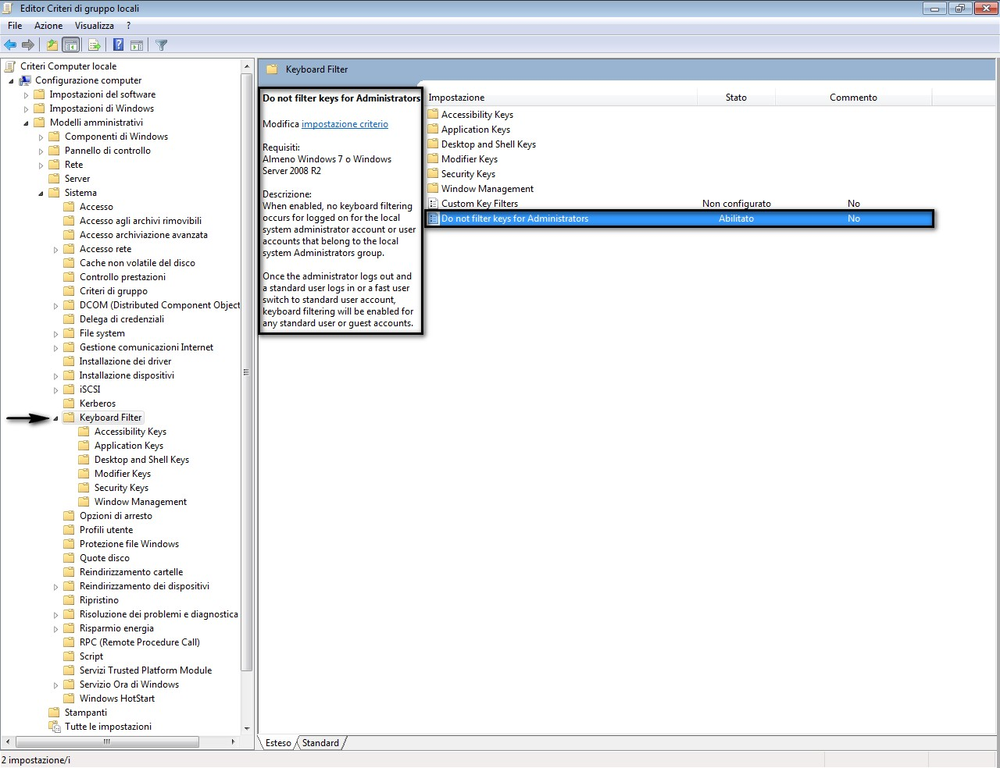
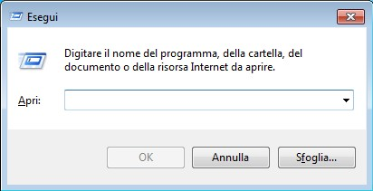
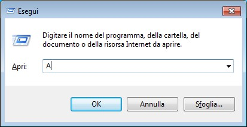
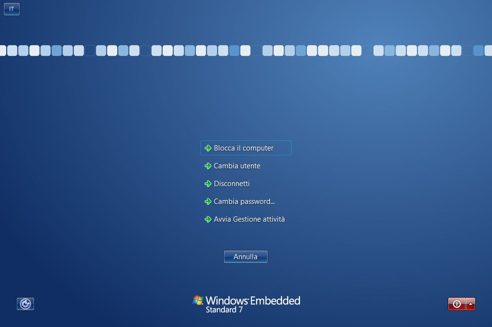
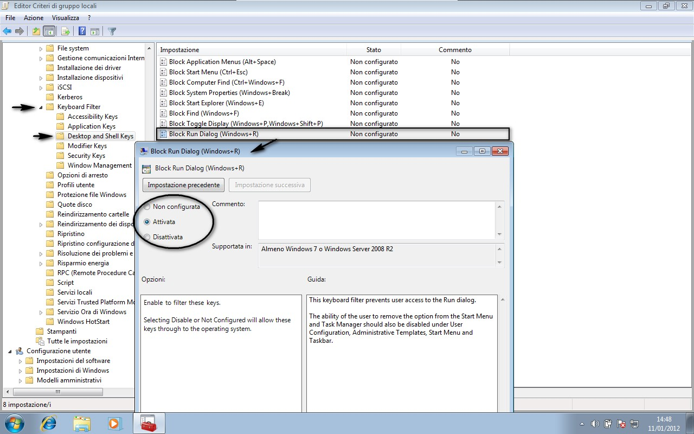

# Windows Embedded Standard 7 SP1: Il filtro per la tastiera

#### di [Beppe Platania](https://mvp.support.microsoft.com/profile=1C0BBF0F-D101-443A-9230-E9D52D2E827A)

Riveduto e corretto da: [Gianni Rosa
Gallina](https://mvp.support.microsoft.com/profile=78547C7F-AA03-4304-88EF-E2CC27B5D683)
e Dorangela Daniele

*Marzo 2012 – corretto Maggio 2012*

L’argomento di cui ci occupiamo è “il filtro per la Tastiera”. Nei
dispositivi Embedded aventi forme proprie e differenti da PC di
scrivania (come, ad esempio, registratori di cassa o chioschi
informativi), il costruttore spesso ha la necessità di trovare soluzioni
proprietarie di tastiera sia per forma e sia per numero e funzionalità
dei tasti. In questo caso spesso si sfrutta la situazione eliminando
fisicamente dalla tastiera tasti potenzialmente pericolosi per la
propria applicazione: il tasto ***Windows*** e/o il tasto ***List***.
Altrettanto spesso però c’è l’esigenza di lasciare l’accessibilità ad
una o più porte USB per svariati utilizzi: manutenzione, aggiornamento o
vere e proprie funzionalità richieste dall’applicazione. Connettendo una
tastiera USB completa alla porta USB si vanificano completamente tutti
gli sforzi di limitare l’uso di combinazioni di tasti non voluti.

Microsoft ha sviluppato quindi questa soluzione che permette di
“filtrare” tutti i tasti e/o le combinazioni di tasti provenienti dalla
tastiera e di far arrivare all’applicativo soltanto quelli previsti.

In questo post e nei due successivi analizzeremo i vari aspetti di
questo package esaminandone le modalità di configurazione e di utilizzo.
In particolare, oltre ad introdurre l’argomento, ci occuperemo di come
inserire il package “Keyboard Filter” nella build di Windows Embedded
Standard 7, della gestione del servizio e delle configurazioni in
generale.

#### Il filtro per la tastiera

Il filtro per la tastiera (*keyboard filter*) è una funzionalità che è
stata introdotta per la prima volta nella distribuzione denominata
Windows Embedded POSReady 7: una versione di Windows Embedded Standard 7
dove la build è stata definita e prodotta direttamente da Microsoft
inserendo i package e gli strati software tipici dell’ambiente POS
(*Point of Services*), cioè per quei dispositivi dove è coinvolta una
transazione economica oppure informativa (ad esempio: distributori di
oggetti, biglietti, materiale di consumo, chioschi informativi, ecc...).

Questa funzionalità permette di configurare le combinazioni di tasti che
non si desidera arrivino al sistema dalla tastiera, ad esempio:
Ctrl+Alt+Canc oppure Windows+L. Queste combinazioni, come tante altre,
possono causare attivazioni di comandi non desiderati su di un
dispositivo dedicato al quale, davanti allo schermo, c’è l'utente finale
e non un tecnico.

Molto spesso i costruttori dei dispositivi embedded progettano soluzioni
con una tastiera personalizzata e priva dei tasti non desiderati come:
Windows, Menu, Alt, ecc... ma poi, durante la fase di produzione si
accorgono che alcune combinazioni sono richieste sia dall’utente finale
sia dalle applicazioni stesse (Ctrl+C, Ctrl+X, Ctrl+V, ecc...), oppure
dalle necessità portate dalla lingua (ad esempio, sulla tastiera
italiana, la “@” si trova sul tasto Alt Gr+ò; se ho tolto dalla tastiera
fisica il tasto Alt Gr non sarò più in grado di inserire quel simbolo).

L’inconsistenza della soluzione fisica diventa palese se si pensa che
molti dispositivi offrono all’utente la possibilità, per svariati
motivi, di avere una porta USB. Diventa banale a questo punto collegare
una tastiera USB alla porta a disposizione e superare tutte le barriere
che pensavamo di aver costruito con una tastiera fisica limitata.

Nelle soluzioni più recenti si è visto un progressivo aumento dei
touch-screen e di tastiere su video che, come quelle fisiche
personalizzate, possono essere limitate ad un insieme ristretto di
caratteri, ma anche qui l’inserimento di una tastiera USB, o di un
applicativo di tastiera completo, vanificherebbe il tutto.

E’ da notare, inoltre, che tutte le tastiere virtuali, sia quelle
interne di Windows che quelle personalizzate, NON vengono “filtrate” da
questa soluzione che è efficace (per scelta architetturale) soltanto per
le tastiere fisiche.

Un altro elemento di attenzione è quello legato alla nazionalità della
tastiera. Il filtro è stato progettato per funzionare sulla tastiera
inglese e quindi tutti i nomi e le sequenze devono essere esplicitate in
inglese.

Il filtro per la tastiera ha già un certo numero di combinazioni
predefinite che possono essere attivate con dei criteri specifici, ma ne
permette la creazione di altre personalizzate e, quindi, copre in
maniera semplice ed efficace tutte le esigenze.

In questo capitolo analizzeremo come inserire nella build i package
opportuni per gestire il filtro di tastiera e come configurarlo per
evitare che l’utente faccia arrivare agli applicativi o al sistema delle
sequenze non desiderate.

#### Inserimento del package “Keyboard Filter” nella build

Al momento l’inserimento è molto semplice e non permette alcuna
configurazione. E’ da notare però che questa nuova funzionalità NON è
contenuta nel SP1, ma è stata rilasciata in seguito (Settembre 2011),
per cui, se non si dovessero trovare gli elementi “Keyboard Filter”
nella sezione delle “Embedded Enabling Features”, bisognerà prima
aggiornare la Distribution Share di lavoro.

#### Il servizio del filtro di tastiera

Il filtro di tastiera si basa su un servizio di Windows denominato
“KeyboardFilter” che può essere avviato o arrestato da un prompt dei
comandi avendo i diritti di amministratore:

Per avviarlo digitare: sc start keyboardfilter

Per arrestarlo digitare: sc stop keyboardfilter

Arrestando il servizio, questo rimarrà nel medesimo stato anche dopo il
successivo riavvio del computer quindi, per riavviarlo, bisognerà
digitare il comando di start manualmente.

#### Configurazione del filtro di tastiera

Per la configurazione del filtro di tastiera bisogna utilizzare il
programma gpedit.msc (Editor dei Criteri di Gruppo***)*** che si trova
nella cartella C:\\Windows\\System32\\. Questo programma fa parte della
console di gestione di Windows (MMC, *Microsoft Management Console*) che
permette di modificare, con la stessa interfaccia utente, sia le
configurazioni che si riferiscono al singolo utente sia quelle che si
riferiscono al sistema. Per utilizzare questa console bisogna avere i
privilegi di amministratore e le configurazioni possono essere
personalizzate per ogni singolo utente. Questo è uno dei motivi per cui
la configurazione, attualmente, va fatta dopo che il sistema è stato
generato.

Possiamo dividere le combinazioni di tasti che si possono intercettare
in due gruppi: quelle predefinite e quelle personalizzate.

#### Configurazione delle combinazioni di tasti predefinite

In questo elenco sono raggruppate le combinazioni di tasti più diffuse,
in modo da semplificarne la configurazione. Queste combinazioni possono
essere divise in:

- Accessibilità (Accessibility keys)
- Applicative (Application keys)
- Scorciatoie del desktop o della shell (*Desktop and shell keys*)
- Modificatori (*Modifier keys*)
- Sicurezza (Security keys)
- Gestione finestre (Windows management keys)

Filtri sulle combinazioni di accessibilità:

|-----|------|------|
|Filtro|Tasti|Descrizione|
|---|-----|-----|
|  Controllo del mouse con i tasti    |              Left Shift+Left Alt+NumLock    ITA:MAIUSC di sinistra+ALT di sinistra+BLOC NUM  |                   Questo filtro blocca l’uso della tastiera per controllare il mouse.|              
| Controllo degli schermi di Windows con i tasti |  Left Shift+Left Alt+Print Screen   ITA:MAIUSC di sinistra+ALT di sinistra+BLOC NUM | Questo filtro blocca l’uso della tastiera per controllare la risoluzione dello schermo e gli schemi di windows.|
| Blocco dell’accesso facilitato con i tasti |      Windows+U    |                                     Questo filtro blocca l’uso della tastiera per abilitare la modalità di accesso facilitato o per configurare la lente d’ingrandimento, i comandi audio, la tastiera a video e tutte le altre funzioni di accesso facilitato. Tutte queste possono comunque essere richiamate dal pannello di controllo.|

Filtri sulle combinazioni applicative:

|----|-----|-----|
|Filtro|Tasti|Descrizione|
|-----|-----|-----------|
|Blocco della chiusura dell’applicazione  | Alt+F4   |    Questo filtro evita che l’applicazione o la finestra si chiuda. Di solito ci sono altri modi per chiuderla: pulsanti OK, ANNULLA, CHIUDI o dal menu a tendina.|
|Blocco della chiusura della finestra  |    Ctrl+F4   |   Questo filtro evita che una “scheda” (ad esempio le schede di Internet Explorer) si chiuda.|
|Blocco dell’aiuto di sistema   |           Windows+F1 |  Questo filtro evita che venga visualizzata la Guida e Supporto di Windows.|

Filtri sulle scorciatoie del desktop e della shell:

|----|----|----|
| Filtro | Tasti | Descrizione |
|----|-----|----|
| Blocco del menu di  ridimensionamento della finestra attiva     | Alt+Space   ITA:ALT+BARRA SPAZIATRICE              | Questo filtro evita che l’utente acceda al menu per ripristinare, ridurre ad icona o chiudere la finestra attiva|
| Blocca il menu di Avvio | Ctrl+Esc | Questo filtro evita che l’utente acceda al menu di Avvio. Questa combinazione produce lo  stesso effetto del  tasto Windows che va bloccato in modo separato (vedi “Blocco del tasto Windows” nella tabella  “Modificatori”).        |
| Blocca la ricerca       | Ctrl+Windows+F          | Questo filtro evita che l’utente acceda automaticamente alla  rete per cercare un  computer o   informazioni.           |
| Blocca l’accesso alle proprietà del sistema       | Windows+Break   ITA:Windows+PAUSA          | Questo filtro evita che  l’utente acceda alle  informazioni del sistema: nome del  computer, workgroup, dominio, ecc... oppure alle configurazioni hardware.               |
| Blocca l’avvio di  Esplora Risorse      | Windows+E | Questo filtro evita che l’utente avvii da tastiera “Esplora Risorse” e quindi      blocca l’accesso   diretto alle risorse     del sistema.            |
| Blocca l’avvio di  ricerche     | Windows+F               | Questo filtro evita che  l’utente avvii da   tastiera ricerche per  informazioni di sistema  o file.|
| Blocca la gestione dei video multipli  | Windows+P  Windows+Shift+P | Questo filtro evita che  l’utente possa gestire  video multipli da       tastiera.|
| Blocca la richiesta di esecuzione applicativi | Windows+R               | Questo filtro evita che  l’utente richiami la finestra ”Esegui”. La   capacità dell’utente di rimuovere quest’opzione dal menu di avvio e da  “Gestione attività Windows” va  disabilitata. Per farlo  bisogna:  - avviare l’editor per la gestione dei criteri di gruppo (gpedit.msc) con  i privilegi di amministratore;  - nel ramo console  spostarsi a questo indirizzo: "Configurazione utente\Modelli amministrativi\Menu Start e barra delle applicazioni"    - nel riquadro dei dettagli abilitare la voce: Rimuovi il menu Esegui dal menu Start.  |

Filtri sui modificatori:

|Filtro|Tasti|Descrizione|
|----|----|-----|
| Blocco del tasto ALT  | Left Alt  Right Alt | Questo filtro disabilita tutte le combinazioni che utilizzano il tasto ALT.| Questo filtro può avere effetti sull’utilizzo delle applicazioni limitando molte scorciatoie (Alt+Tab per passare da un applicativo all’altro, ecc...). Questo filtro blocca anche la combinazione Ctrl+Alt+Canc, che non sarà più disponibile. Per gli utenti italiani, inoltre, sono bloccati anche caratteri essenziali come la chiocciola (@), le parentesi quadre, l’Euro, ecc...|
|Blocco del tasto CTRL     |      Left Ctrl   Right Ctrl    |   Questo filtro disabilita tutte le combinazioni che utilizzano il tasto CTRL.  Questo filtro può avere effetti sull’utilizzo delle applicazioni limitando molte scorciatoie (Ctrl+C = **Copia**, Ctrl+X = **Taglia**, Ctrl+V = **Incolla**, Ctrl+Tab per passare da una finestra all’altra dello stesso applicativo, ecc...). Questo filtro blocca anche la combinazione Ctrl+Alt+Canc che non sarà più disponibile.|
|  Blocco del tasto Menu    |       Menu    |        Questo filtro blocca la visualizzazione del menu di azioni con il tasto Menu.|
|Blocco del tasto di maiuscolo |  Left Shift  Right Shift |    Questo filtro disabilita tutte le combinazioni che utilizzano il tasto Maiuscolo.  Questo filtro può avere effetti sull’utilizzo delle applicazioni limitando l’uso delle maiuscole e dei caratteri che si ottengono normalmente con il tasto Maiuscolo (sulla tastiera italiana molti simboli speciali come !,”,£,\$,%, ecc...) Il tasto di Blocco Maiuscolo (CapsLock) va bloccato separatamente.|
|Blocco del tasto Windows   |     Left Windows  Right Windows  |  Questo filtro disabilita tutte le combinazioni che utilizzano il tasto Windows.|
                                                  

Filtri sulle combinazioni di sicurezza:

|---|----|----|
| Filtro | Tasti | Descrizione |
|---|---|---|
| Blocco del Desktop      | Ctrl+Alt+Del  ITA:Ctrl+Alt+Canc | Questo filtro evita  l’accesso alla finestra di blocco e di logon   del sistema.    Nota: il filtro non è  abilitato all’interno   della finestra di       blocco e di logon del sistema e viene  ri-abilitato dopo che l’utente esegue          l’accesso. |
| Blocco della Gestione attività Windows  | Shift+Ctrl+Esc | Questo filtro evita  l’accesso diretto  dell’utente a “Gestione attività Windows” in  cui può gestire le  applicazioni e i servizi del sistema. “Gestione attività     Windows” essere attivato dalla barra delle applicazioni o dalla  finestra di blocco e     logon. Per rimuovere  queste opzioni bisogna: - avviare l’editor per la  gestione dei criteri di gruppo (gpedit.msc) con i privilegi di amministratore; - nel ramo console spostarsi a questo indirizzo: \Configurazione utente\\Modelli amministrativi\\Sistema\\Opzioni Ctrl+Alt+Canc         **nel riquadro dei  dettagli abilitare la  voce:  Rimuovi Gestione attività**.             |
| Blocco del Log-off      | Windows+L               | Questo filtro evita la  sospensione immediata della sessione con la  visualizzazione della finestra di blocco e di logon del sistema. Quest’opzione si può  bloccare agendo direttamente sui criteri di gruppo di sistema, in questo modo:  - avviare l’editor per la gestione dei criteri di gruppo (gpedit.msc) con i privilegi di amministratore;  - nel ramo console  spostarsi a questo indirizzo:\\Configurazione utente\\Modelli amministrativi\\Sistema\\Opzioni Ctrl+Alt+Canc**.  -  **nel riquadro dei dettagli abilitare la voce: \Rimuovi Blocca computer**. |

Filtri sulle combinazioni di gestione finestre:

|---|----|----|
|Filtro|Tasti|Descrizione|
|---|----|----|
|Blocco del cambio applicativo|Alt+Tab Shift+Alt+Tab|Questo filtro evita che l’utente “giri” tra gli applicativi attivi.|
|Blocco del cambio finestra |                                Ctrl+Tab   Shift+Ctrl+Tab    |              Questo filtro evita che l’utente “giri” tra le finestre di uno stesso applicativo.|
|Blocco delle visualizzazione del Desktop |                  Windows+D        |        Questo filtro evita la visualizzazione immediata del desktop.|
|Blocco della riduzione ad icona di una finestra |           Windows+Down(↓)  |        Questo filtro evita la riduzione ad icona della finestra attiva.|
|Blocco allineamento a sinistra   |                          Windows+Left(←)    |      Questo filtro evita di far allineare la finestra corrente al bordo sinistro dello schermo.|
|Blocco della riduzione ad icona di tutte le finestre    |                                           Windows+M  |              Questo filtro evita la riduzione ad icona di tutte le finestre attive e della visualizzazione del desktop.|
|Blocco allineamento a destra |                              Windows+Right(→)   |      Questo filtro evita di far allineare la finestra corrente al bordo destro dello schermo.|
| Blocco del ripristino dimensione finestra |                 Windows+Shift+Down(↓)  |  Questo filtro evita che la finestra corrente ritorni al suo stato precedente dopo una visualizzazione a schermo intero.|
|Blocco dello spostamento finestra nel monitor a sinistra  | Windows+Shift+Left(←)  |  Questo filtro evita che la finestra attiva sia spostata nel monitor di sinistra (in sistemi con più monitor).|
|Blocco dello spostamento finestra nel monitor a destra   |  Windows+Shift+Right(→)  | Questo filtro evita che la finestra attiva sia spostata nel monitor di destra (in sistemi con più monitor).|
|Blocco ingrandimento verticale finestra  |                  Windows+Shift+Up(↑)  |    Questo filtro evita che la finestra corrente sia ingrandita verticalmente per tutta l’altezza dello schermo.|
|Blocco del cambio applicativi con Aero Flip3D  |            Windows+Tab   Shift+Windows+Tab  |          Questo filtro evita che l’utente “giri” tra gli applicativi attivi utilizzando la funzionalità di Aero Flip 3D.|
|Blocco ingrandimento finestra  |                            Windows+Up(↑)   |         Questo filtro evita che la finestra corrente sia ingrandita a tutto schermo.|

Filtri non catalogati:
|---|----|
|Blocco dei filtri per l’amministratore|Questo filtro va abilitato per fare in modo che tutti i filtri precedenti vangano soltanto per utenti “NON Amministratori”.|
|----|----|

L’ultima configurazione riportata è molto interessante perché si
riferisce alla possibilità di disabilitare tutti i filtri di tastiera
quando l’utente che si è “loggato” è un amministratore. Quando
l’amministratore si disconnette, i filtri vengono riabilitati. La
configurazione avviene nello stesso modo delle configurazioni
precedenti:

Ogni filtro sulle combinazioni predefinite può avere uno di questi tre
valori:

- **Non configurata** (stato di default): il Registro di sistema non
    viene modificato;
-  **Attivata**: nel Registro di sistema viene indicato che
    l'impostazione dei criteri è selezionata;
-    **Disattivata**: nel Registro di sistema viene indicato che
    l'impostazione dei criteri non è selezionata.

Ecco i passi necessari per la configurazione:

- avviare l’editor per la gestione dei Criteri di gruppo (gpedit.msc)
    con i privilegi di amministratore selezionando dal menu **Avvio** la
    voce **Esegui…** e digitando gpedit.msc;

- nel ramo console spostarsi a questo indirizzo: **Configurazione
    computer\\Modelli amministrativi\\Sistema\\Keyboard Filter**;

- nel riquadro dei dettagli selezionare il filtro d’interesse e
    selezionare il menu **Edit** utilizzando il tasto destro del mouse;

- impostare lo stato del filtro scegliendo tra le opzioni **Non
    configurata**, **Attivata** or **Disattivata**.

- Opzionalmente si può aggiungere una descrizione esplicativa
    nell’apposita casella di **Commento**;

- premere **OK** per salvare i cambiamenti effettuati.

    
#### Configurare le combinazioni di tasti predefinite

Avviare l’editor per la gestione dei Criteri di gruppo (gpedit.msc) con
i privilegi di amministratore e selezionare il **Keyboard Filter**.
Scegliere le combinazioni di tasti che si desidera bloccare. In questo
esempio, vengono bloccate le seguenti combinazioni: **Ctrl+Alt+Canc**,
**Windows+R**, e il tasto **Maiusc**.

Verificare che le combinazioni di tasti sopra citate funzionino
correttamente.

Premere **Windows+R**.\
Dovrebbe apparire la finestra di dialogo **Esegui…**.

Nella finestra di dialogo **Esegui…**, premere la combinazione di tasti
**Maiusc+A**.\
Apparirà una A maiuscola.

Infine, premere **Ctrl+Alt+Canc**.\
Dovrebbe apparire la schermata con le opzioni per il blocco del
computer, il cambio degli utenti, e così via..

Premere il tasto **Esc** per tornare al proprio desktop e chiudere la
finestra di dialogo Esegui...

Le combinazioni di tasti predefinite sono raggruppate in categorie.
All’interno della cartella **Security Keys**, selezionare il Block
Secure Desktop (Ctrl+Alt+Del).

Per abilitare il blocco per questa combinazione, fare doppio clic sulle
impostazioni.

Selezionare l’opzione Attivata in alto a sinistra nella finestra di
dialogo, e premere OK.

    **Nota:** L’opzione ***Attivata*** blocca la combinazione di tasti.
    Si abilita il filtro, non permettendo la combinazione dei tasti.

Nel riquadro a sinistra, selezionare Keyboard Filter.

Selezionare Desktop and Shell Keys.

Selezionare Block Run Dialog (Windows+R).

Fare doppio clic, selezionare Attivata e premere OK.

Nel riquadro a sinistra, selezionare nuovamente Keyboard Filter.

Selezionare Modifier Keys.

Fare doppio clic su Block Shift Keys.

Selezionare Attivata e premere OK.

Attendere almeno cinque secondi dal momento in cui si preme sul pulsante
**Applica** o **OK**.

L’editor per la gestione dei Criteri di gruppo (gpedit.msc) può
richiedere più tempo per salvare le impostazioni, soprattutto su
hardware più lento o su sistemi in domini.

>**Nota:** viene registrato un evento nel visualizzatore di eventi
    nel momento in cui il filtro di tastiera carica le nuove
    impostazioni e diventa attivo.

Verificare le combinazioni di tasti appena configurate.

Se tutto ha funzionato, dovrebbero essere disabilitate:
**Ctrl+Alt+Canc** non dovrebbe far apparire la schermata con le opzioni
per il blocco del computer, il cambio degli utenti, e così via...
**Windows+R** non dovrebbe far apparire la finestra di dialogo
**Esegui**. Qualsiasi combinazione di tasti con il tasto **Maiusc** non
dovrebbe funzionare; la lettera maiuscola è un ottimo esempio per
provare che questo non funzioni.

> **Nota:** i filtri sulla tastiera vengono disabilitati nella
    finestra di logon di Windows. Se provate ad uscire dalla
    sessione (log-off) potrete verificare che Maiusc+A farà comparire
    una A maiuscola nel campo password. Questa disabilitazione del
    filtro sulla tastiera garantisce che sia un “utente” e sia un
    “Amministratore” possano entrare in sessione (log-on) senza problemi
    di filtri.

#### Configurazione di filtri personalizzati

La parte di personalizzazione dei filtri permette la creazione di
combinazioni di tasti non incluse in quelle predefinite.

Per codificare i filtri bisogna attenersi ad un certo numero di regole e
limitazioni, ma iniziamo con un paio di definizioni che ci serviranno in
seguito:

- per “tasti modificatori” intendiamo quelli che sono usati in
    combinazione con altri tasti: Ctrl, Alt, Maiusc (Shift) e Windows.
    Per tutti si possono specificare se sono sinistri o destri: LCtrl,
    RCtrl, LAlt, RAlt, LShift, RShift, LWindows e RWindows;

- i filtri devono essere espressi con una combinazione che contiene da
    zero a più tasti modificatori e da un carattere, un numero, un tasto
    cursore delimitato dal simbolo più.

Ecco alcune note cui attenersi:

- I tasti modificatori non possono essere bloccati da soli (per far
    questo si possono utilizzare i filtri predefiniti);

- Per generare dei filtri per una lettera maiuscola
    selezionare Shift+&lt;lettera&gt;. Per esempio se si filtra il tasto
    Z si ottiene soltanto il blocco della z minuscola per bloccare la
    maiuscola bisogna filtrare per Shift+Z.

- Per filtrare un numero bisognerà filtrare *anche* il tasto del
    tastierino numerico. Per esempio se si vuole bloccare il tasto 8,
    bisogna anche filtrare il tasto Up (Freccia su). In questo momento
    quindi NON si può filtrare il numero 5 del tastierino numerico.

- Se si filtrano i tasti del tastierino numerico (Up, Down, Left,
    Right, Home, End, Page Up, Page Down), i tasti saranno bloccati
    anche per i numeri corrispondenti. I numeri della riga sopra le
    lettere continueranno invece a funzionare regolarmente.

- Si possono filtrare tutti i tasti funzione da F1 a F24 e i tasti
    CapsLock, PrintScrn, ScrollLock, Break, Tab, Space, Esc e Backspace.
    Non bisogna mettere spazi nei nomi che, tuttavia, possono essere
    scritti indifferentemente maiuscoli e minuscoli.

- Si possono filtrare i tasti: Up, Down, Left e Right (le frecce di
    spostamento); PageUp, PageDown, Insert, Delete, Home ed End. Non
    bisogna mettere spazi nei nomi che, tuttavia, possono essere scritti
    indifferentemente maiuscoli e minuscoli.

- Quando si crea un filtro per le frecce di spostamento: Up, Down,
    Left, Right, e così via è bene ricordarsi di filtrare anche le
    combinazioni con lo Shift per evitare che la combinazione Shift+Up
    (ad esempio) vanifichi il filtro su Up.
  

Ecco alcuni esempi di filtri personalizzati:

- Windows+L
- LWindows+L
- Ctrl+Break
- Shift+Ctrl+Esc
- Ctrl+C
- Ctrl+Enter

#### Configurazione di filtri personalizzati utilizzando l’editor per la gestione dei Criteri di Gruppo

Ecco i passi necessari per la configurazione:

1.  avviare l’editor per la gestione dei Criteri di Gruppo (gpedit.msc)
    con i privilegi di amministratore selezionando dal menu **Avvio** la
    voce **Esegui…** e digitando gpedit.msc;

2.  nel ramo console spostarsi a questo indirizzo:\
    **Configurazione computer\\Modelli Amministrativi\\Sistema\\Keyboard
    Filter**;

3.  nel riquadro dei dettagli selezionare **Custom Key Filters** e
    selezionare il menu **Modifica** utilizzando il tasto destro del
    mouse;

4.  impostare lo stato del filtro scegliendo **Attivata**.

5.  Nel riquadro **Opzioni**, premere il pulsante **Mostra**

6.  Nella finestra di dialogo **Mostra contenuto**, nella colonna
    **Valore**, aggiungere un nuovo filtro o modificarne uno esistente
    utilizzando il formato specificato in precedenza in questo capitolo.

7.  Premere **OK** per salvare il filtro e chiudere la finestra **Mostra
    contenuto**.

8.  Opzionalmente si può aggiungere una descrizione esplicativa
    nell’apposita casella di **Commento**;

Configurazione dei filtri per tastiere “non inglesi”

I filtri personalizzati di cui abbiamo parlato nel paragrafo precedente,
si riferiscono ai “nomi” dei tasti riguardanti la tastiera inglese (anzi
più correttamente a quella en-US). Quando ci si vuol riferire a tastiere
nazionali (nel caso nostro “italiana”) bisognerà comunque riferirsi ai
nomi di quella inglese. Come riferimento riportiamo la corrispondenza
dei tasti con i relativi nomi e raggruppamenti.

>**Nota**: Alcuni “Nomi Inglesi” di tasti (contrassegnati con (\*) ),
    non hanno una vera e propria traduzione in italiano e quindi sono
    stati lasciati in inglese

Tasti modificatori (*Modifier Keys*):

|  Tasto virtuale    |    Nome inglese    |  Nome italiano|
|---------------------|-----------------|-----------------------------|
|VK\_LWIN|LWin, LWindows|Tasto Windows di sinistra|
|VK\_RWIN|RWin, RWindows|Tasto Windows di destra|
|VK\_LSHIFT|LShift|Tasto Maiuscolo di sinistra|
|VK\_RSHIFT|RShift|Tasto Maiuscolo di destra|
|VK\_LCONTROL|LControl, LCtrl|Tasto Control di sinistra|
|VK\_RCONTROL|RControl, RCtrl  | Tasto Control di destra|
|VK\_LMENU|LAlt|Tasto Alt di sinistra|
|VK\_RMENU|RAlt|Tasto Alt di destra|
|LWin +Rwin|Win, Windows|Tasto Windows|
|LShift + Rshift|Shift|Tasto Maiuscolo|
|LControl + Rcontrol|Control, Ctrl|Tasto Control|
|LAlt + Ralt|Alt|Tasto Alt|

Tasti di sistema (*System Keys*):

|  Tasto virtuale |  Nome inglese   |    Nome italiano|
|----------------|------------------ |-------------------|
|VK\_PRIOR|PageUp, PgUp|Pag ↑|
|VK\_NEXT|PageDown, PgDown |  Pag ↓|
|VK\_END    |      End       |         Fine|
|VK\_HOME   |      Home       |        ↖|
|VK\_LEFT    |     Left       |        ←|
|VK\_UP     |      Up        |         ↑|
|VK\_RIGHT    |    Right     |         →|
|VK\_DOWN    |     Down        |       ↓|
|VK\_INSERT  |     Insert      |       Insert|
|VK\_DELETE  |     Delete, Del    |    Canc|
|VK\_MULTIPLY  |   Multiply   |        \*|
|VK\_ADD    |      Add        |        +|
|VK\_SEPARATOR  |  Separator    |      VK\_SEPARATOR(\*)|
|VK\_SUBTRACT  |   Subtract   |        -|
VK\_DECIMAL    |  Decimal       |     .|
|VK\_DIVIDE  |     Divide  |           /|

Tasti di sistema meno usati (*Less common System Keys*):

| Tasto virtuale |  Nome inglese   |          Nome italiano|
|---------------- |------------------------ |---------------|
|VK\_SELECT   |    Select   |                Select (\*)|
|VK\_PRINT  |      PrintScreen, PrintScrn |  Stamp|
|VK\_EXECUTE |     Execute|                  Execute (\*)|
|VK\_SNAPSHOT  |   Snapshot |                Snapshot (\*)|
|VK\_HELP|Help|Help (\*)|
|VK\_SLEEP|Sleep|Sleep (\*)|

Tasti funzione (*Function Keys*):

|Tasto virtuale|Nome inglese|Nome italiano|
|--------------------| --------------| ---------------|
|VK\_F1 ....VK\_F24 | F1 ... F24 |    F1 ...F24|

Tasti di stato (*State Keys*):

|Tasto virtuale|Nome inglese|Nome |
|---------------- |-------------- |---------------------------|
|VK\_SCROLL|ScrollLock|Bloc Scorr|
|VK\_CAPITAL  |    CapsLock  |     Tasto di blocco maiuscolo|

Tasti nazionalizzati - dipendono dalla tastiera e dalla nazionalità
(*OEM Keys*):

|Tasto virtuale    |     Nome inglese  |                                      Nome italiano|
|---------------------- |--------------------------------------------------- |----------------------------------------------------|
|VK\_OEM\_NEC\_EQUAL  |  KeypadEqual   |                                      = del tastierino numerico|
|VK\_OEM\_FJ\_JISHO|Dictionary  |                                        Dictionary|
|VK\_OEM\_FJ\_MASSHOU  | Unregister  |                                        Unregister|
|VK\_OEM\_FJ\_TOUROKU  | Register   |                                         Register|
|VK\_OEM\_FJ\_LOYA   |   LeftOyayubi |                                        LeftOyayubi|
|VK\_OEM\_FJ\_ROYA |     RightOyayubi   |                                     RightOyayubi|
|VK\_OEM\_PLUS    |      OemPlus   |                                          + (più) alternativo|
|VK\_OEM\_COMMA   |      OemComma     |                                       , (virgola) alternativo|
|VK\_OEM\_MINUS    |     OemMinus   |                                         - (meno) alternativo|
|VK\_OEM\_PERIOD   |     OemPeriod      |                                     . (punto) alternativo|
|VK\_OEM\_1     |        Oem1 (represented as “;:”)       |                   “;:”|
|VK\_OEM\_2    |         Oem2 (represented as “/?”)           |               “/?”|
|VK\_OEM\_3    |         Oem3 (represented as “\`\~”)     |                   “\`\~”|
|VK\_OEM\_4    |         Oem4 (represented as “\[{“)     |                    “\[{“|
|VK\_OEM\_5  |           Oem5 (represented as “\\|”)    |                     “\\|”|
|VK\_OEM\_6    |         Oem6 (represented as “)}”)        |                  “)}”|
|VK\_OEM\_7   |          Oem7 (represented as ‘”)          |                  ‘”|
|VK\_OEM\_8      |       Oem8   |                                             Oem8|
|VK\_OEM\_AX      |      OemAX (AX on Japanese AX keyboard)     |             Idem|
|VK\_OEM\_102     |      Oem102 “&lt;&gt;” or “\\|” on RT 102-key keyboard |  “&lt;&gt;” oppure “\\|” sulla tastiera a 102 tasti|

Tasti non gestibili (*Unsupported Keys*): questi tasti potrebbero
esistere sulle tastiere, ma non possono essere filtrati.

Tasti di sistema (*System Keys*):

|Tasto virtuale  | Nome inglese |  Nome italiano|
|---------------- |-------------- |--------------------------|
|Fn|Function Key |  Seleziona tasto funzione|

Tasti di navigazione (*Browser Keys*):

|Tasto virtuale|Nome inglese|Nome italiano|
|--------------------------- |------------------ |-------------------------|
|VK\_BROWSER\_BACK   |        BrowserBack  |      Indietro nel browser|
|VK\_BROWSER\_FORWARD   |     BrowserForward  |   Avanti nel browser|
|VK\_BROWSER\_REFRESH  |      BrowserRefresh |    Refresh della pagina|
|VK\_BROWSER\_STOP   |        BrowserStop    |    Stop del browser|
|VK\_BROWSER\_SEARCH   |      BrowserSearch  |    Ricerca nel browser|
|VK\_BROWSER\_FAVORITES   |   BrowserFavorites  | Favoriti nel browser|
|VK\_BROWSER\_HOME    |       BrowserHome  |      Home del browser|
|VK\_VOLUME\_MUTE    |        MediaMute |         Volume a zero|
|VK\_VOLUME\_DOWN    |        MediaDown    |      Diminuisci il Volume|
|VK\_VOLUME\_UP    |          MediaUp   |         Aumenta il Volume|
|VK\_MEDIA\_NEXT\_TRACK   |   MediaNext       |   Avanza di una traccia|
|VK\_MEDIA\_PREV\_TRACK   |   MediaPrevious    |  Indietro di una traccia|
|VK\_MEDIA\_STOP  |           MediaStop |         Ferma la riproduzione|
|VK\_MEDIA\_PLAY\_PAUSE  |    MediaPlay  |        Metti in pausa|
|VK\_LAUNCH\_MAIL   |         LaunchMail   |      Avvia una Mail|
|VK\_LAUNCH\_MEDIA\_SELECT   |LaunchMedia  |      LaunchMedia (\*)|
|VK\_LAUNCH\_APP1   |         LaunchApp1   |      Avvia l’applicazione 1|
|VK\_LAUNCH\_APP2     |       LaunchApp2  |       Avvia l’applicazione 1|

Tasti addizionali (A*dditional Keys*):

|Tasto virtuale  | Nome inglese   |Nome italiano|
|---------------- |-------------- |-------------------|
|VK\_ICO\_HELP  |  IcoHelp  |      Tasto di Aiuto|
|VK\_ICO\_00   |   Ico00     |     Tasto doppio zero|
|VK\_ATTN    |     Attn     |      Attn (\*)|
|VK\_CRSEL     |   CrSel     |     CrSel (\*)|
|VK\_EXSEL     |   Exsel        |  Exsel (\*)|
|VK\_EREOF     |   Ereof     |     Ereof (\*)|
|VK\_PLAY      |   Play        |   Play (\*)|
|VK\_ZOOM   |      Zoom     |      Zoom (\*)|
|VK\_PA1    |      Pa1   |         Pa1 (\*)|
|VK\_OEM\_CLEAR |  OemClear  |    OemClear (\*)|

Tasti internazionali (*International Keys*):

|Tasto virtuale |  Nome inglese  | Nome italiano|
|----------------| -------------- |---------------|
| VK\_KANA   |      Kana      |     Kana|
|VK\_HANGUL   |    Hangul      |   Hangul|
|VK\_JUNJA     |   Junja       |   Junja|
|VK\_FINAL    |    Final      |    Final|
|VK\_HANJA    |    Hanja      |    Hanja|
|VK\_KANJI     |   Kanji      |    Kanji|

Filtri di tastiera e tastiera a video

La tastiera a video di sistema (*On Screen Keyboard*) visualizza una
versione del tutto simile a quella fisica della nazione corrente, dove i
tasti possono essere selezionati con il mouse o altri dispositivi di
puntamento (o con le dita in caso di schermi touch). *La tastiera a
video NON viene bloccata dai filtri*.

I filtri di tastiera hanno effetto soltanto sulle tastiere fisiche e
quindi tutte le soluzioni software che gestiscono l’input di “tasti”
virtuali (utilizzando chiamate al sistema) non possono essere bloccate
in questo modo.

------------------

Questo articolo è stato scritto, curato nei particolari oltre che da me
anche da due miei colleghi (entrambi Trainer Certificati Microsoft per
Windows Embedded Standard 7): Gianni Rosa Gallina
([blog](http://giannishub.cloudapp.net/)) e Dorangela Daniele.

Per ulteriori informazioni potete riferirVi a questo collegamento (in
inglese):

<http://msdn.microsoft.com/en-us/library/ff794908(v=WinEmbedded.60).aspx>

#### di Beppe Platania ([blog](http://beppeplatania.cloudapp.net/)) – Microsoft MVP

