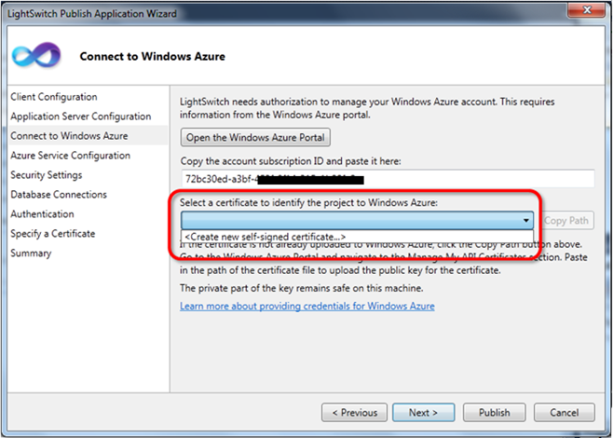
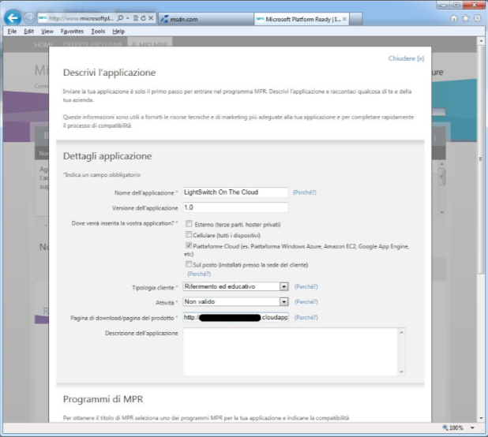
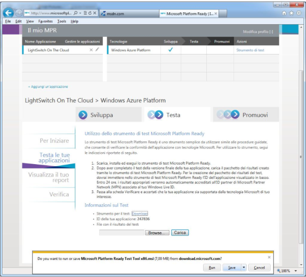
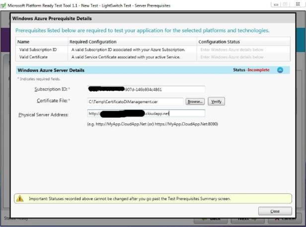
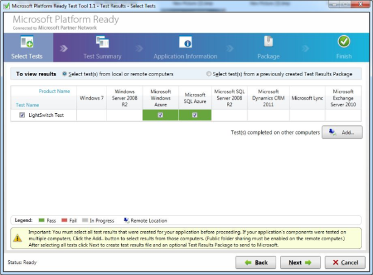
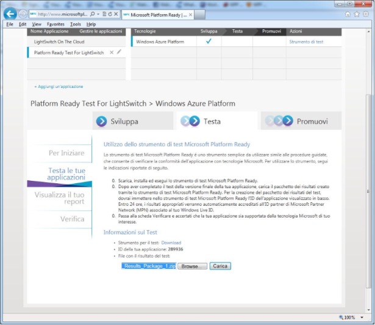
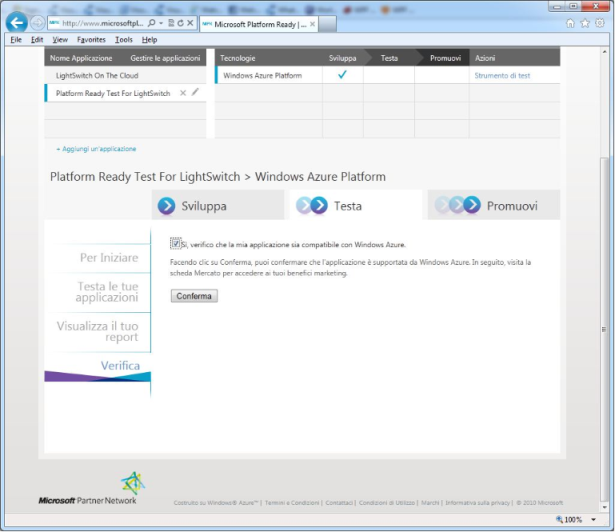
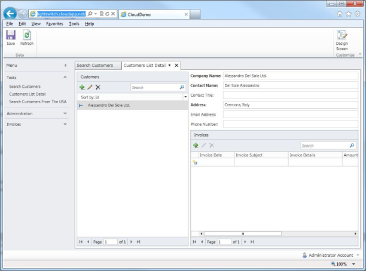

#### di [*Alessandro Del Sole*](https://mvp.support.microsoft.com/profile/Alessandro.Del%20Sole) – Microsoft MVP

1.  {width="0.59375in" height="0.9375in"}

*Aprile, 2012*

#### Premessa

Alcuni dei concetti base di Microsoft Platform Ready per la
certificazione di applicazioni basate su Windows Azure sono chiaramente
spiegati in [questo
post](http://blogs.msdn.com/b/mariofontana/archive/2011/05/02/come-ottenere-gratuitamente-il-logo-powered-by-windows-azure.aspx)
di Mario Fontana. Se non siete familiari con questi concetti ve ne
consiglio la lettura.

#### La certificazione

Come saprete, anche le applicazioni LightSwitch possono essere
pubblicate su Windows Azure, nel qual caso andranno a utilizzare
database su SQL Azure. Il programma MPR prevede la certificazione di
applicazioni che usano entrambe le tecnologie, quindi è possibile
certificare le proprie applicazioni LightSwitch per il cloud.

Proviamo quindi a spiegare come si fa. Innanzitutto si crea una
qualunque applicazione LightSwitch che abbia almeno una tabella, sia
essa creata da zero o a partire da un database esistente, e almeno uno
Screen. Ricordate che se decidete di usare il framework di sicurezza in
LightSwitch, per Azure dovete necessariamente abilitare l'autenticazione
Forms.

Chiaramente dovete avere una sottoscrizione Windows Azure. Prima di fare
il deploy, riguardate nel post di Mario le istruzioni per generare un
certificato digitale di test e completate direttamente anche
l'operazione di caricamento del certificato nel portale di gestione di
Azure. E' fondamentale.

Supponiamo ora che l'applicazione LightSwitch sia completata e pronta
per il deploy su Azure. Se non l'avete mai fatto, in questo
[post](http://blogs.msdn.com/b/lightswitch/archive/2011/03/18/step-by-step-how-to-publish-to-windows-azure-andy-kung.aspx)
di Andy Kung il tutto è spiegato step-by-step.

**Attenzione però**: nel post (dal quale riprendo la seguente figura) vi
viene detto di utilizzare lo strumento di auto-generazione del
certificato in LightSwitch, che va bene per altri contesti ma non per
MPR. In sostanza qui:

1.  {width="6.4in"
    height="4.571428258967629in"}

Troverete anche il certificato che avrete precedentemente caricato sul
portale, quello creato attraverso le istruzioni mostrate nel blog di
Mario Fontana e sarà questo certificato che andrete a selezionare. Se
tutto va a buon fine, l'applicazione pubblicata si poggerà su Windows
Azure per l'hosting dei servizi e su SQL Azure come database, di
conseguenza dovremo testare l'applicazione affinché venga certificata
per l'utilizzo di queste due tecnologie.

Una volta che l'applicazione è pubblicata su Azure, possiamo passare
alla certificazione. Una volta loggati al sito Platform Ready col
proprio Live ID, è necessario creare un test, specificando i dettagli
dell'applicazione. Nel caso di un'applicazione LightSwitch che va su
Azure, va indicato il nome, la piattaforma di hosting di cui fa uso,
tipologia di cliente e attività, URL del prodotto. Nel caso di
quest'ultimo requisito, è sufficiente specificare l'URL su cui è
pubblicata l'applicazione LightSwitch che, nel caso di Azure, avrà la
forma: http://miaapplicazione.cloudapp.net. Esempio:

1.  {width="6.410714129483814in"
    height="5.777420166229222in"}

Andando avanti nel portale, si va nella scheda Test e dapprima si prende
nota dell'ID dell'applicazione (ci servirà dopo) e poi si scarica il
client per eseguire il test vero e proprio:

1.  {width="6.48in" height="5.88in"}

Una volta installato il client, si clicca su Start New Test:

1.  {width="6.4in" height="4.71in"}

Indicheremo quindi un nome per il test, a piacimento, e le tecnologie
che la nostra applicazione usa e per le quali dev'essere certificata;
quindi, nel caso di LightSwitch, Windows Azure e SQL Azure:

1.  {width="6.4in" height="4.73in"}

Dovremo a questo punto indicare i dettagli per la connessione ai nostri
account Windows Azure & SQL Azure. Nel primo caso:

1.  {width="6.4in" height="4.76in"}

Dovremo in sostanza indicare l'ID del nostro abbonamento, il file del
certificato che abbiamo creato in precedenza e che dev'essere lo stesso
caricato sul portale di Management di Azure, infine l'URL
dell'applicazione da certificare. Per quanto riguarda SQL Azure, dovremo
invece indicare l'indirizzo del server e le credenziali di accesso:

1.  {width="6.4in" height="4.7in"}

Se in entrambi i passaggi abbiamo indicato i parametri corretti,
entrambi i test di connessione avranno successo (diversamente dovremo
correggere i dati immessi):

1.  {width="6.4in" height="4.7in"}

Le due schermate successive le salto, poiché ci chiederanno conferma del
fatto che l'applicazione è in esecuzione e che sta usando tutte le
caratteristiche da certificare. Al termine viene generato un primo
report in HTML del quale è mostrato il nome:

1.  {width="6.4in" height="4.74in"}

Facendo click su Show il report viene mostrato nel programma predefinito
per visualizzare pagine Web:

1.  {width="6.4in" height="5.71in"}

Non finisce qui, però. Bisogna andare alla schermata principale e
cliccare su Reports. Questo al fine di generare un pacchetto da caricare
in MPR per ottenere il logo. Selezioneremo il test creato all'inizio,
del quale verrà mostrato un riepilogo:

1.  {width="6.4in" height="4.71in"}

La schermata successiva mostra un ulteriore riepilogo, quella ancora
successiva richiede l'inserimento del nome dell'applicazione e della sua
versione:

1.  {width="6.4in" height="4.72in"}

La schermata successiva è fondamentale, poiché indicheremo il nome del
pacchetto contenente i risultati del test e il numero identificativo
dell'applicazione così come ci è stato fornito all'inizio nel portale
MPR, unitamente ad altri dati di contatto e l'assenso al contratto d'uso
del logo:

1.  {width="6.4in" height="4.73in"}

Al termine, un'ultima schermata riepilogativa ci avviserà della
generazione completata del pacchetto. Ma non ci interessa, almeno in
questa fase, visualizzarlo. Infatti l'importante è tornare al portale
MPR e, nella pagina dei Test, fare l'upload del package:

1.  {width="6.4in" height="5.53in"}

Se l'analisi dà esito positivo, veniamo giustamente avvisati:

1.  {width="6.4in" height="5.53in"}

A questo punto cliccheremo sulla scheda Verifica e accetteremo la
conferma di aderenza ai requisiti:

1.  {width="6.4in" height="5.53in"}

Successivamente alla conferma sarà possibile scaricare il logo "Powered
by Windows Azure", che potrete utilizzare nella vostra applicazione
LightSwitch.

Come esempio, questa è l'applicazione di prova che ho certificato:

1.  {width="6.4in" height="4.74in"}

#### di [*Alessandro Del Sole*](https://mvp.support.microsoft.com/profile/Alessandro.Del%20Sole) - Microsoft MVP

1.  [*Altri articoli di Alessandro Del Sole nella
    Libreria*](http://sxp.microsoft.com/feeds/3.0/msdntn/TA_MSDN_ITA?contenttype=Article&author=Alessandro%20Del%20Sole)
    {width="0.1771084864391951in"
    height="0.1771084864391951in"}

