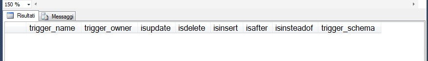
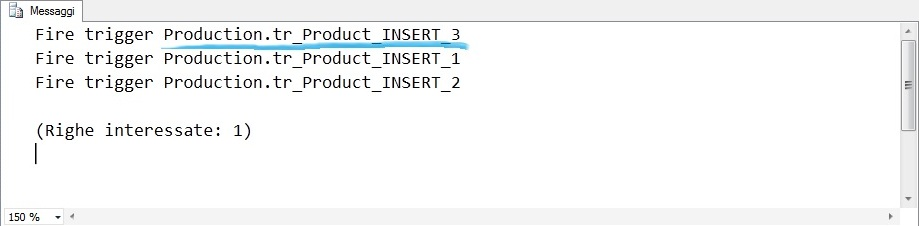

#### di Sergio Govoni – Microsoft MVP ([Blog](http://community.ugiss.org/blogs/sgovoni) / [MVP Profile](http://mvp.microsoft.com/profiles/Sergio.Govoni))

1.  {width="0.5938331146106737in"
    height="0.9376312335958005in"}

*Agosto, 2012*

Introduzione
------------

In SQL Server non c’è un limite massimo di Trigger che possono essere
definiti su una tabella; l’unico limite esistente è rappresentato dalla
somma di tutti gli oggetti che possono essere creati per database,
ovvero la somma di tutte le Table, View, Stored Procedure, User-Defined
Function, Trigger, Rule, Default e Constraint non deve superare il
valore di 2.147.483.647 (massimo valore rappresentabile dal tipo di dato
Integer), com’è specificato in una nota riportata sui books on-line a
[questo link](http://msdn.microsoft.com/en-us/library/ms143432.aspx).

Per ogni tabella potremo quindi definire molteplici oggetti Trigger,
attivi per la stessa tipologia di comando, ovvero per l’INSERT, l’UPDATE
o il DELETE… in uno scenario di questo tipo, vi siete mai chiesti quale
fosse l’ordine di attivazione di tali Trigger? E’ possibile garantire un
particolare ordine di attivazione?

Primi e Ultimi Trigger
----------------------

Ipotizziamo di utilizzare il database di esempio
[AdventureWorks2012](http://msftdbprodsamples.codeplex.com/releases/view/55330).

La tabella Production.Product, al momento, non ha oggetti Trigger, lo
verifichiamo con il seguente frammento di codice in linguaggio T-SQL, il
cui output è illustrato in figura 1.

1.  USE \[AdventureWorks2012\];

    GO

    EXEC sp\_helptrigger 'Production.Product';

    GO

<!-- -->

1.  {width="6.5in"
    height="0.9256944444444445in"}

<!-- -->

1.  Figura 1 – Trigger definiti per la tabella Production.Product nel
    database AdventureWorks2012

Dopo aver verificato l’assenza di Trigger sulla tabella
Production.Product (che potevano interferire con i test che faremo di
seguito) possiamo procedere con la creazione di tre oggetti Trigger
attivi sul comando INSERT. Per semplicità ogni Trigger eseguirà la
funzione [PRINT](http://msdn.microsoft.com/it-it/library/ms176047.aspx)
con lo scopo di restituire in output un messaggio informativo che ci
permetterà di analizzare l’ordine di attivazione.

1.  USE \[AdventureWorks2012\];

    GO

    -- Create triggers on Production.Product

    CREATE TRIGGER Production.tr\_Product\_INSERT\_1 ON
    Production.Product AFTER INSERT

    AS

    PRINT 'Fire trigger Production.tr\_Product\_INSERT\_1';

    GO

    CREATE TRIGGER Production.tr\_Product\_INSERT\_2 ON
    Production.Product AFTER INSERT

    AS

    PRINT 'Fire trigger Production.tr\_Product\_INSERT\_2';

    GO

    CREATE TRIGGER Production.tr\_Product\_INSERT\_3 ON
    Production.Product AFTER INSERT

    AS

    PRINT 'Fire trigger Production.tr\_Product\_INSERT\_3';

    GO

Come possiamo garantire l’ordine di attivazione dei tre oggetti Trigger
(after) INSERT appena creati?

La stored procedure di sistema
[sp\_settriggerorder](http://msdn.microsoft.com/en-us/library/ms186762.aspx)
permette di stabilire, per ogni tipo di statement INSERT, UPDATE o
DELETE, il primo e l’ultimo Trigger che verrà attivato al verificarsi
del comando per il quale è stato definito.

Eseguiamo l’inserimento di un prodotto nella tabella Production.Product,
ci aspettiamo vengano attivati, in sequenza, i trigger appena definiti…

1.  USE \[AdventureWorks2012\];

    GO

    INSERT INTO Production.Product

    (

    Name

    ,ProductNumber

    ,MakeFlag

    ,FinishedGoodsFlag

    ,Color

    ,SafetyStockLevel

    ,ReorderPoint

    ,StandardCost

    ,ListPrice

    ,Size

    ,SizeUnitMeasureCode

    ,WeightUnitMeasureCode

    ,Weight

    ,DaysToManufacture

    ,ProductLine

    ,Class

    ,Style

    ,ProductSubcategoryID

    ,ProductModelID

    ,SellStartDate

    ,SellEndDate

    ,DiscontinuedDate

    ,rowguid

    ,ModifiedDate

    )

    VALUES

    (

    N'CityBike'

    ,N'CB-5381'

    ,0

    ,0

    ,NULL

    ,1000

    ,750

    ,0.0000

    ,0.0000

    ,NULL

    ,NULL

    ,NULL

    ,NULL

    ,0

    ,NULL

    ,NULL

    ,NULL

    ,NULL

    ,NULL

    ,GETDATE()

    ,NULL

    ,NULL

    ,NEWID()

    ,GETDATE()

    );

    GO

L’ordine di attivazione by default dei tre oggetti Trigger coincide, ma
non è scontato, con l’ordine di creazione, lo possiamo constatare
osservando la scheda Messaggi illustrata in figura 2.

1.  {width="6.5in"
    height="1.5430555555555556in"}

<!-- -->

1.  Figura 2 – Ordine di attivazione by default dei Trigger definiti
    sulla tabella Production.Product

Ipotizziamo ora, sia necessario garantire che il Trigger
Production.tr\_Product\_INSERT\_3 sia il primo (dei tre) ad attivarsi.

Il seguente frammento di codice in linguaggio T-SQL utilizza la stored
procedure di sistema sp\_settriggerorder che permette di specificare il
primo Trigger da attivare in corrispondenza di un comando INSERT.

1.  USE \[AdventureWorks2012\];

    GO

    -- Impostazione del primo Trigger attivo per lo statement INSERT

    EXEC sp\_settriggerorder

    @triggername = 'Production.tr\_Product\_INSERT\_3'

    ,@order = 'First'

    ,@stmttype = 'INSERT';

    GO

Inseriamo un altro record nella tabella prodotti e verifichiamo l’ordine
di attivazione dei Trigger, ci aspettiamo che il primo ad attivarsi sia
proprio Production.tr\_Product\_INSERT\_3. L’output del seguente INSERT
è illustrato in figura 3.

1.  USE \[AdventureWorks2012\];

    GO

    INSERT INTO Production.Product

    (

    Name

    ,ProductNumber

    ,MakeFlag

    ,FinishedGoodsFlag

    ,Color

    ,SafetyStockLevel

    ,ReorderPoint

    ,StandardCost

    ,ListPrice

    ,Size

    ,SizeUnitMeasureCode

    ,WeightUnitMeasureCode

    ,Weight

    ,DaysToManufacture

    ,ProductLine

    ,Class

    ,Style

    ,ProductSubcategoryID

    ,ProductModelID

    ,SellStartDate

    ,SellEndDate

    ,DiscontinuedDate

    ,rowguid

    ,ModifiedDate

    )

    VALUES

    (

    N'CityBike PRO'

    ,N'CB-5382'

    ,0

    ,0

    ,NULL

    ,1000

    ,750

    ,0.0000

    ,0.0000

    ,NULL

    ,NULL

    ,NULL

    ,NULL

    ,0

    ,NULL

    ,NULL

    ,NULL

    ,NULL

    ,NULL

    ,GETDATE()

    ,NULL

    ,NULL

    ,NEWID()

    ,GETDATE()

    );

    GO

<!-- -->

1.  {width="6.5in"
    height="1.5986111111111112in"}

<!-- -->

1.  Figura 3 – Ordine di attivazione personalizzato per i Trigger della
    tabella Production.Product

Osserviamo un cambiamento nell’ordine di attivazione dei Trigger, ora il
primo Trigger ad attivarsi è proprio il numero 3 ovvero
Production.tr\_Product\_INSERT\_3, nel precedente esempio era stato
attivato per ultimo (vedi figura 2).

In modo analogo possiamo garantire anche l’attivazione dell’ultimo
Trigger, in questo esempio si desidera che l’ultimo Trigger ad attivarsi
sia Production.tr\_Product\_INSERT\_1, per questa impostazione
utilizziamo di nuovo la stored procedure sp\_settriggerorder come
illustrato di seguito.

1.  USE \[AdventureWorks2012\];

    GO

    -- Impostazione dell’ultimo Trigger attivo per lo statement INSERT

    EXEC sp\_settriggerorder

    @triggername = ' Production.tr\_Product\_INSERT\_1'

    ,@order = 'Last'

    ,@stmttype = 'INSERT';

    GO

Inseriamo un altro record nella tabella prodotti e verifichiamo
nuovamente l’ordine di attivazione dei Trigger. L’output del seguente
INSERT è illustrato in figura 4.

1.  USE \[AdventureWorks2012\];

    GO

    INSERT INTO Production.Product

    (

    Name

    ,ProductNumber

    ,MakeFlag

    ,FinishedGoodsFlag

    ,Color

    ,SafetyStockLevel

    ,ReorderPoint

    ,StandardCost

    ,ListPrice

    ,Size

    ,SizeUnitMeasureCode

    ,WeightUnitMeasureCode

    ,Weight

    ,DaysToManufacture

    ,ProductLine

    ,Class

    ,Style

    ,ProductSubcategoryID

    ,ProductModelID

    ,SellStartDate

    ,SellEndDate

    ,DiscontinuedDate

    ,rowguid

    ,ModifiedDate

    )

    VALUES

    (

    N'CityBike PRO2'

    ,N'CB-5383'

    ,0

    ,0

    ,NULL

    ,1000

    ,750

    ,0.0000

    ,0.0000

    ,NULL

    ,NULL

    ,NULL

    ,NULL

    ,0

    ,NULL

    ,NULL

    ,NULL

    ,NULL

    ,NULL

    ,GETDATE()

    ,NULL

    ,NULL

    ,NEWID()

    ,GETDATE()

    );

    GO

<!-- -->

1.  {width="6.5in"
    height="1.4361111111111111in"}

<!-- -->

1.  Figura 4 – Ordine di attivazione personalizzato per i Trigger della
    tabella Production.Product

Conclusioni
-----------

L’output ottenuto in figura 4 dimostra la possibilità di garantire
l’attivazione del primo e dell’ultimo Trigger per ogni tipo, per
ciascuna tabella; gli altri Trigger verranno eseguiti in base a un
ordine non definito.

Pulizia del database
--------------------

Eliminazione dei Trigger e dei dati di prova inseriti nella tabella
Production.Product del database AdventureWorks2012.

1.  USE \[AdventureWorks2012\];

    GO

    DROP TRIGGER Production.tr\_Product\_INSERT\_1;

    DROP TRIGGER Production.tr\_Product\_INSERT\_2;

    DROP TRIGGER Production.tr\_Product\_INSERT\_3;

    GO

    DELETE

    FROM

    Production.Product

    WHERE

    ProductNumber IN (N'CB-5381', N'CB-5382', N'CB-5383');

    GO

#### di Sergio Govoni – Microsoft MVP ([Blog](http://community.ugiss.org/blogs/sgovoni) / [MVP Profile](http://mvp.microsoft.com/profiles/Sergio.Govoni))

1.  [*Altri articoli di Sergio Govoni nella
    Libreria*](http://sxp.microsoft.com/feeds/3.0/msdntn/TA_MSDN_ITA?contenttype=Article&author=Sergio%20Govoni)
    {width="0.1771084864391951in"
    height="0.1771084864391951in"}

