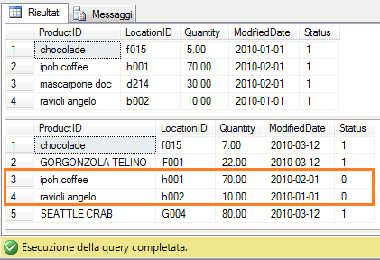

#### di [Sergio Govoni](http://mvp.microsoft.com/profiles/Sergio.Govoni) - Microsoft MVP

Blog: <http://www.ugiss.org/sgovoni/>

Twitter: <https://twitter.com/segovoni>

1.  {width="0.5938331146106737in"
    height="0.9376312335958005in"}

*Febbraio, 2013*

Introduzione {#introduzione .ppSection}
============

SQL Server 2008 introduce il supporto al comando MERGE. Questo comando
permette di distinguere una tabella sorgente (source) ed una tabella
destinazione (destination), modificando il contenuto della tabella di
destinazione con i dati della tabella sorgente. SQL Server implementa
tutte le caratteristiche del comando MERGE standard ANSI SQL-2006 e
aggiunge, a queste, alcune importanti estensioni disponibili solo nel
linguaggio T-SQL.

La figura seguente schematizza sorgente e destinazione in un comando
MERGE.

1.  {width="5.886239063867016in"
    height="1.7606627296587927in"}

<!-- -->

1.  Figura 1 – Sorgente e Destinazione nel comando MERGE

Ambiti di utilizzo {#ambiti-di-utilizzo .ppSection}
==================

Il comando MERGE può essere utilizzato in ambienti OLTP, ma anche OLAP.
In uno scenario transazionale, possiamo utilizzarlo per eseguire il
Merge dei dati da una sorgente esterna ad una tabella esistente. In un
data werehouse, il comando MERGE può essere utilizzato per eseguire
UPDATE incrementali oppure per processare slowly changing dimensions.

Il comando MERGE viene risolto utilizzando operazioni di Join, che
interessano la tabella sorgente e la tabella destinazione. Il predicato
ON esprime la condizione di Join che deve essere verificata per
collegare le righe della tabella sorgente con le righe della tabella
destinazione. Si potrà quindi specificare quale azione avviare quando la
riga:

1.  Esiste sia nella tabella sorgente che nella tabella destinazione
    (WHEN MATCHED)

    Esiste nella tabella sorgente, ma non nella tabella destinazione
    (WHEN NOT MATCHED \[BY TARGET\])

    Esiste nella tabella destinazione, ma non in quella sorgente (WHEN
    NOT MATCHED \[BY SOURCE\])

L’ultima clausola WHEN NOT MATCHED \[BY SOURCE\] rappresenta
un’estensione proprietaria del linguaggio T-SQL, non è disponibile nel
comando MERGE standard ANSI SQL.

Scenario OLTP: Inventario di magazzino {#scenario-oltp-inventario-di-magazzino .ppSection}
======================================

Vediamo ora come il comando MERGE può aiutarci nel caricamento di un
inventario di magazzino.

Ipotizziamo di eseguire l’inventario a rotazione, dei prodotti giacenti
a magazzino e di dover aggiornare le giacenze logiche memorizzate nella
tabella dbo.ProductInventory del database AdventureWorks2012, con le
giacenze fisiche rilevate dagli operatori durante l’inventario. Il
comando MERGE sarà di grande aiuto per aggiornare i dati contenuti nella
tabella dbo.ProductInventory. Si dovrà quindi prevedere di:

1.  Aggiornare la quantità giacente di un prodotto

    Eliminare, dalla tabella dbo.ProductInventory, i prodotti non
    presenti a magazzino (rilevazioni con giacenza uguale a zero)

    Inserire, nella tabella dbo.ProductInventory, i nuovi prodotti
    rilevati a magazzino (non presenti nella destinazione)

    1.  

Procediamo con la creazione della tabella dbo.ProductInventory sul
database AdventureWorks2012 (scaricabile da CodePlex) e inseriamo alcuni
dati di prova.

1.  use \[AdventureWorks2012\];

    go

    ------------------------------------------------------------------------

    -- Setup table & insert data

    ------------------------------------------------------------------------

    -- dbo.ProductInventory

    if OBJECT\_ID('dbo.ProductInventory', 'U') is not null

    drop table dbo.ProductInventory;

    go

    create table dbo.ProductInventory

    (

    ProductID varchar(25) not null

    ,LocationID varchar(20) not null

    ,Quantity decimal(9, 2) not null

    ,ModifiedDate date not null default getdate()

    ,Status bit not null default 1

    ,constraint PK\_ProductInventory primary key(ProductID, LocationID)

    );

    insert into dbo.ProductInventory

    (ProductID, LocationID, Quantity, ModifiedDate)

    values

    ('ravioli angelo', 'b002', 10, '20100101'),

    ('chocolade', 'f015', 5, '20100101'),

    ('ipoh coffee', 'h001', 70, '20100201'),

    ('mascarpone doc', 'd214', 30, '20100201');

    go

Consultiamo i dati inseriti, che rappresentano le giacenze logiche dei
prodotti disponibili in magazzino:

1.  use \[AdventureWorks2012\];

    go

    select \* from dbo.ProductInventory;

    go

L’output è illustrato in figura 2.

1.  {width="3.9484678477690287in"
    height="1.7085717410323709in"}

<!-- -->

1.  Figura 2 – Giacenze logiche dei prodotti disponibili in magazzino

Ipotizziamo di raccogliere i dati inventariali nella tabella
dbo.FrequentInventory, che possiamo creare e popolare con alcuni dati di
test attraverso il seguente frammento di codice T-SQL:

1.  use \[AdventureWorks2012\];

    go

    -- dbo.FrequentInventory

    if OBJECT\_ID('dbo.FrequentInventory', 'U') is not null

    drop table dbo.FrequentInventory;

    go

    create table dbo.FrequentInventory

    (

    ProductID varchar(25) not null

    ,LocationID varchar(20) not null

    ,Quantity decimal(9, 2) not null

    ,ModifiedDate date not null default getdate()

    ,constraint PK\_FrequentInventory primary key(ProductID, LocationID)

    );

    go

    insert into dbo.FrequentInventory

    (ProductID, LocationID, Quantity, ModifiedDate)

    values

    ('CHOCOLADE', 'F015', 7, '20100612'),

    ('GORGONZOLA TELINO', 'F001', 22, '20100612'),

    ('SEATTLE CRAB', 'G004', 80, '20100612'),

    ('MASCARPONE DOC', 'D214', 0, '20100201');

    go

Consultiamo i dati rilevati durante l’inventario, l’output è illustrato
in figura 3.

1.  use \[AdventureWorks2012\];

    go

    select \* from dbo.FrequentInventory;

    go

<!-- -->

1.  {width="3.9067957130358706in"
    height="1.6668996062992125in"}

<!-- -->

1.  Figura 3 – Giacenze fisiche rilevate dai magazzinieri durante
    l’inventario

Il comando MERGE in azione {#il-comando-merge-in-azione .ppSection}
==========================

Il primo comando MERGE che esaminiamo è quello che ci permette di
aggiornare le righe presenti sia nella tabella sorgente
dbo.FrequentInventory che nella tabella destinazione
dbo.ProductInventory. Per far questo è sufficiente scrivere un comando
di UPDATE nella clausola WHEN MATCHED. Si osservi la presenza della
transazione esplicita, dopo aver modificato i dati ed aver interrogato
il contenuto della tabella dbo.ProductInventory, la transazione verrà
respinta con un ROLLBACK esplicito in modo che si possano utilizzare gli
stessi dati anche per i prossimi esempi.

Osserviamo il comando UPDATE, non è stata specificata la tabella
dbo.ProductInventory, quest’ultima è infatti già nota by design, è la
tabella di destinazione.

1.  -- MERGE con la clausola WHEN MATCHED

    begin tran;

    go

    select \* from dbo.ProductInventory;

    go

    merge into dbo.ProductInventory as itarget

    using dbo.FrequentInventory as isource

    on ((itarget.ProductId = isource.ProductId)

    and (itarget.LocationId = isource.LocationId))

    when matched then

    update /\* dbo.ProductInventory \*/ set

    itarget.Quantity = isource.Quantity

    ,itarget.ModifiedDate = isource.ModifiedDate;

    select \* from dbo.ProductInventory;

    go

    rollback tran;

    go

L’output è illustrato in figura 4, le righe nei riquadri rossi
rappresentano i record che verranno aggiornati, mentre quelle nei
riquadri verdi rappresentano i record dopo l’esecuzione del comando
MERGE.

1.  {width="3.969304461942257in"
    height="2.8858191163604547in"}

<!-- -->

1.  Figura 4 – Aggiornamenti eseguiti dal comando MERGE con clausola
    WHEN MATCHED

In presenza della sola clausola WHEN MATCHED, il comando MERGE viene
implementato con una INNER JOIN che possiamo vedere nel piano di
esecuzione illustrato nella figura seguente.

1.  {width="6.5in"
    height="0.9965277777777778in"}

<!-- -->

1.  Figura 5 – Piano di esecuzione per il comando MERGE con clausola
    WHEN MATCHED

La clausola WHEN NOT MATCHED {#la-clausola-when-not-matched .ppSection}
============================

Soddisfiamo un altro requisito richiesto, ovvero la possibilità di
inserire le righe della tabella sorgente che non trovano corrispondenza
nella tabella destinazione. Modifichiamo quindi il precedente comando
MERGE per aggiungere la clausola WHEN NOT MATCHED alla quale assoceremo
un’operazione di INSERT. Come per il comando di UPDATE, la sintassi del
comando INSERT è molto simile a quella che utilizziamo abitualmente ad
eccezione del nome della tabella oggetto degli inserimenti, che non
viene specificata perché la tabella di destinazione è già nota.

Eseguiamo il seguente frammento di codice, anche in questo caso la
transazione viene annullata con un ROLLBACK.

1.  -- MERGE con le clausole WHEN MATCHED e WHEN NOT MATCHED

    begin tran;

    go

    select \* from dbo.ProductInventory;

    go

    merge into dbo.ProductInventory as itarget

    using dbo.FrequentInventory as isource

    on ((itarget.ProductId = isource.ProductId)

    and (itarget.LocationId = isource.LocationId))

    when matched then

    update /\* dbo.ProductInventory \*/ set

    itarget.Quantity = isource.Quantity

    ,itarget.ModifiedDate = isource.ModifiedDate

    when not matched then

    insert /\* into dbo.ProductInventory \*/

    (

    ProductId

    ,LocationId

    ,Quantity

    ,ModifiedDate

    )

    values

    (

    isource.ProductId

    ,isource.LocationId

    ,isource.Quantity

    ,isource.ModifiedDate

    );

    select \* from dbo.ProductInventory;

    go

    rollback tran;

    go

Otteniamo l’output illustrato in figura 6, osserviamo che i prodotti
“GORGONZOLA TELINO” e “SEATTLE CRAB” sono stati inseriti nella tabella
destinazione dbo.ProductInventory per effetto dell’azione specificata
nella clausola WHEN NOT MATCHED.

1.  {width="4.365192475940508in"
    height="3.229617235345582in"}

<!-- -->

1.  Figura 6 – MERGE con clausole WHEN MATCHED e WHEN NOT MATCHED

La soluzione nelle precedenti versioni di SQL Server (SQL Server 2005 o precedenti) {#la-soluzione-nelle-precedenti-versioni-di-sql-server-sql-server-2005-o-precedenti .ppSection}
===================================================================================

Come avremmo implementato la soluzione di questo problema in SQL Server
2005 o precedenti? Probabilmente scrivendo due comandi separati, un
UPDATE ed un INSERT, come quelli riportati di seguito, che avrebbero
permesso di ottenere lo stesso output di figura 6.

1.  begin tran

    go

    select \* from dbo.ProductInventory;

    go

    update

    itarget

    set

    itarget.Quantity = isource.Quantity

    ,itarget.ModifiedDate = isource.ModifiedDate

    from

    dbo.ProductInventory itarget

    join

    dbo.FrequentInventory isource

    on (itarget.ProductID = isource.ProductID) and

    (itarget.LocationID = isource.LocationID);

    go

    insert into dbo.ProductInventory

    (

    ProductID, LocationID, Quantity, ModifiedDate

    )

    select

    isource.ProductID

    ,isource.LocationID

    ,isource.Quantity

    ,isource.ModifiedDate

    from

    dbo.FrequentInventory as isource

    where

    not exists (select \*

    from

    dbo.ProductInventory as itarget

    where

    (isource.ProductID = itarget.ProductID)

    and (isource.LocationID = itarget.LocationID)

    );

    go

    select \* from dbo.ProductInventory;

    go

    rollback tran

    go

Rispetto alla soluzione tradizionale, uno dei vantaggi che deriva
dall’utilizzo del comando MERGE è nell’accesso ai dati, con MERGE i dati
vengono acceduti una sola volta, contro il doppio accesso nel caso dei
due comandi separati INSERT e UPDATE. Il comando MERGE viene eseguito
con una operazione atomica, che non necessità di transazioni esplicite.
In aggiunta, l’operazione Merge ci protegge da eventuali UPDATE non
deterministici, nel senso che, se la stessa riga verrà aggiornata più di
una volta, l’intero comando di MERGE fallirà.

Le clausole WHEN supportano la presenza dell’operatore AND seguito da un
predicato, la clausola assumerà quindi la forma:

1.  WHEN MATCHED AND &lt;predicato&gt; THEN &lt;azione&gt;

Aggiunta dell’operatore AND {#aggiunta-delloperatore-and .ppSection}
===========================

Aggiungendo l’operatore AND, l’azione racchiusa nella clausola verrà
eseguita solo se risulteranno essere vere entrambe le condizioni, quella
specificata nel predicato ON e quella specificata nel predicato
aggiuntivo AND.

Il seguente comando MERGE permette di aggiornare le righe nella tabella
di destinazione solo se gli attributi non chiave sono diversi da quelli
nella sorgente. Con questa tecnica, le performance migliorano, si
previene inoltre l’attivazione di eventuali trigger.

1.  -- MERGE con operatore AND nella clausola WHEN MATCHED

    begin tran;

    go

    select \* from dbo.ProductInventory;

    go

    merge into dbo.ProductInventory as itarget

    using dbo.FrequentInventory as isource

    on ((itarget.ProductId = isource.ProductId)

    and (itarget.LocationId = isource.LocationId))

    when matched AND

    ((itarget.Quantity &lt;&gt; isource.Quantity)

    or (itarget.ModifiedDate &lt;&gt; isource.ModifiedDate)) then

    update set

    itarget.Quantity = isource.Quantity

    ,itarget.ModifiedDate = isource.ModifiedDate

    when not matched then

    insert

    (

    ProductId

    ,LocationId

    ,Quantity

    ,ModifiedDate

    )

    values

    (

    isource.ProductId

    ,isource.LocationId

    ,isource.Quantity

    ,isource.ModifiedDate

    );

    select \* from dbo.ProductInventory;

    go

    rollback tran;

    go

Clausole WHEN MATCHED multiple {#clausole-when-matched-multiple .ppSection}
==============================

Il comando MERGE supporta al più due clausole WHEN MATCHED con l’obbligo
di specificare nella prima clausola l’operatore aggiuntivo AND, che
opzionalmente può essere specificato anche nella seconda clausola.
Quando vengono specificate due clausole WHEN MATCHED, SQL Server esegue
l’azione indicata nella prima clausola solo se risultano essere
verificate le condizioni specificate nel predicato ON e nel predicato
aggiuntivo AND. Se l’espressione logica nel predicato ON risulta essere
vera, ma l’espressione nel predicato aggiuntivo AND della prima clausola
risulta essere falsa o unknown, SQL Server valuterà la seconda clausola
WHEN MATCHED e l’azione indicata nella prima clausola non verrà
applicata.

L’utilizzo multiplo delle clausole WHEN MATCHED è di aiuto per
implementare il seguente requisito: quando l’inventario rileva un
prodotto con giacenza uguale a zero (= non presente a magazzino), la
rispettiva riga, nella tabella destinazione, deve essere eliminata. Il
seguente comando MERGE implementa anche questo requisito.

1.  -- MERGE con WHEN MATCHED multipli

    begin tran;

    go

    select \* from dbo.ProductInventory;

    go

    merge into dbo.ProductInventory as itarget

    using dbo.FrequentInventory as isource

    on ((itarget.ProductId = isource.ProductId)

    and (itarget.LocationId = isource.LocationId))

    when matched AND

    (isource.Quantity &lt;&gt; 0)

    and ((itarget.Quantity &lt;&gt; isource.Quantity)

    or (itarget.ModifiedDate &lt;&gt; isource.ModifiedDate)) then

    update set

    itarget.Quantity = isource.Quantity

    ,itarget.ModifiedDate = isource.ModifiedDate

    when matched AND

    (isource.Quantity = 0) then

    delete

    when not matched then

    insert

    (

    ProductId

    ,LocationId

    ,Quantity

    ,ModifiedDate

    )

    values

    (

    isource.ProductId

    ,isource.LocationId

    ,isource.Quantity

    ,isource.ModifiedDate

    );

    select \* from dbo.ProductInventory;

    go

    rollback tran;

    go

L’output ottenuto è illustrato in figura 7, in particolare osserviamo
che la riga relativa al prodotto “mascarpone doc” è stata eliminata (in
dbo.ProductInventory) per effetto dell’azione DELETE specificata nella
seconda clausola WHEN MATCHED.

1.  {width="4.375611329833771in"
    height="3.073345363079615in"}

<!-- -->

1.  Figura 7 – MERGE con clausole WHEN MATCHED multiple

Estensioni proprietarie del linguaggio T-SQL {#estensioni-proprietarie-del-linguaggio-t-sql .ppSection}
============================================

Il comando MERGE, solo nel linguaggio T-SQL, supporta una terza clausola
chiamata WHEN NOT MATCHED \[BY SOURCE\], che permette di indicare una
azione da eseguire quando ad una riga nella tabella destinazione non
corrisponde nessuna riga nella tabella sorgente.

Questa terza clausola, WHEN NOT MATCHED \[BY SOURCE\], ci aiuta ad
implementare un altro requisito richiesto nella soluzione: quando una
riga nella tabella destinazione non trova corrispondenza nella tabella
sorgente aggiornare il campo Status impostando il valore zero. Il
seguente frammento di codice T-SQL rappresenta un esempio di utilizzo
della clausola WHEN NOT MATCHED \[BY SOURCE\].

1.  -- MERGE con terza clausola WHEN NOT MATCHED BY SOURCE

    begin tran;

    go

    select \* from dbo.ProductInventory;

    go

    merge into dbo.ProductInventory as itarget

    using dbo.FrequentInventory as isource

    on ((itarget.ProductId = isource.ProductId)

    and (itarget.LocationId = isource.LocationId))

    when matched AND

    (isource.Quantity &lt;&gt; 0)

    and ((itarget.Quantity &lt;&gt; isource.Quantity)

    or (itarget.ModifiedDate &lt;&gt; isource.ModifiedDate)) then

    update set

    itarget.Quantity = isource.Quantity

    ,itarget.ModifiedDate = isource.ModifiedDate

    when matched AND

    (isource.Quantity = 0) then

    delete

    when not matched then

    insert

    (

    ProductId

    ,LocationId

    ,Quantity

    ,ModifiedDate

    )

    values

    (

    isource.ProductId

    ,isource.LocationId

    ,isource.Quantity

    ,isource.ModifiedDate

    )

    when not matched by source then

    update set

    status = 0;

    go

    select \* from dbo.ProductInventory;

    go

    rollback tran;

    go

L’output ottenuto è illustrato in figura 8, in particolare osserviamo i
valori della colonna Status per i prodotti “ipoh coffee” e “ravioli
angelo” non presenti nella tabella dbo.FrequentInventory.

1.  {width="4.386029090113736in"
    height="3.0004188538932635in"}

<!-- -->

1.  Figura 8 – MERGE con clausola WHEN NOT MATCHED \[BY SOURCE\]

Conclusioni {#conclusioni .ppSection}
===========

Il comando MERGE permette di eseguire, nella destinazione, operazioni
DML multiple (INSERT/UPDATE/DELETE) in funzione delle condizioni logiche
specificate nelle clausole del comando. Come si è potuto osservare negli
esempi, MERGE è un’istruzione molto potente, è quindi necessario
prestare attenzione alle condizioni specificate nelle clausole WHEN ed
effettuare gli opportuni test prima di utilizzarlo in produzione.

#### di [Sergio Govoni](http://mvp.microsoft.com/profiles/Sergio.Govoni) - Microsoft MVP 

Blog: <http://www.ugiss.org/sgovoni/>

Twitter: <https://twitter.com/segovoni>
