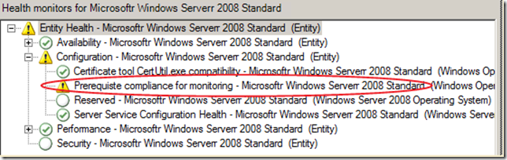

#### di [Daniele Grandini](https://mvp.support.microsoft.com/profile=58922C7A-F40F-438B-93D1-7E4E3CF963AD) – Microsoft MVP ([blog](http://nocentdocent.wordpress.com))

1.  {width="0.5938331146106737in"
    height="0.9376312335958005in"}

*Maggio 2012*

Introduzione
------------

Il controllo della configurazione dei sistemi sotto monitor non è uno
dei principali compiti di Operations Manager. All’interno di System
Center, Configuration Manager e Service Manager, magari con il supporto
di Orchestrator sono gli strumenti di elezione per realizzare un monitor
della configurazione. Non sempre è però possibile implementare tutti i
componenti di System Center. Questo articolo ha lo scopo di sviluppare
un Management Pack che permetta di verificare i sistemi che sono
conformi in termini di sistema operativo, service pack e hotfix
installate.

Sebbene i moduli sviluppati saranno generici ed applicabili a diversi
contesti, la realizzazione ha lo scopo di individuare i sistemi che non
abbiano tutti i prerequisiti necessari al corretto funzionamento
dell’agente Operations Manager. Si tratta di tutte quelle fix, esterne a
Operations Manager, che fanno una drammatica differenza rispetto alla
qualità e all’affidabilità del monitor. Per un elenco sempre aggiornato
si può fare riferimento all’articolo “[*Things to make and do for agent
health*](http://nocentdocent.wordpress.com/articles-and-series/things-to-make-and-do-for-agent-health/)”.

Ci addentreremo dunque nello sviluppo di un management pack che dovrà
rispondere alle seguenti richieste:

1.  Controllo del livello di service pack dato uno specifico sistema
    operativo

    Controllo della presenza di una lista di patch dato uno specifico
    sistema operativo e livello di service pack

    Opzionalmente dovrà integrarsi nell’health model dell’agente
    Operations Manager (HealthService class)

    Dovrà segnalare in modo dettagliato le ragioni per cui un sistema è
    ritenuto non compliant (livello di service pack, quali patch sono
    mancanti e così via)

    1.  

L’articolo presuppone che il lettore abbia familiarità con Operations
Manager e il modello di monitor da esso sotteso.

Per ragioni di brevità e per non confondere il lettore con troppi
dettagli mi concentrerò su Windows Server 2008 e Windows Server 2008 R2,
ma la medesima tecnica può essere applicata a sistemi Windows 2003 o se
per questo anche a sistemi operativi client controllati con Operations
Manager. Questa è la ragione per cui, pur concentrandomi su questi
sistemi operativi userò come linguaggio di scripting vbscript invece di
powershell. L’utilizzo di moduli powershell è tipicamente più efficiente
in quanto non è necessario uno spawn di un processo esterno come invece
avviene con vbscript.

Non tratterò della parte di reporting, eventualmente lasciata d un
articolo specifico.

Health model
------------

L’health model per la compliance deve integrarsi con quello del sistema
operativo preso in esame, tutto questo è logico in quanto i parametri di
configurazione che andremo a controllare sono specifici del sistema
operativo. Trattandosi di configurazione la sua collocazione è semplice:

1.  {width="6.708333333333333in"
    height="2.125in"}

<!-- -->

1.  Fig. 1 – Health model

Dal momento che, in questo specifico caso, la presenza o assenza di
queste fix ha una ripercussione sul funzionamento dell’agente Operations
Manager è possibile pensare di integrare anche l’health model
dell’agente (classe HealthService). Il management pack definirà questa
relazione, ma la lascerà disabilitata. Sarà possibile attivarla tramite
uno specifico override.

1.  {width="5.947916666666667in"
    height="2.7153532370953632in"}

<!-- -->

1.  Fig. 2 – Integrazione con l’health model dell’HealthService

Stabilire una relazione tra classi
----------------------------------

Per ottenere questo il primo passaggio è definire una relazione, la più
debole possibile, tra le classi che rappresentano il sistema operativo
(Microsoft.Windows.OperatingSystem) e l’agente
(Microsoft.SystemCenter.HealthService). Il tipo di relazione più debole
a nostra disposizione è la System.Reference che non implica null’altro
che una generica relazione tra le due classi. Questa relazione deve
essere definita nella sezione dedicata ai tipi. Attenzione alla
direzione della relazione, dal momento che sarà l’HealthService a dover
“ereditare” lo stato di salute di un componente di sistema operativo, la
relazione avrà questa direzione HealthService -&gt; Operating System :

1.  XML

<!-- -->

1.  &lt;TypeDefinitions&gt;

    &lt;EntityTypes&gt;

    &lt;RelationshipTypes&gt;

    &lt;RelationshipType
    ID="QND.Compliance.HealthServiceReferenceOperatingSystem"
    Accessibility="Internal" Abstract="false"
    Base="System!System.Reference"&gt;

    &lt;Source&gt;SC!Microsoft.SystemCenter.HealthService&lt;/Source&gt;

    &lt;Target&gt;Windows!Microsoft.Windows.OperatingSystem&lt;/Target&gt;

    &lt;/RelationshipType&gt;

    &lt;/RelationshipTypes&gt;

    &lt;/EntityTypes&gt;

    &lt;/TypeDefinitions&gt;

Definita la relazione sarà necessario definire un tipo particolare di
monitor, ma lo vedremo a tempo opportuno, il punto da ricordare è che
senza questa relazione non è possibile definire il monitor necessario
alla rappresentazione di cui sopra.

Un ultima nota di attenzione per la proprietà Accessibility, come vedete
l’hop definita “Internal” questo significa che la relazione sarà
utilizzabile unicamente all’interno di questo Management Pack, se
ritenete la relazione di utilità generale cambiate il codice per
definirla “Public”.

Baseline vecchie e nuove
------------------------

Rimane un ultimo aspetto da indirizzare, ossia la gestione delle
baseline. Quello che si vuole avere è fondamentalmente un controllo del
livello di patching, ovviamente il livello deve essere relativo ad un
punto di partenza o baseline, ai fini di questo articolo le baseline
prese in considerazione saranno le seguenti:

1.  Windows Server 2008

    Windows Server 2008 R2 RTM

    Windows Server 2008 R2 Service Pack 1

Nel codice mostrerò come definire una nuova baseline tramite una regola
di discovery apposita per Windows Server 2008 R2 Service Pack 1. Ma dal
momento che stiamo definendo i tipi che ci serviranno per lo sviluppo di
questo Management Pack iniziamo con il definire la nuova classe per
Windows 2008 R2 con Service Pack 1
(Microsoft.Windows.Server.2008.R2.SP1.OperatingSystem).

Il compito sembra semplice, ma la ricchezza del modello ci mette in
realtà a disposizione diverse possibilità, soprattutto in termini di
quale classe utilizzare come base per derivare la nostra. Possiamo
restringere le scelte a due:

1.  Windows 2008 R2 SP1 è un sistema operativo generico, nel qual caso
    lo deriviamo dalla classe Microsoft.Windows.OperatingSystem

    Windows 2008 R2 SP1 è un Windows 2008 R2, in questo caso lo
    deriviamo da Microsoft.Windows.Server.2008.R2.OperatingSystem

    1.  

La questione, come vedremo, non è di lana caprina perché ci sono
implicazioni per entrambe le scelte. Nel mio caso ho preferito seguire
il pattern impostato da Microsoft nel suo management pack per Windows
2008, dove Windows 2008 R2 è un Windows 2008, quindi deriva da
Microsoft.Windows.Server.2008.OperatingSystem.

Come sempre un’immagine vale più di mille parole:

1.  {width="6.925in"
    height="3.8651159230096237in"}

Come anticipato, questa scelta ha le sue implicazioni ed effetti
collaterali. La prima implicazione è che tutte le regole di monitor che
hanno come target Windows 2008 saranno applicate anche a Windows 2008 R2
e tutte quelle con target R2 saranno ereditate da Windows 2008 R2 SP1
(comprese quelle per Windows 2008). Cioè, come ci aspettiamo, le regole
seguono l’ereditarietà delle classi. Per chi è nuovo nello sviluppo di
Management Pack basta pensare alle regole come ai metodi delle classi,
le regole vengono ereditate così come i metodi.

Bene, e quindi? Dal momento che, come vedremo, il nostro monitor per il
check di compliance sarà genericamente applicato al
Microsoft.Windows.Server.OperatingSystem, avremo un effetto collaterale
che io chiamo di “convergenza lenta”, quello che accadrà per un nuovo
sistema Windows 2008 R2 Service Pack 1 sarà:

1.  Prima di tutto sarà indviduato come un Windows 2008 R2 e la nostra
    regola di compliance per quella baseline sarà applicata ad esso,
    questo causerà una non compliance in quanto le patch da applicare
    sono diverse tra Windows 2008 R2 e Windows 2008 R2 SP1 (altrimenti
    non avremmo avuto bisogno di differenziare le baseline). Il
    management pack per Windows 2008 ha un’unica regola di discovery che
    ritorna il sistema operativo corretto (Windows 2008 o 2008 R2),
    quindi questo effetto di convergenza lenta si ha solo tra R2 e R2
    con SP1.

    Quindi il sistema sarà classificato come Windows 2008 R2 SP1, a quel
    punto la regola più specifica che si applica a Windows 2008 R2 con
    SP1 sarà applicata ritornando l’effettivo e corretto stato di
    compliance

    1.  

Penso che questa “convergenza lenta” sia accettabile, l’alternativa è
derivare la classe Windows 2008 R2 SP1 da Windows.Server.OperatingSystem
e riscrivere la regola di discovery che a questo punto dovrà essere più
articolata.

Tornando al codice la definizione della nuova classe sarà piuttosto
semplice:

1.  XML

<!-- -->

1.  &lt;ClassTypes&gt;

    &lt;ClassType
    ID="Microsoft.Windows.Server.2008.R2.SP1.OperatingSystem"
    Abstract="false" Accessibility="Public"
    Base="Win2008!Microsoft.Windows.Server.2008.R2.OperatingSystem"
    Hosted="true" Singleton="false"&gt;

    &lt;/ClassType&gt;

    &lt;/ClassTypes&gt;

Non preoccupatevi se il nostro Management Pack non prende ancora una sua
forma definitiva, la strada è ancora lunga e ci vuole pazienza. Per il
momento abbiamo definito l’health model e le nuove erlazioni e classi
necessarie.

Lo script di monitor
--------------------

Prima di addentrarci ancora nella struttura del management pack, voglio
concentrarmi sullo script che dovrà fornire le informazioni necessarie
al controllo della baseline. Come anticipato, per ragioni di supporto di
Windows 2003, lo script sarà in vbscript. Per migliorarne la leggibilità
ho rimosso tutti i controlli di errore e il logging diagnostico non
indispensabili, in questo modo la logica con cui ritornare i dati a
Operations Manager dovrebbe essere evidente. Questo implica però che
prima di utilizzare lo script in un ambiente di produzione occorre
introdurre un accurato controllo di errore.

Le specifiche sono le seguenti:

1.  L’output deve poter essere utilizzato sia per il controllo della
    compliance sia per ritornare le informazioni su quali componenti
    sono eventualmente fuori compliance

    Lo script deve usare interfacce che permettano il suo utilizzo su
    Windows 2003, 2008 e 2008 R2

    Lo script dovrà controllare la compliance di una baseline data, per
    dirla con Operations Manager il target sarà una specifica baseline

    La lista delle patch deve essere dinamica in modo da potersi
    adattare alle singole baseline e alle esigenze dei singoli sistemi
    (tramite override)

    Lo script dovrà verificare la versione del sistema operativo, la
    versione di Windows Scripting Host e la presenza delle patch
    appropriate

    1.  

Da queste specifiche derivano i parametri in input allo script:

1.  Versione del sistema operativo desiderata (per esempio per Windows
    2008 la service pack richiesta è la service pack 2)

    Versione di Windows Scripting Host necessaria (tipicamente 5.7, se
    il parametro è impostato a IGNORE il check viene saltato)

    Elenco separato da virgole delle patch richieste, anche in questo
    caso se il parametro vale IGNORE il controllo viene saltato

    1.  

L’output dello script sarà una property bag che dovrà riportare dati di
sintesi rispetto alla compliance e dati descrittivi da utilizzare per
fornire maggiori informazioni agli operatori. I dati sintetici di tipo
boolean saranno:

1.  OS compliance

    Patches compliance

    WSH compliance

    1.  

Le proprietà descrittive saranno:

1.  Versione del sistema operativo

    Versione di Windows Scripting Host

    Una entry per ogni patch in input che riporti se la patch è presente
    oppure no

    Una descrizione da utilizzare direttamente nell’alert che indichi la
    ragione della non compliance

    1.  

Tutto questo premesso, la logica dello script è articolata su 5
passaggi:

1.  Carica tutte le patch all’interno di un dizionario, al termine dei
    check il dizionario conterrà, per ogni voce, la sua presenza o
    assenza e sarà la base per la property bag ritornata

2.  Controlla la versione dell’OS tramite la classe WMI
    Win32\_OperatingSystem

3.  Controlla la versione di windows scripting host utilizzando la
    proprietà Version, se il parametro in input è “IGNORE” lo script
    assume che windows scripting host sia compliant

4.  Controlla la presenza delle patch utilizzando la classe
    WMI Win32\_QuickFixEngineering. Se date una scorsa al codice e ai
    commenti vedrete che prima viene cercato un match esatto e in
    assenza di questo vengono cercate eventuali versioni successive
    della fix usando il postfisso \_v&lt;n&gt;

5.  In ultimo tramite le informazioni raccolte viene costruita la
    property bag e assemblata la stringa descrittiva da usare negli
    alert

6.  

<!-- -->

1.  Visual Basic

<!-- -->

1.  Option Explicit

    SetLocale ("en-us")

    'Globals

    Dim g\_API, g\_oXML

    Dim g\_StdErr

    Dim P\_TraceLevel, P\_OSVer, P\_QFEList, P\_WSHVersion

    'On Error Resume Next

    Dim dtStart, oArgs

    Dim dicQFEs, qfe, oQFEs

    Dim i, oWMI, oWMIOS, OSVersion, Keys

    Dim oBag, bOSCompliance, os, bQFECompliance, bWshCompliance

    dtStart = Now

    Globals

    Set oArgs = WScript.Arguments

    P\_OSVer = oArgs(0)

    if UCASE(TRIM(oArgs(1)))="IGNORE" Then

    P\_QFEList = Split("", ",")

    else

    P\_QFEList = Split(oArgs(1),",")

    end if

    P\_WSHVersion = oArgs(2)

    Set dicQFEs = CreateObject("Scripting.Dictionary")

    dicQFEs.CompareMode=vbTextCompare

    for I=0 to ubound(P\_QFEList)

    dicQFEs.Add P\_QFEList(i), false

    next

    'Now get the info we need via WMI

    Set oWMI = GetObject("winmgmts:\\\\.\\root\\cimv2")

    Set oWMIOS = oWMI.ExecQuery("Select Version
    from Win32\_OperatingSystem")

    for each os in oWMIOS

    OSVersion = os.Version

    next

    bOSCompliance = (OSVersion &gt;= P\_OSVer)

    bWshCompliance = (WScript.Version &gt;= P\_WSHVersion
    or UCASE(P\_WSHVersion)="IGNORE")

    Set oQFEs = oWMI.ExecQuery("Select \*
    from Win32\_QuickFixEngineering")

    for each qfe in oQFEs

    'sadly I cannot use an exact match to take into account the
    KB123456-v? fix naming

    if (dicQFEs.Exists(qfe.HotFixID)) Then

    dicQFEs(qfe.HotFixID) = true

    else

    'if I have not an exact match then check for patch versioning

    keys = dicQFEs.Keys

    for I=0 to dicQFEs.count -1

    if UCASE(keys(I) & "-v") =
    UCASE(Left(qfe.HotFixID, Len(keys(I)&"-v"))) then

    dicQFEs(keys(I)) = true

    exit for

    end if

    next

    end if

    next

    'Now prepare the data to return

    Dim sMessage

    If Not bOSCompliance Then

    sMessage = sMessage & "OS is not compliant required version: " &
    P\_OSVer & " Detected Version: " & OSVersion & vbCrLf

    end if

    If Not bWshCompliance Then

    sMessage = sMessage & "WSH is not compliant required version: " &
    P\_WSHVersion & " Detected Version: " & WScript.Version & vbCrLf

    end if

    Set oBag = g\_API.CreateTypedPropertyBag(StateDataType)

    call oBag.AddValue("OSVersion", OSVersion)

    call oBag.AddValue("OSCompliant", bOSCompliance)

    bQFECompliance = True

    for each qfe in dicQFEs.Keys

    if false = dicQFEs(qfe) Then

    bQFECompliance = false

    sMessage = sMessage & qfe & " is missing" & vbCrLf

    end if

    call oBag.AddValue(qfe, dicQFEs(qfe))

    next

    call oBag.AddValue("QFECompliant", bQFECompliance)

    call oBag.AddValue("WSHCompliant", bWSHCompliance)

    call oBag.AddValue("Message", sMessage)

    'finally resturn the property bag

    g\_API.AddItem oBag

    Call g\_API.ReturnItems

    ClearGlobals

    '\*\*\*\*\*\*\*\*\*\*\*\*\*\*\*\*\*\*\*\*\*\*\*\*\*\*\*\*\*\*\*\*\*\*\*\*\*\*\*\*\*\*\*\*\*\*

    '\*\*\*\* HELPER FUNCTIONS SCOM sempre necessarie

    '\*\*\*\*\*\*\*\*\*\*\*\*\*\*\*\*\*\*\*\*\*\*\*\*\*\*\*\*\*\*\*\*\*\*\*\*\*\*\*\*\*\*\*\*\*\*

    Sub Globals

    P\_TraceLevel = TRACE\_VERBOSE

    Set g\_API = CreateObject("MOM.ScriptAPI")

    Set g\_oXML = CreateObject("MSXML.DOMDocument")

    Set g\_StdErr = WScript.StdErr

    end Sub

    Sub ClearGlobals

    Set g\_API = Nothing

    Set g\_oXML = Nothing

    End Sub

Definizione dei tipi di moduli
------------------------------

Ora che abbiamo lo script occorre utilizzarlo all’interno del management
pack. Anche in questo caso ci sono diverse possibilità, ma per favorire
la riusabilità dei componenti nei miei management pack utilizzo sempre
uno schema tipo. Dal momento che il nostro fine ultimo sarà quello di
costruire un monitor che verifichi la compliance di un sistema ecco il
pattern che seguiremo

Percorso per la definizione di un monitor

1.  Definire un ProbeModuleType

<!-- -->

1.  Nella composition definire il modulo opportuno per il tipo di
    provider dati preparato (il nostro script)

2.  Definire un DataSourceModuleType

3.  Nella composition, oltre ai moduli aggiuntivi necessari (tipicamente
    uno scheduler), utilizzare il probe type definito al punto 1.

4.  Definire uno UnitMonitorType che utilizzerà il data source definito
    in 3.

5.  In ultimo definire uno UnitMonitor basato sul monitor type di cui al
    punto 5

6.  

Prima di procedere oltre facciamo un rapido elenco dei moduli che
dovremo utilizzare nel nostro management pack, procedendo a ritroso:

1.  Per il monitor di compliance avremo necessità di un **monitor
    type**, a sua volta questo necessiterà di un **datasource type**
    che, come da paragrafo precedente, scegliamo di comporre con un
    **probe type**

    Per il discovery dei sistemi Windows 2008 R2 SP1 avremo bisogno di
    un data source, ma in questo caso utilizzando il registry per il
    discovery potremo usare un modulo standard senza doverne definire
    uno nostro

    Per il discovery della relazione tra l’HealthService e il sistema
    operativo avremo invece bisogno di un **datasource type**

    1.  

Ricapitolando dovremo definire i seguenti moduli:

1.  Probe type per utilizzare lo script **QND.OSQFEGet.PT**

    Data source type per il monitor di compliance **QND.OSQFEGet.DS**

    Monitor type per la valutazione della compliance
    **QND.OSCompliance.MT**

    Data source per il discovery della relazione tra l’HealthService e
    il sistema operativo **QND.Compliance.HSRefOS.DT**

    1.  

Il datasource per il monitor
----------------------------

Iniziamo con il definire il probe type, I management pack hanno una
sezione apposite per la definizione di nuovi moduli &lt;ModuleTypes&gt;
a loro volta contenuti nella sezione &lt;TypeDefinitions&gt; che abbiamo
già usato per definire la classe Windows 2008 R2 SP1 e la relazione tra
HealthService e sistema operativo.

Il probe utilizzerà un unico membro nella sua composizione uno
ScriptPropertyBagProbe, la configurazione esporrà il parametro
ScriptTimeout necessario al ScriptPropertyBagProbe e i parametri che
abbiamo previsto per il nostro script:

1.  Versione del sistema operativo desiderata - OSVersion

    Versione di Windows Scripting Host necessaria - WSHVersion

    Elenco separato da virgole delle patch richieste – QFEList

    1.  

Non è necessario definire override perchè non useremo questo modulo
direttamente nella sezione di moitoring, ma ovviamente farlo non ha
implicazioni negative:

Un'altra accortezza che facilita e di molto il troubleshooting e il test
è quello di includere tutti gli script in una sezione CDATA, in modo da
evitare l’escaping HTML altrimenti necessario. I management Pack sono
documenti XML e quindi non è possibile utilizzare caratteri riservati se
non all’interno di sezioni CDATA.

Tutto questo è una mia convenzione, ma non è strettamente richiesto:
potete tranquillamente fare l’embedding dello script direttamente
all’interno del DataSourceModuleType facendo escaping dello script
stesso. A voi la scelta.

1.  XML

<!-- -->

1.  &lt;ModuleTypes&gt;

    &lt;ProbeActionModuleType ID="QND.OSQFEGet.PT"
    Accessibility="Public" Batching="false"&gt;

    &lt;Configuration&gt;

    &lt;xsd:element name="OSVersion" type="xsd:string" /&gt;

    &lt;xsd:element name="QFEList" type="xsd:string" /&gt;

    &lt;xsd:element name="WSHVersion" type="xsd:string" /&gt;

    &lt;xsd:element name="ScriptTimeout" type="xsd:integer" /&gt;

    &lt;/Configuration&gt;

    &lt;ModuleImplementation Isolation="Any"&gt;

    &lt;Composite&gt;

    &lt;MemberModules&gt;

    &lt;ProbeAction ID="GetData"
    TypeID="Windows!Microsoft.Windows.ScriptPropertyBagProbe"&gt;

    &lt;ScriptName&gt;QND.GetOSCompliance.vbs&lt;/ScriptName&gt;

    &lt;Arguments&gt;\$Config/OSVersion\$ "\$Config/QFEList\$"
    \$Config/WSHVersion\$&lt;/Arguments&gt;

    &lt;ScriptBody&gt;

    &lt;!\[CDATA\[Inserire lo script qui\]\]&gt;

    &lt;/ScriptBody&gt;

    &lt;TimeoutSeconds&gt;\$Config/ScriptTimeout\$&lt;/TimeoutSeconds&gt;

    &lt;/ProbeAction&gt;

    &lt;/MemberModules&gt;

    &lt;Composition&gt;

    &lt;Node ID="GetData"/&gt;

    &lt;/Composition&gt;

    &lt;/Composite&gt;

    &lt;/ModuleImplementation&gt;

    &lt;OutputType&gt;System!System.PropertyBagData&lt;/OutputType&gt;

    &lt;InputType&gt;System!System.BaseData&lt;/InputType&gt;

    &lt;/ProbeActionModuleType&gt;

    &lt;/ModuleTypes&gt;

Costruito il probe, la definizione del nostro DataSource è questione di
comporre il probe con un opportuno scheduler che ci permetta di eseguire
lo script ad intervalli prestabiliti, volendo anche con la possibilità
di sincronia ad un determinato orario. Come ho anticipato il data source
così definito sarà poi utilizzato nella definizione del monitor.

Il data source dovrà essere aggiunto alla sezione ModuleTypes \*prima\*
del ProbeActionModuleType.

I parametri del data source esporranno tutti quelli del probe e in
aggiunta l’intervallo di esecuzione (IntervalSeconds) e l’eventuale
orario di sincronizzazione (SyncTime) usati dal System.Scheduler. Anche
in questo caso non è strettamente necessario definire i parametri
overrideable.

1.  XML

<!-- -->

1.  &lt;DataSourceModuleType ID="QND.OSQFEGet.DS" Accessibility="Public"
    Batching="false"&gt;

    &lt;Configuration&gt;

    &lt;xsd:element name="OSVersion" type="xsd:string"/&gt;

    &lt;xsd:element name="QFEList" type="xsd:string" /&gt;

    &lt;xsd:element name="WSHVersion" type="xsd:string" /&gt;

    &lt;xsd:element name="ScriptTimeout" type="xsd:integer" /&gt;

    &lt;xsd:element name="IntervalSeconds" type="xsd:integer" /&gt;

    &lt;xsd:element name="SyncTime" type="xsd:string" /&gt;

    &lt;/Configuration&gt;

    &lt;ModuleImplementation&gt;

    &lt;Composite&gt;

    &lt;MemberModules&gt;

    &lt;DataSource ID="Scheduler" TypeID="System!System.Scheduler"&gt;

    &lt;Scheduler&gt;

    &lt;SimpleReccuringSchedule&gt;

    &lt;Interval&gt;\$Config/IntervalSeconds\$&lt;/Interval&gt;

    &lt;SyncTime&gt;\$Config/SyncTime\$&lt;/SyncTime&gt;

    &lt;/SimpleReccuringSchedule&gt;

    &lt;ExcludeDates /&gt;

    &lt;/Scheduler&gt;

    &lt;/DataSource&gt;

    &lt;ProbeAction ID="GetData" TypeID="QND.OSQFEGet.PT"&gt;

    &lt;OSVersion&gt;\$Config/OSVersion\$&lt;/OSVersion&gt;

    &lt;QFEList&gt;\$Config/QFEList\$&lt;/QFEList&gt;

    &lt;WSHVersion&gt;\$Config/WSHVersion\$&lt;/WSHVersion&gt;

    &lt;ScriptTimeout&gt;\$Config/ScriptTimeout\$&lt;/ScriptTimeout&gt;

    &lt;/ProbeAction&gt;

    &lt;/MemberModules&gt;

    &lt;Composition&gt;

    &lt;Node ID="GetData"&gt;

    &lt;Node ID="Scheduler"/&gt;

    &lt;/Node&gt;

    &lt;/Composition&gt;

    &lt;/Composite&gt;

    &lt;/ModuleImplementation&gt;

    &lt;OutputType&gt;System!System.PropertyBagData&lt;/OutputType&gt;

    &lt;/DataSourceModuleType&gt;

Il monitor type
---------------

Il data source appena creato è funzionale alla definizione del nostro
monitor type che a sua volta è funzionale al cuore di questo management
pack, ossia il controllo della compliance dei sistemi. Se vi siete persi
tornate al paragrafo iniziale per la definizione dei tipi di moduli.

Per questo monitor saranno sufficienti due stati, molto semplicemente
“Compliant” e “NonCompliant”

1.  XML

<!-- -->

1.  &lt;MonitorTypeStates&gt;

    &lt;MonitorTypeState ID="Compliant" NoDetection="false" /&gt;

    &lt;MonitorTypeState ID="NonCompliant" NoDetection="false" /&gt;

    &lt;/MonitorTypeStates&gt;

Questo stati vengono individuati in base ai valori ritornati dal data
source, se ricordate il nostro script ritorna tre valori di tipo
boolean:

1.  OSCompliant

    QFECompliant

    WSHCompliant

Perchè il sistema sia compliant tutti e tre le proprietà devono essere
vere, basta quindi definire una condition detection che metta in AND le
tre proprietà, secondo il seguente pattern:

1.  XML

<!-- -->

1.  &lt;Expression&gt;

    &lt;And&gt;

    &lt;Expression OS/&gt;

    &lt;Expression WSH/&gt;

    &lt;Expression QFE/&gt;

    &lt;/And&gt;

    &lt;/Expression&gt;

Dove &lt;Expression OS/WHS/QFE&gt; seguono il seguente schema:

1.  XML

<!-- -->

1.  &lt;Expression&gt;

    &lt;SimpleExpression&gt;

    &lt;ValueExpression&gt;

    &lt;XPathQuery
    Type="Boolean"&gt;Property\[@Name="OSCompliant"\]&lt;/XPathQuery&gt;

    &lt;/ValueExpression&gt;

    &lt;Operator&gt;Equal&lt;/Operator&gt;

    &lt;ValueExpression&gt;

    &lt;Value Type="Boolean"&gt;true&lt;/Value&gt;

    &lt;/ValueExpression&gt;

    &lt;/SimpleExpression&gt;

    &lt;/Expression&gt;

Il controllo di non compliance è simile ponendo in OR le tre variabili
testate sul valore false.

Dal momento che questo modulo sarà utilizzato nella monitoring section è
giunto il momento di definire i parametri overridable, mentre i
parametri di configurazione saranno identici a quelli del data source,
detto questo si tratta solo di comporre l’xml

1.  XML

<!-- -->

1.  &lt;MonitorTypes&gt;

    &lt;UnitMonitorType ID="QND.OSCompliance.MT"
    Accessibility="Public"&gt;

    &lt;MonitorTypeStates&gt;

    &lt;MonitorTypeState ID="Compliant" NoDetection="false" /&gt;

    &lt;MonitorTypeState ID="NonCompliant" NoDetection="false" /&gt;

    &lt;/MonitorTypeStates&gt;

    &lt;Configuration&gt;

    &lt;xsd:element name="OSVersion" type="xsd:string"/&gt;

    &lt;xsd:element name="QFEList" type="xsd:string" /&gt;

    &lt;xsd:element name="WSHVersion" type="xsd:string" /&gt;

    &lt;xsd:element name="ScriptTimeout" type="xsd:integer" /&gt;

    &lt;xsd:element name="IntervalSeconds" type="xsd:integer" /&gt;

    &lt;xsd:element name="SyncTime" type="xsd:string" /&gt;

    &lt;/Configuration&gt;

    &lt;OverrideableParameters&gt;

    &lt;OverrideableParameter ID="IntervalSeconds"
    Selector="\$Config/IntervalSeconds\$" ParameterType="int" /&gt;

    &lt;OverrideableParameter ID="SyncTime"
    Selector="\$Config/SyncTime\$" ParameterType="string" /&gt;

    &lt;OverrideableParameter ID="OSVersion"
    Selector="\$Config/OSVersion\$" ParameterType="string" /&gt;

    &lt;OverrideableParameter ID="QFEList" Selector="\$Config/QFEList\$"
    ParameterType="string" /&gt;

    &lt;OverrideableParameter ID="WSHVersion"
    Selector="\$Config/WSHVersion\$" ParameterType="string" /&gt;

    &lt;OverrideableParameter ID="ScriptTimeout"
    Selector="\$Config/ScriptTimeout\$" ParameterType="int" /&gt;

    &lt;/OverrideableParameters&gt;

    &lt;MonitorImplementation&gt;

    &lt;MemberModules&gt;

    &lt;DataSource ID="DS" TypeID="QND.OSQFEGet.DS"&gt;

    &lt;OSVersion&gt;\$Config/OSVersion\$&lt;/OSVersion&gt;

    &lt;QFEList&gt;\$Config/QFEList\$&lt;/QFEList&gt;

    &lt;WSHVersion&gt;\$Config/WSHVersion\$&lt;/WSHVersion&gt;

    &lt;ScriptTimeout&gt;\$Config/ScriptTimeout\$&lt;/ScriptTimeout&gt;

    &lt;IntervalSeconds&gt;\$Config/IntervalSeconds\$&lt;/IntervalSeconds&gt;

    &lt;SyncTime&gt;\$Config/SyncTime\$&lt;/SyncTime&gt;

    &lt;/DataSource&gt;

    &lt;ConditionDetection ID="CDCompliant"
    TypeID="System!System.ExpressionFilter"&gt;

    &lt;Expression&gt;

    &lt;And&gt;

    &lt;Expression&gt;

    &lt;SimpleExpression&gt;

    &lt;ValueExpression&gt;

    &lt;XPathQuery
    Type="Boolean"&gt;Property\[@Name="OSCompliant"\]&lt;/XPathQuery&gt;

    &lt;/ValueExpression&gt;

    &lt;Operator&gt;Equal&lt;/Operator&gt;

    &lt;ValueExpression&gt;

    &lt;Value Type="Boolean"&gt;true&lt;/Value&gt;

    &lt;/ValueExpression&gt;

    &lt;/SimpleExpression&gt;

    &lt;/Expression&gt;

    &lt;Expression&gt;

    &lt;SimpleExpression&gt;

    &lt;ValueExpression&gt;

    &lt;XPathQuery
    Type="Boolean"&gt;Property\[@Name="QFECompliant"\]&lt;/XPathQuery&gt;

    &lt;/ValueExpression&gt;

    &lt;Operator&gt;Equal&lt;/Operator&gt;

    &lt;ValueExpression&gt;

    &lt;Value Type="Boolean"&gt;true&lt;/Value&gt;

    &lt;/ValueExpression&gt;

    &lt;/SimpleExpression&gt;

    &lt;/Expression&gt;

    &lt;Expression&gt;

    &lt;SimpleExpression&gt;

    &lt;ValueExpression&gt;

    &lt;XPathQuery
    Type="Boolean"&gt;Property\[@Name="WSHCompliant"\]&lt;/XPathQuery&gt;

    &lt;/ValueExpression&gt;

    &lt;Operator&gt;Equal&lt;/Operator&gt;

    &lt;ValueExpression&gt;

    &lt;Value Type="Boolean"&gt;true&lt;/Value&gt;

    &lt;/ValueExpression&gt;

    &lt;/SimpleExpression&gt;

    &lt;/Expression&gt;

    &lt;/And&gt;

    &lt;/Expression&gt;

    &lt;/ConditionDetection&gt;

    &lt;ConditionDetection ID="CDNonCompliant"
    TypeID="System!System.ExpressionFilter"&gt;

    &lt;Expression&gt;

    &lt;Or&gt;

    &lt;Expression&gt;

    &lt;SimpleExpression&gt;

    &lt;ValueExpression&gt;

    &lt;XPathQuery
    Type="Boolean"&gt;Property\[@Name="OSCompliant"\]&lt;/XPathQuery&gt;

    &lt;/ValueExpression&gt;

    &lt;Operator&gt;Equal&lt;/Operator&gt;

    &lt;ValueExpression&gt;

    &lt;Value Type="Boolean"&gt;false&lt;/Value&gt;

    &lt;/ValueExpression&gt;

    &lt;/SimpleExpression&gt;

    &lt;/Expression&gt;

    &lt;Expression&gt;

    &lt;SimpleExpression&gt;

    &lt;ValueExpression&gt;

    &lt;XPathQuery
    Type="Boolean"&gt;Property\[@Name="QFECompliant"\]&lt;/XPathQuery&gt;

    &lt;/ValueExpression&gt;

    &lt;Operator&gt;Equal&lt;/Operator&gt;

    &lt;ValueExpression&gt;

    &lt;Value Type="Boolean"&gt;false&lt;/Value&gt;

    &lt;/ValueExpression&gt;

    &lt;/SimpleExpression&gt;

    &lt;/Expression&gt;

    &lt;Expression&gt;

    &lt;SimpleExpression&gt;

    &lt;ValueExpression&gt;

    &lt;XPathQuery
    Type="Boolean"&gt;Property\[@Name="WSHCompliant"\]&lt;/XPathQuery&gt;

    &lt;/ValueExpression&gt;

    &lt;Operator&gt;Equal&lt;/Operator&gt;

    &lt;ValueExpression&gt;

    &lt;Value Type="Boolean"&gt;false&lt;/Value&gt;

    &lt;/ValueExpression&gt;

    &lt;/SimpleExpression&gt;

    &lt;/Expression&gt;

    &lt;/Or&gt;

    &lt;/Expression&gt;

    &lt;/ConditionDetection&gt;

    &lt;/MemberModules&gt;

    &lt;RegularDetections&gt;

    &lt;RegularDetection MonitorTypeStateID="Compliant"&gt;

    &lt;Node ID="CDCompliant"&gt;

    &lt;Node ID="DS" /&gt;

    &lt;/Node&gt;

    &lt;/RegularDetection&gt;

    &lt;RegularDetection MonitorTypeStateID="NonCompliant"&gt;

    &lt;Node ID="CDNonCompliant"&gt;

    &lt;Node ID="DS" /&gt;

    &lt;/Node&gt;

    &lt;/RegularDetection&gt;

    &lt;/RegularDetections&gt;

    &lt;/MonitorImplementation&gt;

    &lt;/UnitMonitorType&gt;

    &lt;/MonitorTypes&gt;

Il data source per il discovery della relazione
-----------------------------------------------

Classi e relazioni definite hanno necessità di un metodo per poter
essere instanziate, ossia per poter determinare quali e quante istanze
di queste classi o relazioni siano presenti nell’ambiente di cui
effettuare il monitor. Per meglio intenderci: definire una classe
Windows 2008 R2 Service Pack 1 significa solamente predisporre il
sistema a ricevere oggetti di quella classe. L’individuazione degli
oggetti è lasciata a regole di discovery.

Per l’individuazione della relazione tra HealthService e sistema
operativo, di primo acchito, avevo pensato di scrivere uno script
apposito, ma spulciando nella documentazione dei moduli disponibili ne
ho trovato uno che poteva fare al caso nostro:
[*System.Discovery.RelationshipSnapshotDataMapper*](http://msdn.microsoft.com/en-us/library/ee692973.aspx).

In verità la documentazione è piuttosto scarna e non ha esempi calzanti
al nostro caso, ma verificando l’implementazione del modulo non è stato
difficile trovare la sintassi corretta. Dal momento che questo modulo è
una condition detection lo dovremo combinare con uno scheduler per
ottenere il data source necessario al discovery della relazione. Come
abbiamo già visto il data source esporrà i parametri dei moduli
coinvolti e lascerà all’implementazione finale la loro valorizzazione.
In questo caso la regola di discovery dovrà semplicemente indicare le
proprietà chiave di Operating System e HealthService, lo vedremo in
seguito, per il momento, con un atto di fiducia, teniamo questa semplice
composition.

1.  XML

<!-- -->

1.  &lt;DataSourceModuleType ID="QND.Compliance.HSRefOS.DT"
    Accessibility="Public" Batching="false"&gt;

    &lt;Configuration&gt;

    &lt;IncludeSchemaTypes&gt;

    &lt;SchemaType&gt;System!System.Discovery.MapperSchema&lt;/SchemaType&gt;

    &lt;/IncludeSchemaTypes&gt;

    &lt;xsd:element minOccurs="1" name="Frequency" type="xsd:integer"
    /&gt;

    &lt;xsd:element minOccurs="0" name="SyncTime" type="xsd:string"
    /&gt;

    &lt;xsd:element name="RelationshipId" type="xsd:string" /&gt;

    &lt;xsd:element name="SourceTypeId" minOccurs="0" maxOccurs="1"
    type="xsd:string" /&gt;

    &lt;xsd:element name="TargetTypeId" minOccurs="0" maxOccurs="1"
    type="xsd:string" /&gt;

    &lt;xsd:element name="SourceRoleSettings" type="SettingsType" /&gt;

    &lt;xsd:element name="TargetRoleSettings" type="SettingsType" /&gt;

    &lt;xsd:element name="InstanceSettings" minOccurs="0" maxOccurs="1"
    type="SettingsType" /&gt;

    &lt;/Configuration&gt;

    &lt;OverrideableParameters&gt;

    &lt;OverrideableParameter ID="Frequency"
    Selector="\$Config/Frequency\$" ParameterType="int" /&gt;

    &lt;OverrideableParameter ID="SyncTime"
    Selector="\$Config/SyncTime\$" ParameterType="string" /&gt;

    &lt;/OverrideableParameters&gt;

    &lt;ModuleImplementation Isolation="Any"&gt;

    &lt;Composite&gt;

    &lt;MemberModules&gt;

    &lt;DataSource ID="DS"
    TypeID="System!System.Discovery.Scheduler"&gt;

    &lt;Scheduler&gt;

    &lt;SimpleReccuringSchedule&gt;

    &lt;Interval Unit="Seconds"&gt;\$Config/Frequency\$&lt;/Interval&gt;

    &lt;SyncTime&gt;\$Config/SyncTime\$&lt;/SyncTime&gt;

    &lt;/SimpleReccuringSchedule&gt;

    &lt;ExcludeDates /&gt;

    &lt;/Scheduler&gt;

    &lt;/DataSource&gt;

    &lt;ConditionDetection ID="Mapping"
    TypeID="System!System.Discovery.RelationshipSnapshotDataMapper"&gt;

    &lt;RelationshipId&gt;\$Config/RelationshipId\$&lt;/RelationshipId&gt;

    &lt;SourceTypeId&gt;\$Config/SourceTypeId\$&lt;/SourceTypeId&gt;

    &lt;TargetTypeId&gt;\$Config/TargetTypeId\$&lt;/TargetTypeId&gt;

    &lt;SourceRoleSettings&gt;\$Config/SourceRoleSettings\$&lt;/SourceRoleSettings&gt;

    &lt;TargetRoleSettings&gt;\$Config/TargetRoleSettings\$&lt;/TargetRoleSettings&gt;

    &lt;InstanceSettings&gt;\$Config/InstanceSettings\$&lt;/InstanceSettings&gt;

    &lt;/ConditionDetection&gt;

    &lt;/MemberModules&gt;

    &lt;Composition&gt;

    &lt;Node ID="Mapping"&gt;

    &lt;Node ID="DS" /&gt;

    &lt;/Node&gt;

    &lt;/Composition&gt;

    &lt;/Composite&gt;

    &lt;/ModuleImplementation&gt;

    &lt;OutputType&gt;System!System.Discovery.Data&lt;/OutputType&gt;

    &lt;/DataSourceModuleType&gt;

La struttura esterna del management pack
----------------------------------------

Prima di procedere oltre è giunto il tempo di definire lo scheletro del
nostro management pack a partire con la definizione della sua identità,
dare seguito con la sezione in cui definire tutte le dipendenze da
management pack di sistema e finire l’importantissima sezione per le
informazioni mostrate in console.

1.  XML

<!-- -->

1.  &lt;?xml version="1.0" encoding="utf-8"?&gt;

    &lt;ManagementPack xmlns:xsd="http://www.w3.org/2001/XMLSchema"
    xmlns:xsl="http://www.w3.org/1999/XSL/Transform”
    xmlns:xsi="http://www.w3.org/2001/XMLSchema-instance"&gt;

    &lt;Manifest&gt;

    &lt;Identity&gt;

    &lt;ID&gt;QND.AgentCompliance&lt;/ID&gt;

    &lt;Version&gt;6.1.7221.11&lt;/Version&gt;

    &lt;/Identity&gt;

    &lt;Name&gt;QND Agent Compliance&lt;/Name&gt;

    &lt;References&gt;

    &lt;Reference Alias="System"&gt;

    &lt;ID&gt;System.Library&lt;/ID&gt;

    &lt;Version&gt;6.0.4941.0&lt;/Version&gt;

    &lt;PublicKeyToken&gt;31bf3856ad364e35&lt;/PublicKeyToken&gt;

    &lt;/Reference&gt;

    &lt;Reference Alias="Windows"&gt;

    &lt;ID&gt;Microsoft.Windows.Library&lt;/ID&gt;

    &lt;Version&gt;6.0.4941.0&lt;/Version&gt;

    &lt;PublicKeyToken&gt;31bf3856ad364e35&lt;/PublicKeyToken&gt;

    &lt;/Reference&gt;

    &lt;Reference Alias="Win2003"&gt;

    &lt;ID&gt;Microsoft.Windows.Server.2003&lt;/ID&gt;

    &lt;Version&gt;6.0.4941.0&lt;/Version&gt;

    &lt;PublicKeyToken&gt;31bf3856ad364e35&lt;/PublicKeyToken&gt;

    &lt;/Reference&gt;

    &lt;Reference Alias="Win2008"&gt;

    &lt;ID&gt;Microsoft.Windows.Server.2008.Discovery&lt;/ID&gt;

    &lt;Version&gt;6.0.4941.0&lt;/Version&gt;

    &lt;PublicKeyToken&gt;31bf3856ad364e35&lt;/PublicKeyToken&gt;

    &lt;/Reference&gt;

    &lt;Reference Alias="SC"&gt;

    &lt;ID&gt;Microsoft.SystemCenter.Library&lt;/ID&gt;

    &lt;Version&gt;6.0.4941.0&lt;/Version&gt;

    &lt;PublicKeyToken&gt;31bf3856ad364e35&lt;/PublicKeyToken&gt;

    &lt;/Reference&gt;

    &lt;Reference Alias="Health"&gt;

    &lt;ID&gt;System.Health.Library&lt;/ID&gt;

    &lt;Version&gt;6.1.7043.0&lt;/Version&gt;

    &lt;PublicKeyToken&gt;31bf3856ad364e35&lt;/PublicKeyToken&gt;

    &lt;/Reference&gt;

    &lt;/References&gt;

    &lt;/Manifest&gt;

Lo schema dei Management Pack prevede di concentrare tutte le stringhe
in un’apposita sezione che supporta anche la localizzazione delle
stesse. Dal momento che tutto il management pack è scritto in inglese
anche le stringhe sono definite in inglese nel LanguagePack ENU, per chi
voglila localizzarlo basta aggiungere un LanguagePack ITA con le
medesime display string e ovviamente nome e descrizione tradotte in
italiano. La definizione delle display string non è obbligatoria (a
parte alcuni casi particolari come nel caso degli alert), ma rimane una
pratica da perseguire per consentire agli operatori di ricevere
informazioni intellegibili e non criptiche.

1.  XML

<!-- -->

1.  &lt;LanguagePacks&gt;

    &lt;LanguagePack ID="ENU" IsDefault="true"&gt;

    &lt;DisplayStrings&gt;

    &lt;DisplayString ElementID="QND.AgentCompliance"&gt;

    &lt;Name&gt;Quae Nocent Docent Agent Compliance&lt;/Name&gt;

    &lt;Description&gt;Checks for OS compliance for
    monitoring&lt;/Description&gt;

    &lt;/DisplayString&gt;

    &lt;DisplayString
    ElementID="QND.Compliance.HealthServiceReferenceOperatingSystem"&gt;

    &lt;Name&gt;HealthService references Operating System&lt;/Name&gt;

    &lt;/DisplayString&gt;

    &lt;DisplayString
    ElementID="Microsoft.Windows.Server.2008.R2.SP1.OperatingSystem"&gt;

    &lt;Name&gt;Windows Server 2008 R2 Operating System with
    SP1&lt;/Name&gt;

    &lt;/DisplayString&gt;

    &lt;/DisplayStrings&gt;

    &lt;/LanguagePack&gt;

    &lt;/LanguagePacks&gt;

Sempre nella sezione dei Language Pack è possibile definire articoli di
Knowledge Base, anche qui non c’è nessun obbligo, ma è bene che almeno
per il management pack stesso e per i monitor sia presente un articolo
di Knowledge Base. Di seguito l’articolo per il management pack che
illustra la sua funzione e le necessità di configurazione oltre che i
link esterni per maggiori informazioni:

1.  XML

<!-- -->

1.  &lt;KnowledgeArticle ElementID="QND.AgentCompliance"
    Visible="true"&gt;

    &lt;MamlContent&gt;

    &lt;maml:section
    xmlns:maml="http://schemas.microsoft.com/maml/2004/10"&gt;

    &lt;maml:title&gt;Summary&lt;/maml:title&gt;

    &lt;maml:para&gt;This set of rules checks for Operating System and
    Operations Manager Agent configuration compliance&lt;/maml:para&gt;

    &lt;/maml:section&gt;

    &lt;maml:section
    xmlns:maml="http://schemas.microsoft.com/maml/2004/10"&gt;

    &lt;maml:title&gt;Configuration&lt;/maml:title&gt;

    &lt;maml:para&gt;By default the non compliance status is not
    projected to the agent (health service) health state, to enable such
    a projection turn on the QND OS Prerequisite Compliance dependency
    monitor&lt;/maml:para&gt;

    &lt;/maml:section&gt;

    &lt;maml:section
    xmlns:maml="http://schemas.microsoft.com/maml/2004/10"&gt;

    &lt;maml:title&gt;External&lt;/maml:title&gt;

    &lt;maml:para&gt;

    &lt;maml:navigationLink&gt;

    &lt;maml:linkText&gt;Things to make and do for agent
    health&lt;/maml:linkText&gt;

    &lt;maml:uri
    href="http://nocentdocent.wordpress.com/articles-and-series/things-to-make-and-do-for-agent-health/"
    /&gt;

    &lt;/maml:navigationLink&gt;

    &lt;/maml:para&gt;

    &lt;/maml:section&gt;

    &lt;/MamlContent&gt;

    &lt;/KnowledgeArticle&gt;

La sezione di monitoring
------------------------

Ora che le fondamenta sono gettate e che i moduli necessari sono stati
sviluppati e inseriti nel Management Pack è ora di iniziare a costruire
la parte di monitor vera e propria.

Discovery
---------

La nuova classe per Windows 2008 R2 Service Pack 1 e la definizione
della relazione tra HealthService e sistema operativo devono trovare
implementazione tramite la scrittura di apposite regole di discovery.
Delle due la più interessante dal punto di vista formale è sicuramente
quella che permette il discovery della relazione, mentre quella per
Windows 2008 R2 SP1 è più comune e con diversi esempi nella
documentazione.

Per il discovery della relationship useremo il data source definito
appositamente, il target della rule è l’HealthService, il source della
relazione, ma non fatevi confondere tutto questo è logico. Come vedete
il datasource richiede il nome della relzione
(QND.Compliance.HealthServiceReferenceOperatingSystem) e per le due
entità coinvolte le proprietà definite come chiave nelle rispettive
classi. Il nostro è un caso particolare perché per entrambe
(HealthService e OperatingSystem) abbiamo un’unica proprietà chiave che
è il nome del computer (PrincipalName).

1.  XML

<!-- -->

1.  &lt;Discovery ID="QND.Compliance.HSRefOSDiscovery" Enabled="true"
    Target="SC!Microsoft.SystemCenter.HealthService"
    ConfirmDelivery="true" Remotable="true" Priority="Normal"&gt;

    &lt;Category&gt;Discovery&lt;/Category&gt;

    &lt;DiscoveryTypes&gt;

    &lt;DiscoveryRelationship
    TypeID="QND.Compliance.HealthServiceReferenceOperatingSystem" /&gt;

    &lt;/DiscoveryTypes&gt;

    &lt;DataSource ID="DS" TypeID="QND.Compliance.HSRefOS.DT"&gt;

    &lt;Frequency&gt;86400&lt;/Frequency&gt;

    &lt;SyncTime&gt;&lt;/SyncTime&gt;

    &lt;RelationshipId&gt;\$MPElement\[Name="QND.Compliance.HealthServiceReferenceOperatingSystem"\]\$&lt;/RelationshipId&gt;

    &lt;SourceRoleSettings&gt;

    &lt;Settings&gt;

    &lt;Setting&gt;

    &lt;Name&gt;\$MPElement\[Name="Windows!Microsoft.Windows.Computer"\]/PrincipalName\$&lt;/Name&gt;

    &lt;Value&gt;\$Target/Host/Property\[Type="Windows!Microsoft.Windows.Computer"\]/PrincipalName\$&lt;/Value&gt;

    &lt;/Setting&gt;

    &lt;/Settings&gt;

    &lt;/SourceRoleSettings&gt;

    &lt;TargetRoleSettings&gt;

    &lt;Settings&gt;

    &lt;Setting&gt;

    &lt;Name&gt;\$MPElement\[Name="Windows!Microsoft.Windows.Computer"\]/PrincipalName\$&lt;/Name&gt;

    &lt;Value&gt;\$Target/Host/Property\[Type="Windows!Microsoft.Windows.Computer"\]/PrincipalName\$&lt;/Value&gt;

    &lt;/Setting&gt;

    &lt;/Settings&gt;

    &lt;/TargetRoleSettings&gt;

    &lt;/DataSource&gt;

    &lt;/Discovery&gt;

Come anticipato per il discovery di Windows 2008 R2 SP1 useremo un
semplice registry discovery verificando che la system build sia pari a
7601. Non aggiungo altro se non che di default questo discovery è
disabilitato quindi se volete avere questa baseline dovrete abilitarlo.

1.  XML

<!-- -->

1.  &lt;Discovery ID="QND.Compliance.Win2008R2SP1.Discovery"
    Enabled="false"
    Target="Win2008!Microsoft.Windows.Server.2008.R2.OperatingSystem"
    ConfirmDelivery="true" Remotable="true" Priority="Normal"&gt;

    &lt;Category&gt;Discovery&lt;/Category&gt;

    &lt;DiscoveryTypes&gt;

    &lt;DiscoveryClass
    TypeID="Microsoft.Windows.Server.2008.R2.SP1.OperatingSystem" /&gt;

    &lt;/DiscoveryTypes&gt;

    &lt;DataSource ID="DS"
    TypeID="Windows!Microsoft.Windows.FilteredRegistryDiscoveryProvider"&gt;

    &lt;ComputerName&gt;\$Target/Host/Property\[Type="Windows!Microsoft.Windows.Computer"\]/NetworkName\$&lt;/ComputerName&gt;

    &lt;RegistryAttributeDefinitions&gt;

    &lt;RegistryAttributeDefinition&gt;

    &lt;AttributeName&gt;WindowsCurrentVersion&lt;/AttributeName&gt;

    &lt;Path&gt;SOFTWARE\\Microsoft\\Windows
    NT\\CurrentVersion\\CurrentVersion&lt;/Path&gt;

    &lt;PathType&gt;1&lt;/PathType&gt;

    &lt;AttributeType&gt;1&lt;/AttributeType&gt;

    &lt;/RegistryAttributeDefinition&gt;

    &lt;RegistryAttributeDefinition&gt;

    &lt;AttributeName&gt;WindowsCurrentBuild&lt;/AttributeName&gt;

    &lt;Path&gt;SOFTWARE\\Microsoft\\Windows
    NT\\CurrentVersion\\CurrentBuild&lt;/Path&gt;

    &lt;PathType&gt;1&lt;/PathType&gt;

    &lt;AttributeType&gt;1&lt;/AttributeType&gt;

    &lt;/RegistryAttributeDefinition&gt;

    &lt;/RegistryAttributeDefinitions&gt;

    &lt;Frequency&gt;14400&lt;/Frequency&gt;

    &lt;ClassId&gt;\$MPElement\[Name="Microsoft.Windows.Server.2008.R2.SP1.OperatingSystem"\]\$&lt;/ClassId&gt;

    &lt;InstanceSettings&gt;

    &lt;Settings&gt;

    &lt;Setting&gt;

    &lt;Name&gt;\$MPElement\[Name='Windows!Microsoft.Windows.Computer'\]/PrincipalName\$&lt;/Name&gt;

    &lt;Value&gt;\$Target/Host/Property\[Type="Windows!Microsoft.Windows.Computer"\]/PrincipalName\$&lt;/Value&gt;

    &lt;/Setting&gt;

    &lt;/Settings&gt;

    &lt;/InstanceSettings&gt;

    &lt;Expression&gt;

    &lt;And&gt;

    &lt;Expression&gt;

    &lt;SimpleExpression&gt;

    &lt;ValueExpression&gt;

    &lt;XPathQuery
    Type="String"&gt;Values/WindowsCurrentVersion&lt;/XPathQuery&gt;

    &lt;/ValueExpression&gt;

    &lt;Operator&gt;Equal&lt;/Operator&gt;

    &lt;ValueExpression&gt;

    &lt;Value Type="String"&gt;6.1&lt;/Value&gt;

    &lt;/ValueExpression&gt;

    &lt;/SimpleExpression&gt;

    &lt;/Expression&gt;

    &lt;Expression&gt;

    &lt;SimpleExpression&gt;

    &lt;ValueExpression&gt;

    &lt;XPathQuery
    Type="String"&gt;Values/WindowsCurrentBuild&lt;/XPathQuery&gt;

    &lt;/ValueExpression&gt;

    &lt;Operator&gt;Equal&lt;/Operator&gt;

    &lt;ValueExpression&gt;

    &lt;Value Type="String"&gt;7601&lt;/Value&gt;

    &lt;/ValueExpression&gt;

    &lt;/SimpleExpression&gt;

    &lt;/Expression&gt;

    &lt;/And&gt;

    &lt;/Expression&gt;

    &lt;/DataSource&gt;

    &lt;/Discovery&gt;

    &lt;/Discoveries&gt;

Ovviamente non dimentichiamo le rispettive display string da aggiungere
nel language pack.

1.  XML

<!-- -->

1.  &lt;DisplayString ElementID="QND.Compliance.HSRefOSDiscovery"&gt;

    &lt;Name&gt;QND HealthService Reference OS Discovery&lt;/Name&gt;

    &lt;Description&gt;Sets a reference to the OS for the HealthService
    needed for projecting the fix compliance to the agent
    state&lt;/Description&gt;

    &lt;/DisplayString&gt;

    &lt;DisplayString
    ElementID="QND.Compliance.Win2008R2SP1.Discovery"&gt;

    &lt;Name&gt;QND Windows 2008 Server R2 with SP1
    discovery&lt;/Name&gt;

    &lt;/DisplayString&gt;

Monitoring
----------

Eccoci arrivati al cuore del nostro management pack dove finalmente
implementare il controllo di compliance, come vedrete dopo tutto quanto
realizzato in precedenza la definizione del monitor sarà piuttosto
semplice. Come sempre ci sono molte opzioni per l’implementazione del
monitor, la scelta che ho preso prevede di avere un monitor generico con
target un generico sistema operativo (Microsoft.Windows.OperatingSystem)
e quindi implementare tramite override le casistiche specifiche per le
singole baseline. In sintesi:

1.  Lo unit monitor è generico, ha come target la classe Microsoft.
    Windows.OperatingSystem ed è disabilitato

    Ogni baseline (es. Windows 2008 SP2) avrà un proprio override (in
    realtà una serie, ma logicamente sono come uno) che abiliterà il
    monitor ed imposterà i parametri in termini di versione di sistema
    operativo, elenco di patch richieste e così via

    L’aggiunta di una baseline, posta che ci sia già il discovery del
    sistema operativo, è solo questione dell’aggiunta di un override
    (ancora un volta una serie, ma logicamente è come se fossero uno).
    In questo modo il management pack è estensibile ad altri sistemi
    operativi direttamente da Operations Console senza doverlo
    modificare

Lo unit monitor è dunque un’istanza del monitor type precedentemente
definito che genera un alert utilizzando la proprietà Message ritornata
dal nostro data source. È bene sottolineare che questo meccanismo non
permette una localizzazione del messaggio usando i differenti language
pack. Un approccio più strutturato avrebbe richiesto che il data source
tornasse solo le parti variabili e non localizzabili del messaggio e
quindi la definizione di un alert message con più parametri. Nella
realtà dei fatti questo approccio non è sempre possibile perché manca,
nella composizione dell’alert message, ogni possibilità di avere
parametri condizionali. Questo significa che a fronte della necessità di
avere un descrizione dell’alert fortemente dinamica, rischiamo di
doverla creare o con informazioni inutili o con informazioni mancanti.
Potremmo discuterne a lungo, ma fin tanto che l’implementazione
dell’alert message è questa non vedo alternative a creare messaggi
strutturati direttamente nel data source. Quindi il nostro alert avrà un
unico parametro: la proprietà “Message”.

1.  XML

<!-- -->

1.  &lt;AlertSettings AlertMessage="QND.Compliance.OS.AlertID"&gt;

    &lt;AlertOnState&gt;Warning&lt;/AlertOnState&gt;

    &lt;AutoResolve&gt;true&lt;/AutoResolve&gt;

    &lt;AlertPriority&gt;Normal&lt;/AlertPriority&gt;

    &lt;AlertSeverity&gt;Warning&lt;/AlertSeverity&gt;

    &lt;AlertParameters&gt;

    &lt;AlertParameter1&gt;\$Data/Context/Property\[@Name='Message'\]\$&lt;/AlertParameter1&gt;

    &lt;/AlertParameters&gt;

    &lt;/AlertSettings&gt;

Altra nota importante riguarda il controbuto dello unit monitor al
modello di salute del sistema operativo, ovviamente, come abbiamo già
definito nell’health model, il monitor modificherà lo stato dell’aspetto
“configurazione” del sistema. La domanda è: quale criticità deve avere
la non compliance? A mio modo di vedere non può essere altro che a
livello “warning”, fin tanto che la mancata compliance non comporta
un’interruzione del servizio non ha senso marcarla come “critical”. Ci
sono troppi management pack sul mercato che utilizzano in modo non
mediato le criticità degli alert, portando a console dove è difficile
dare una prioritizzazione degli allarmi. In definitiva il nostro monitor
in mancanza di compliance cambierà il suo stato in warning e genererà un
alert parimenti di livello warning.

1.  XML

<!-- -->

1.  &lt;OperationalStates&gt;

    &lt;OperationalState ID="Compliant" MonitorTypeStateID="Compliant"
    HealthState="Success" /&gt;

    &lt;OperationalState ID="NonCompliant"
    MonitorTypeStateID="NonCompliant" HealthState="Warning" /&gt;

    &lt;/OperationalStates&gt;

La composizione definitiva dell’unit monitor, da aggiungere nella
sezione di Monitoring è dunque la seguente:

1.  XML

<!-- -->

1.  &lt;UnitMonitor ID="QND.Compliance.WindowsOS" Accessibility="Public"
    Enabled="false" ConfirmDelivery="true" Priority="Normal"
    Remotable="false"

    ParentMonitorID="Health!System.Health.ConfigurationState"
    Target="Windows!Microsoft.Windows.OperatingSystem"
    TypeID="QND.OSCompliance.MT"&gt;

    &lt;Category&gt;ConfigurationHealth&lt;/Category&gt;

    &lt;AlertSettings AlertMessage="QND.Compliance.OS.AlertID"&gt;

    &lt;AlertOnState&gt;Warning&lt;/AlertOnState&gt;

    &lt;AutoResolve&gt;true&lt;/AutoResolve&gt;

    &lt;AlertPriority&gt;Normal&lt;/AlertPriority&gt;

    &lt;AlertSeverity&gt;Warning&lt;/AlertSeverity&gt;

    &lt;AlertParameters&gt;

    &lt;AlertParameter1&gt;\$Data/Context/Property\[@Name='Message'\]\$&lt;/AlertParameter1&gt;

    &lt;/AlertParameters&gt;

    &lt;/AlertSettings&gt;

    &lt;OperationalStates&gt;

    &lt;OperationalState ID="Compliant" MonitorTypeStateID="Compliant"
    HealthState="Success" /&gt;

    &lt;OperationalState ID="NonCompliant"
    MonitorTypeStateID="NonCompliant" HealthState="Warning" /&gt;

    &lt;/OperationalStates&gt;

    &lt;Configuration&gt;

    &lt;OSVersion&gt;&lt;/OSVersion&gt;

    &lt;QFEList&gt;Ignore&lt;/QFEList&gt;

    &lt;WSHVersion&gt;5.7&lt;/WSHVersion&gt;

    &lt;ScriptTimeout&gt;300&lt;/ScriptTimeout&gt;

    &lt;IntervalSeconds&gt;14400&lt;/IntervalSeconds&gt;

    &lt;SyncTime /&gt;

    &lt;/Configuration&gt;

    &lt;/UnitMonitor&gt;

Con i parametri di default il monitor, per altro disabilitato, controlla
ogni 4 ore la versione del Windows Scripting Host. Per completare il
monitor rimane da implementare la definizione dell’alert message e come
sempre le display string utili a rendere più leggibile il monitor in
console. Le stringhe per i messaggi di alert devono prima essere
dichiarate nella sezione Presentation e quindi definite nel Language
Pack:

1.  XML

<!-- -->

1.  &lt;Presentation&gt;

    &lt;StringResources&gt;

    &lt;StringResource ID="QND.Compliance.OS.AlertID"/&gt;

    &lt;/StringResources&gt;

    &lt;/Presentation&gt;

Nella display string attenzione alla inconsistenza nella sostituzione
dei parametri, mentre nella definizione del monitor il primo parametro è
definito come AlertParameter1 nella sostituzione i parametri iniziano da
0 ({0}). Purtroppo ci sono tante piccole inconsistenze che rendono più
difficile scrivere management pack.

1.  XML

<!-- -->

1.  &lt;DisplayString ElementID="QND.Compliance.OS.AlertID"&gt;

    &lt;Name&gt;Windows OS not compliant with minimum version and
    QFEs&lt;/Name&gt;

    &lt;Description&gt;The Windows OS isn’t compliant with the minimum
    baseline required for monitoring.

    {0}

    Check the alert context for more information.&lt;/Description&gt;

    &lt;/DisplayString&gt;

    Finally don’t forget the display string for the monitor itself

    &lt;DisplayString ElementID="QND.Compliance.WindowsOS"&gt;

    &lt;Name&gt;Prerequiste compliance for monitoring&lt;/Name&gt;

    &lt;/DisplayString&gt;

Come abbiamo già indicato nessun monitor dovrebbe mancare della propria
knowledge base:

1.  XML

<!-- -->

1.  &lt;KnowledgeArticle ElementID="QND.Compliance.WindowsOS"
    Visible="true"&gt;

    &lt;MamlContent&gt;

    &lt;maml:section
    xmlns:maml="http://schemas.microsoft.com/maml/2004/10"&gt;

    &lt;maml:title&gt;Summary&lt;/maml:title&gt;

    &lt;maml:para&gt;The monitor check for Operating System compliance
    in terms of:&lt;/maml:para&gt;

    &lt;maml:list&gt;

    &lt;maml:listItem&gt;

    &lt;maml:para&gt;Operating System version&lt;/maml:para&gt;

    &lt;/maml:listItem&gt;

    &lt;maml:listItem&gt;

    &lt;maml:para&gt;Windows Scripting Host Version&lt;/maml:para&gt;

    &lt;/maml:listItem&gt;

    &lt;maml:listItem&gt;

    &lt;maml:para&gt;QFEs installed&lt;/maml:para&gt;

    &lt;/maml:listItem&gt;

    &lt;/maml:list&gt;

    &lt;maml:para&gt;Missing requirements can impair the monitor
    capabilities and/or effect agent and operating system performance
    &lt;/maml:para&gt;

    &lt;/maml:section&gt;

    &lt;maml:section
    xmlns:maml="http://schemas.microsoft.com/maml/2004/10"&gt;

    &lt;maml:title&gt;Configuration&lt;/maml:title&gt;

    &lt;maml:para&gt;Proper overrides have been defined for each
    operating system version, the list of requirements can be adjusted
    using custom overrides&lt;/maml:para&gt;

    &lt;/maml:section&gt;

    &lt;maml:section
    xmlns:maml="http://schemas.microsoft.com/maml/2004/10"&gt;

    &lt;maml:title&gt;Causes&lt;/maml:title&gt;

    &lt;maml:para&gt;Fixes are not installed or operating system has not
    been updated to the proper service pack level&lt;/maml:para&gt;

    &lt;/maml:section&gt;

    &lt;maml:section
    xmlns:maml="http://schemas.microsoft.com/maml/2004/10"&gt;

    &lt;maml:title&gt;Resolutions&lt;/maml:title&gt;

    &lt;maml:para&gt;Install the missing prerequisites&lt;/maml:para&gt;

    &lt;/maml:section&gt;

    &lt;maml:section
    xmlns:maml="http://schemas.microsoft.com/maml/2004/10"&gt;

    &lt;maml:title&gt;External&lt;/maml:title&gt;

    &lt;maml:para&gt;

    For an up to date list of requirements check:
    &lt;maml:navigationLink&gt;

    &lt;maml:linkText&gt;Things to make and do for agent
    health&lt;/maml:linkText&gt;

    &lt;maml:uri
    href="http://nocentdocent.wordpress.com/articles-and-series/things-to-make-and-do-for-agent-health/"
    /&gt;

    &lt;/maml:navigationLink&gt;

    &lt;/maml:para&gt;

    &lt;/maml:section&gt;

    &lt;/MamlContent&gt;

    &lt;/KnowledgeArticle&gt;

Finito? Non ancora. Se vogliamo rispettare il nostro health model
dobbiamo definire come lo stato del monitor di compliance possa
proiettarsi sullo stato dell’HealthService. Ricapitolando:

1.  Il monitor ha come target il sistema operativo e contribuisce allo
    stato della sezione “Configuration”

    Vogliamo che questo stato, trattandosi di fix che migliorano il
    funzionamento dell’agente Operations Manager, venga anche proiettato
    sull’health model dell’agente, o in altre parole vogliamo mettere
    una dipendenza al monitor di compliance per l’HealthService

    Per fare questo occorre creare un DependencyMonitor

    Per poter definire un DependencyMonitor tra due classi occorre che
    tra esse ci sia una relazione, questo è il motivo per cui abbiamo
    definito un relazione tra HealthService e sistema operativo

Tutto questo si traduce come segue all’interno del management pack, da
notare che è disabilitato di default, per far sì che lo stato si
propaghi all’HealthService occorre abilitarlo o direttamente nel
management pack oppure tramite specifico override

1.  XML

<!-- -->

1.  &lt;DependencyMonitor ID="QND.Compliance.OSPrereq.DM"
    Accessibility="Public" Enabled="false"
    Target="SC!Microsoft.SystemCenter.HealthService"

    ParentMonitorID="Health!System.Health.ConfigurationState"
    MemberMonitor="QND.Compliance.WindowsOS"

    RelationshipType="QND.Compliance.HealthServiceReferenceOperatingSystem"
    Priority="Normal" Remotable="true"&gt;

    &lt;Category&gt;ConfigurationHealth&lt;/Category&gt;

    &lt;Algorithm&gt;WorstOf&lt;/Algorithm&gt;

    &lt;/DependencyMonitor&gt;

Infine occorre la display string che verrà mostrata nell’health model
della classe HealthService

1.  XML

<!-- -->

1.  &lt;DisplayString ElementID="QND.Compliance.OSPrereq.DM"&gt;

    &lt;Name&gt;OS Prerequisite compliance&lt;/Name&gt;

    &lt;/DisplayString&gt;

Override
--------

Come anticipato il monitor così come definito ha poca utilità e in
effetti è disabilitato. Per portarlo alla vita occorrono almeno un paio
di override il cui ambito di applicazione (context) può essere una
qualsiasi classe derivata da Microsoft.Windows.OperatingSystem (oppure
gruppi di oggetti o singole istanze degli stessi):

1.  Un override che abiliti il monitor

    Uno o più override per i parametri specifici (versione del sistema
    operativo, liste delle fix, versione di windows scripting
    host minima)

Ad esempio per abilitare il monitor per i Server Windows 2008 occorrerà
scrivere

1.  XML

<!-- -->

1.  &lt;MonitorPropertyOverride ID="QND.Compliance.Win2008.Enable.OR"
    Context="Win2008!Microsoft.Windows.Server.2008.OperatingSystem"
    Enforced="false"

    Monitor="QND.Compliance.WindowsOS" Property="Enabled"&gt;

    &lt;Value&gt;true&lt;/Value&gt;

    &lt;/MonitorPropertyOverride&gt;

Per impostare la versione minima del sistema operativo, diciamo per
Windows 2008 la Service Pack 2, ovvero la versione 6.0.6002 occorrerà
indicare

1.  XML

<!-- -->

1.  &lt;MonitorConfigurationOverride
    ID="QND.Compliance.Win2008.OSVer.OR"
    Context="Win2008!Microsoft.Windows.Server.2008.OperatingSystem"
    Enforced="false"

    Monitor="QND.Compliance.WindowsOS" Parameter="OSVersion"&gt;

    &lt;Value&gt;6.0.6002&lt;/Value&gt;

    &lt;/MonitorConfigurationOverride&gt;

Analogamente per le fix:

1.  XML

<!-- -->

1.  &lt;MonitorConfigurationOverride ID="QND.Compliance.Win2008.QFE.OR"
    Context="Win2008!Microsoft.Windows.Server.2008.OperatingSystem"
    Enforced="false"

    Monitor="QND.Compliance.WindowsOS" Parameter="QFEList"&gt;

    &lt;Value&gt;KB968967,KB981936,KB2458331&lt;/Value&gt;

    &lt;/MonitorConfigurationOverride&gt;

Se vi siete stancati di scrivere XML tutto questo può essere fatto anche
tramite UI, una volta che il management pack è stato importato:

1.  {width="5.520833333333333in"
    height="5.634899387576553in"}

Per convenienza il Management Pack che potrete scaricare conterrà tutti
gli override necessari per le baseline oggetto di questo articolo, la
sezione degli override completa sarà:

1.  XML

<!-- -->

1.  &lt;Overrides&gt;

    &lt;MonitorPropertyOverride ID="QND.Compliance.Win2008.Enable.OR"
    Context="Win2008!Microsoft.Windows.Server.2008.OperatingSystem"
    Enforced="false"

    Monitor="QND.Compliance.WindowsOS" Property="Enabled"&gt;

    &lt;Value&gt;true&lt;/Value&gt;

    &lt;/MonitorPropertyOverride&gt;

    &lt;MonitorConfigurationOverride
    ID="QND.Compliance.Win2008.OSVer.OR"
    Context="Win2008!Microsoft.Windows.Server.2008.OperatingSystem"
    Enforced="false"

    Monitor="QND.Compliance.WindowsOS" Parameter="OSVersion"&gt;

    &lt;Value&gt;6.0.6002&lt;/Value&gt;

    &lt;/MonitorConfigurationOverride&gt;

    &lt;MonitorConfigurationOverride ID="QND.Compliance.Win2008.QFE.OR"
    Context="Win2008!Microsoft.Windows.Server.2008.OperatingSystem"
    Enforced="false"

    Monitor="QND.Compliance.WindowsOS" Parameter="QFEList"&gt;

    &lt;Value&gt;KB968967,KB981936,KB2458331&lt;/Value&gt;

    &lt;/MonitorConfigurationOverride&gt;

    &lt;MonitorPropertyOverride ID="QND.Compliance.Win2008R2.Enable.OR"
    Context="Win2008!Microsoft.Windows.Server.2008.R2.OperatingSystem"
    Enforced="false"

    Monitor="QND.Compliance.WindowsOS" Property="Enabled"&gt;

    &lt;Value&gt;true&lt;/Value&gt;

    &lt;/MonitorPropertyOverride&gt;

    &lt;MonitorConfigurationOverride
    ID="QND.Compliance.Win2008R2.OSVer.OR"
    Context="Win2008!Microsoft.Windows.Server.2008.R2.OperatingSystem"
    Enforced="false"

    Monitor="QND.Compliance.WindowsOS" Parameter="OSVersion"&gt;

    &lt;Value&gt;6.1.7600&lt;/Value&gt;

    &lt;/MonitorConfigurationOverride&gt;

    &lt;MonitorConfigurationOverride
    ID="QND.Compliance.Win2008R2.QFE.OR"
    Context="Win2008!Microsoft.Windows.Server.2008.R2.OperatingSystem"
    Enforced="false"

    Monitor="QND.Compliance.WindowsOS" Parameter="QFEList"&gt;

    &lt;Value&gt;KB981314,KB981936&lt;/Value&gt;

    &lt;/MonitorConfigurationOverride&gt;

    &lt;MonitorPropertyOverride
    ID="QND.Compliance.Win2008R2SP1.Enable.OR"
    Context="Microsoft.Windows.Server.2008.R2.SP1.OperatingSystem"
    Enforced="false"

    Monitor="QND.Compliance.WindowsOS" Property="Enabled"&gt;

    &lt;Value&gt;true&lt;/Value&gt;

    &lt;/MonitorPropertyOverride&gt;

    &lt;MonitorConfigurationOverride
    ID="QND.Compliance.Win2008R2SP1.OSVer.OR"
    Context="Microsoft.Windows.Server.2008.R2.SP1.OperatingSystem"
    Enforced="false"

    Monitor="QND.Compliance.WindowsOS" Parameter="OSVersion"&gt;

    &lt;Value&gt;6.1.7601&lt;/Value&gt;

    &lt;/MonitorConfigurationOverride&gt;

    &lt;MonitorConfigurationOverride
    ID="QND.Compliance.Win2008R2SP1.QFE.OR"
    Context="Microsoft.Windows.Server.2008.R2.SP1.OperatingSystem"
    Enforced="false"

    Monitor="QND.Compliance.WindowsOS" Parameter="QFEList"&gt;

    &lt;Value&gt;ignore&lt;/Value&gt;

    &lt;/MonitorConfigurationOverride&gt;

    &lt;/Overrides&gt;

Se volete che l’override per Windows 2008 R2 Service Pack 1 sia utile
occorre abilitare il discovery di questa versione del sistema operativo:

1.  XML

<!-- -->

1.  &lt;DiscoveryPropertyOverride
    ID="QND.Compliance.Win2008R2SP1Discovery.Enable.OR"
    Context="Win2008!Microsoft.Windows.Server.2008.R2.OperatingSystem"
    Enforced="false"

    Discovery="QND.Compliance.Win2008R2SP1.Discovery"
    Property="Enabled"&gt;

    &lt;Value&gt;true&lt;/Value&gt;

    &lt;/DiscoveryPropertyOverride&gt;

Conclusioni
-----------

Spero con questo articolo di aver raggiunto due risultati, da un lato
dare risposta ad una esigenza molto sentita come quella di verificare se
le fix consigliate per il corretto funzionamento degli agenti Operations
Manager siano state installate, dall’altro aver mostrato la flessibilità
permessa dai Management Pack.

A onor del vero l’intero sistema può sembrare complesso. Non voglio
negare una certa complessità del modello dei Management Pack, ma è bene
precisare che molti ambiti di monitor sono risolti tramite facili wizard
o tramite schemi Visio che generano in automatico le regole di monitor
necessarie, l’accesso al codice come mostrato in questo articolo è
necessario solo per le situazioni più complesse e al di fuori
dell’ordinario.

Per comodità il Management Pack può essere scaricato
[qui](https://skydrive.live.com/?cid=69A8661ACB441E62&id=69A8661ACB441E62%21124).

Ovviamente il management pack è un esempio e non deve essere usato in
ambiente di produzione.

La stessa tecnica e il medesimo data source può essere utilizzato per
indirizzare altri ambiti di compliance, sempre relativamente alle fix da
installare. Ad esempio è stato utilizzato con successo per verificare la
presenza di fix ritenute critiche in ambienti hyper-v mission critical
dove, per scelta non tecnica, l’agente Configuration Manager non poteva
essere installato.

#### di [Daniele Grandini](https://mvp.support.microsoft.com/profile=58922C7A-F40F-438B-93D1-7E4E3CF963AD) – Microsoft MVP ([blog](http://nocentdocent.wordpress.com))

1.  [*Altri articoli di Daniele Grandini nella
    Library*](http://sxp.microsoft.com/feeds/3.0/msdntn/TA_MSDN_ITA?contenttype=Article&author=Daniele%20Grandini)
    {width="0.1771084864391951in"
    height="0.1771084864391951in"}

