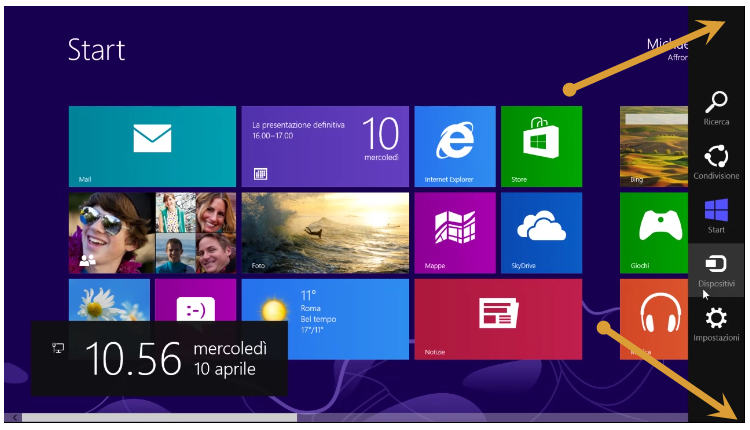

#### di [Beppe Platania](https://mvp.support.microsoft.com/profile=1C0BBF0F-D101-443A-9230-E9D52D2E827A) - Microsoft eMVP

Blog: <http://beppeplatania.cloudapp.net/>

1.  {width="0.59375in" height="0.9375in"}

Riveduto e corretto da: [Gianni Rosa
Gallina](https://mvp.support.microsoft.com/profile=78547C7F-AA03-4304-88EF-E2CC27B5D683)
 **- Microsoft eMVP**

Blog: <http://giannishub.cloudapp.net/>

*Maggio 2013*

Con l’avvento di Windows 8 l’uso delle funzionalità legate alla
possibilità di “toccare” il video è diventato normale. Sui nuovi tablet
e sui dispositivi muniti di “touch screen” ben presto l’utente si abitua
ai nuovi gesti e li adopera con disinvoltura.

Questi “gesti” possono attivare delle “azioni” effettuate direttamente
dal sistema operativo, oppure è il sistema che, in funzione di “gesti”
predefiniti, genera degli eventi che possono essere utilizzati
direttamente dagli applicativi.

1.  {width="3.760941601049869in"
    height="1.791917104111986in"}

Nell’ambiente embedded può essere molto interessante poter filtrare
questi gesti in modo che l’applicazione (o le applicazioni) per cui è
stato progettato il dispositivo non venga disturbata da azioni scaturite
da gesti interpretati dal sistema operativo, ma che, allo stesso tempo,
possano arrivare all’applicazione quegli eventi che essa aspetta.

Nel novero dei “gesti” che attivano delle “azioni” del sistema operativo
troviamo quelle della nuova shell di Windows 8 e che fanno apparire
alcune nuove funzionalità di sistema:

se si fa scorrere rapidamente un dito dal bordo destro della schermata,

1.  {width="0.7631944444444444in"
    height="0.925in"}

compare la lista degli Accessi (in inglese Charms) che permettono di
selezionare l’azione voluta:

Ricerca (tasto Windows+F)

Condividi (tasto Windows+H)

Start (tasto Windows)

Dispositivi (tasto Windows+K)

Impostazioni (tasto Windows+I)

1.  

Subito dopo il nome in italiano dell’*Accesso* abbiamo riportato la
sequenza, invariante per tutte le lingue, da effettuare da tastiera per
richiamare la stessa funzione.

Per ottenere la visualizzazione degli *Accessi* mediante il mouse,
basterà portare il puntatore nell’angolo in alto (o in basso) a destra
dello schermo.

1.  {width="3.8976377952755907in"
    height="2.232283464566929in"}

    se si fa scorrere un dito dal bordo superiore della schermata quando
    è visualizzata un’applicazione Windows 8, il puntatore si presenta a
    forma di “manina” e se si fa scorrere il dito verticalmente verso il
    basso, si ottiene la chiusura dell’applicazione stessa: la manina si
    chiude a pugno come se prendesse la schermata e la portasse verso il
    basso fuori dallo schermo. Oppure, in altre applicazioni, potrebbero
    essere visualizzate una serie di opzioni con una tendina che scende
    dal bordo superiore e/o con una che sale da quello inferiore:

    {width="4.57273731408574in"
    height="2.595744750656168in"}

    se si fa scorrere rapidamente un dito dal bordo sinistro della
    schermata, compare la lista degli applicativi in esecuzione per
    poter rapidamente passare da un’applicazione ad un’altra.

    {width="0.7480314960629921in"
    height="0.8464566929133859in"}

    {width="3.1618055555555555in"
    height="2.370138888888889in"}

<!-- -->

1.  

Questi sono soltanto alcuni “gesti” che comportano delle azioni di
sistema, ma la cosa importante è capire la metodologia che ci mette a
disposizione lo strumento di Windows Embedded 8 Standard per poter
“filtrare” questi gesti.

#### Configurazione mediante ICE

Dopo aver inserito nella build il package “*Gesture Filter*” che si
trova in: Features/Lockdown, abbiamo a disposizione una variabile
“DisabledEdges” che prevede un valore numerico:

1.  {width="5.398565179352581in"
    height="1.3239435695538058in"}

Questo valore va determinato sommando i singoli filtri facendo
riferimento alla seguente tabella:

  Bordo                        Valore   Descrizione
  ---------------------------- -------- ----------------------------------------------------------------------------------------------------
  Sinistra                     1        Disabilita l’azione del bordo sinistro e la funzionalità di navigazione tra le applicazioni
  Destra                       2        Disabilita l’azione del bordo destro e la comparse della lista degli *Accessi*
  Superiore                    4        Disabilita l’azione del bordo superiore e le funzionalità della barra superiore delle applicazioni
  Inferiore                    8        Disabilita l’azione del bordo inferiore e le funzionalità della barra inferiore delle applicazioni
  Angolo in alto a sinistra    16       Disabilita l’azione collegata all’angolo in alto a sinistra
  Angolo in alto a destra      32       Disabilita l’azione collegata all’angolo in alto a destra
  Angolo in basso a sinistra   64       Disabilita l’azione collegata all’angolo in basso a sinistra
  Angolo in basso a destra     128      Disabilita l’azione collegata all’angolo in basso a destra

Facciamo alcuni esempi:

il valore 15 (=1+2+4+8) abiliterà i primi quattro filtri e quindi
disabiliterà le funzioni corrispondenti;

il valore 255 (=1+2+4+8+16+32+64+128) abiliterà tutti e otto i filtri e
quindi disabiliterà tutte le funzioni corrispondenti.

1.  **NOTA**: I valori riportati, sono in rappresentazione decimale.

#### Configurazione mediante IBW

Mentre la configurazione che abbiamo visto può essere facilmente
effettuata all’interno del Configuratore (ICE), utilizzando il Wizard
(IBW) non è possibile scendere nello stesso dettaglio. Ci si limiterà ad
inserire il modulo “*Gesture Filter*” nella build e, a Run-Time, si
interverrà, con le dovute cautele, sulle chiavi di registro che pilotano
questo filtro. Con riferimento alle variabili di cui sopra, bisogna
agire sulla chiave:

HKLM\\Software\\Microsoft\\Windows\\CurrentVersion\\ImmersiveShell\\EdgeUI\\DisabledEdges

Il valore 0 (zero) della variabile significa che non c’è nessun filtro
di gesti abilitato.

**NOTE**:

La modifica di queste chiavi, di solito, necessita di un riavvio della
macchina.

Attenzione all’utilizzo di questi filtri con quelli che proteggono la
scrittura su disco. Il consiglio è di disabilitare tutti i filtri di
scrittura su disco, effettuare tutte le prove del caso fino ad arrivare
ad una situazione soddisfacente e, solo in quel momento, creare la copia
MASTER del sistema.

#### Configurazione mediante DISM

Il modulo “*Gesture Filter*” non ha dipendenze da altri moduli e quindi
può essere aggiunto “On-line” senza problemi. Utilizzando il tool DISM
(Deployment Image Servicing and Management), si possono direttamente
installare sia il .CAB che il .EMD che sono le due parti del modulo
“*Gesture Filter*”.

Per aggiungere il modulo al nostro sistema **Standard 8** (OnLine):

Individuare i nomi degli elementi che si vogliono inserire e la loro
posizione; per esempio, nel caso specifico sono:

Microsoft-Windows-Embedded-GestureFilter-Package\~31bf3856ad364e35\~x86\~\~6.2.9200.16384.cab

WinEmb-Edge-Gesture-Filter\~31bf3856ad364e35\~x86\~\~6.2.9200.16384.emd

1.  

Entrambi nella cartella:

%catalogroot%\\x86\\modules\\FeaturePack

Copiamo i file d’installazione (.CAB e .EMD) in un posto raggiungibile
dal sistema che vogliamo aggiornare (ad esempio sulla cartella
principale di una chiavetta USB).

Supponiamo che la chiavetta di cui sopra per il sistema che vogliamo
aggiornare si chiami “E:”. Per eseguire il comando:

Aprire un prompt di comandi con i diritti di amministratore;

Dare il comando:

dism /online /add-package
/PackagePath:E:\\Microsoft-Windows-Embedded-GestureFilter-Package\~31bf3856ad364e35\~x86\~\~6.2.9200.16384.cab

Il sistema risponderà con una serie di messaggi:

WE8S&gt;dism.exe /OnLine /Add-Package
/PackagePath:E:\\Catalog\\6.2\\9200.16384\\x86\\modules\\FeaturePack\\Microsoft-Windows-Embedded-GestureFilter-Package\~31bf3856ad364e35\~x86\~\~6.2.9200.16384.cab

Deployment Image Servicing and Management tool

Version: 6.2.9200.16384

Image Version: 6.2.9200.16384

Processing 1 of 1 - Adding package
Microsoft-Windows-Embedded-GestureFilter-Package\~31bf3856ad364e35\~x86\~\~6.2.9200.16384

\[==========================100.0%==========================\]

The operation completed successfully.

Restart Windows to complete this operation.

Do you want to restart the computer now? (Y/N)

Non è necessario effettuare questo riavvio, si può continuare
l’installazione dando il comando:

dism /online /add-module
/ModulePath:E:\\WinEmb-Edge-Gesture-Filter\~31bf3856ad364e35\~x86\~\~6.2.9200.16384.emd

Il sistema risponderà con una serie di messaggi:

WE8S&gt;dism.exe /OnLine /Add-Module
/ModulePath:E:\\Catalog\\6.2\\9200.16384\\x86\\modules\\FeaturePack\\\
WinEmb-Edge-Gesture-Filter\~31bf3856ad364e35\~x86\~\~6.2.9200.16384.emd

Deployment Image Servicing and Management tool

Version: 6.2.9200.16384

Image Version: 6.2.9200.16384

Adding package
Microsoft-Windows-Embedded-GestureFilter-Package\~31bf3856ad364e35\~x86\~\~6.2.9200.16384

\[==========================100.0%==========================\]

The operation completed successfully.

Restart Windows to complete this operation.

Do you want to restart the computer now? (Y/N)

Al riavvio il sistema completerà l’installazione.

**NOTA**: Il Filtro così installato è subito abilitato
all’intercettazione dei vari gesti anche se, come default, NON ne filtra
nessuno.

#### Esempio pratico

Per comprendere il funzionamento di questo filtro il modo migliore è
quello empirico.

Lanciamo un editor per il registro Regedit.exe (con privilegi di
amministratore) e posizioniamoci sulla chiave:

**HKLM\\Software\\Microsoft\\Windows\\CurrentVersion\\ImmersiveShell\\EdgeUI**

La variabile **DisabledEdges** dopo l’installazione del modulo “Gesture
Filter” ha il valore 0 (zero).

1.  {width="3.5196850393700787in"
    height="1.1141732283464567in"}

Per “filtrare”, in un colpo soltanto, tutti e otto i gesti (Microsoft
nella versione italiana del sistema li chiama “tocchi”) bisognerà
assegnare alla variabile il valore 255 (0xff in esadecimale).

1.  {width="3.9803149606299213in"
    height="1.279527559055118in"}

Dopo questa assegnazione, al prossimo login, le azioni collegate ai
gesti “filtrati” non verranno eseguite. Un esempio per tutte: andando
sul “desktop” (o su qualsiasi applicazione Windows 8) e posizionando il
cursore sul bordo superiore del video l’icona del puntatore non cambierà
immagine diventando una manina aperta pronta a chiudere l’applicazione,
ma rimarrà a forma di punta di freccia (ci riferiamo a icone di
default).

1.  **NOTA:** Per poter utilizzare gli applicativi di amministrazione
    > sul PC-Target, bisogna includere nella build i moduli che li
    > contengono; ad esempio, per “Regedit.exe” il modulo è:

    > **Features\\Diagnostics, Feedback and Maintenance\\Registry
    > Editor**

    > Per trovare il modulo corretto nell'ambiente del configuratore
    > (ICE), si consiglia di:

    > • utilizzare la funzione "Find" (Ctrl-F)

    > • selezionare l'opzione "Search file names"

    > • cercare "Regedit.exe"

    Con un doppio click sulla riga corrispondente ci si ritroverà già
    nella colonna del Catalog con il modulo corretto selezionato. Lo si
    può includere nella build ed aggiungere i moduli in dipendenza.
    (vedere figura sotto)

<!-- -->

1.  {width="3.9875in"
    height="1.626865704286964in"}

#### Conclusioni

Per proteggere la nostra applicazione dalle azioni scaturite dai nuovi
gesti implementate da Windows 8, possiamo usare una qualsiasi
combinazione degli 8 filtri che la piattaforma ci mette a disposizione.
Questo intervento non basta da solo, ma va usato insieme alle altre
funzionalità come il filtro sulla tastiera. Per esempio se si attivano
tutti i filtri dei gesti per evitare che l’utente acceda alla
condivisione, ma poi si lascia attivo il tasto Windows (tasto Windows)
l’utente potrà richiamare la funzione “Condividi” utilizzando la
sequenza di tastiera (tasto Windows+H).
